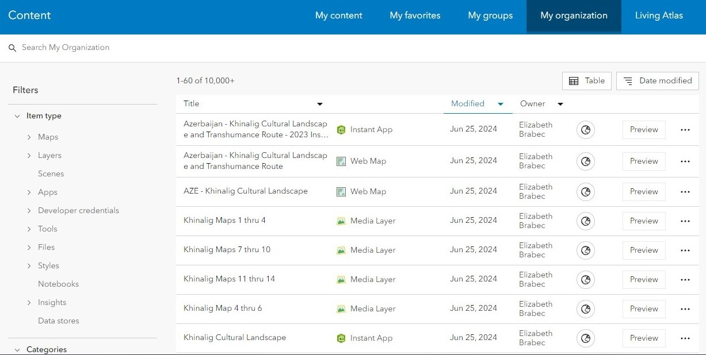
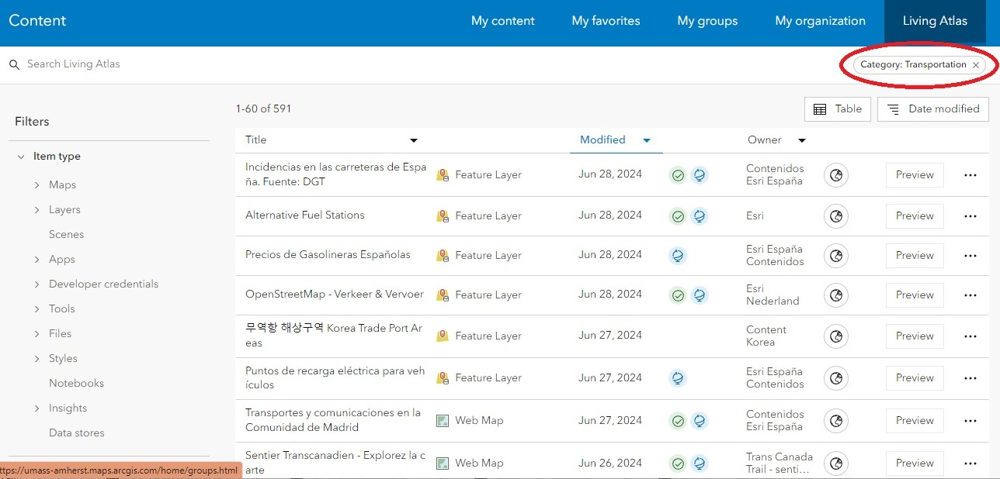
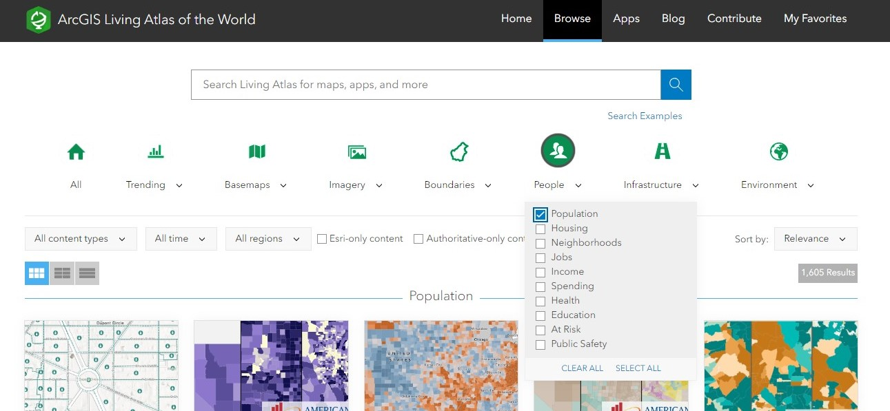
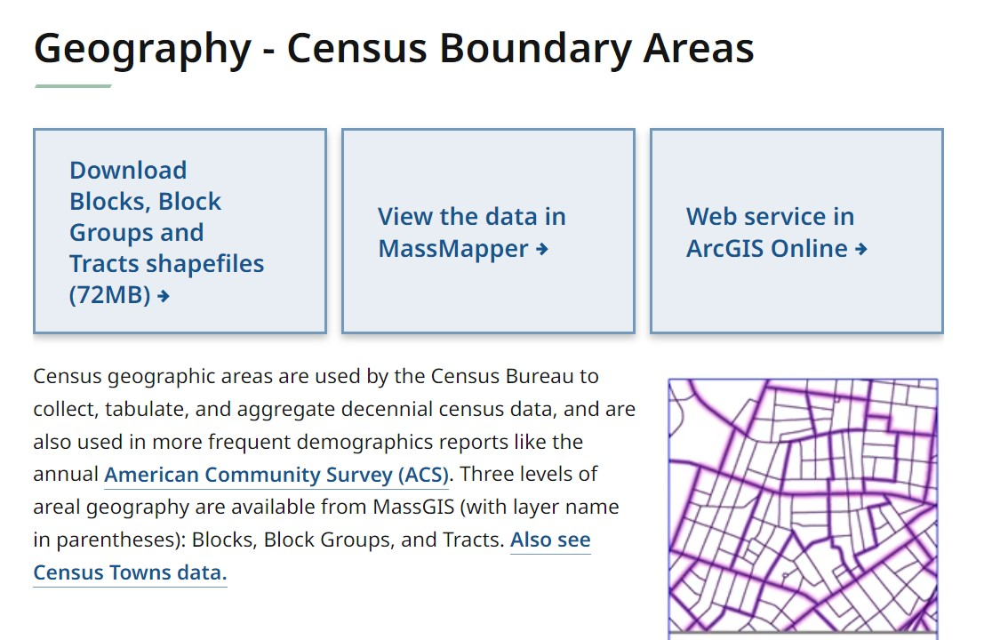

# Finding Data
{: .no_toc }

Using AGOL, Living Atlas and external sites for data sourcing
{: .fs-6 .fw-300 }

  

    Table of contents
  

  {: .text-delta }
1. TOC
{:toc}

## My Organization
{:toc}

When you have an account through a large organization like UMass, there is a wealth of geospatial data already available to you through your organization. In the **Content** tab, click **My Organization** to browse the items that other users have already published.

Tips:
* Type keywords into the search bar to look for specific content
* Use filters to limit results to specific items, types, locations etc. 

--- 

## Living Atlas
{:toc}

The ArcGIS Living Atlas of the World is a collection of curated spatial data from around the world. It contains maps, apps, and data layers created by Esri and supported partners that are made available for free to all AGOL users. All Living Atlas layers have been verified by Esri, making it a reliable source of spatial data. 

### Finding Living Atlas Data via AGOL
{: .no_toc }

Navigate to the **Content** tab, then in the blue menu bar click **Living Atlas.** From here, you can use use keywords and filters to limit the results. Filters can be selected using the menus on the left side, and appear at the top when they are applied.

Notice that in between the “Modified” and “Owner” columns, there are green and blue icons next to some of the items:
* A **green** icon (a circle with a checkmark inside) indicates that the item is *authoritative,* meaning Esri, the company behind Arc products, recommends the dataset for use.
* A **blue** icon (a globe) indicates that the item was created by Esri itself. 
Finding data with either of these labels is a good way to ensure you're using reliable data in your maps. 

### Finding Living Atlas Data via the Living Atlas Gallery
{: .no_toc }

You can also access Living Atlas content through the [Living Atlas Gallery](https://livingatlas.arcgis.com/en/browse/). Similarly to the AGOL interface, filters can be applied through the menus to narrow down to a specific category. 

---

## External Sources
{:toc}

If you can’t find what you’re looking for in AGOL, chances are good that you can find it somewhere else on the web. For a non-exhaustive list of reputable external data sources, check out the [UMass GIS Hub](https://gis.library.umass.edu/data/subject/).

One of the main sources of authoritative spatial data are government agencies. Many states have open data portals where you can easily search for and download geospatial data within that state. For example, in Massachusetts we have:
* The state’s GIS bureau, **MassGIS,** which is an excellent source of data for tax parcels, buildings, roads, open space, aerial imagery, elevation data, and anything else to do with state-level management. You can browse data on the [MassGIS Data Hub](https://gis.data.mass.gov/) or the [MassGIS Data Layers](https://www.mass.gov/info-details/massgis-data-layers) page. 
* Additionally, the [Massachusetts Department of Transportation Open Data Portal](https://geodot-massdot.hub.arcgis.com/pages/open-data-portal) hosts datasets available for download or for use in AGOL.

For both of these resources, you will find some data that is already available as a web service in AGOL. In this example from MassGIS, you can see that there are three ways to access the data: download it, view it in [MassMapper](https://maps.massgis.digital.mass.gov/MassMapper/MassMapper.html), or access it via AGOL:

The most important aspect of looking for data, especially from external sources, is to use reliable sites. We already went over how to look for reliable datasets via the AGOL interface, but if you're looking for a good starting point for external sources, be sure to explore the UMass libaray's [GIS database](https://gis.library.umass.edu/data/), specially curated and fact-checked by our wonderful librarians!

---

Do some exploring on your own and find some datasets you'd like to work with, and when you're ready, tune in to the next tutorial where we will be covering how to make a web map!