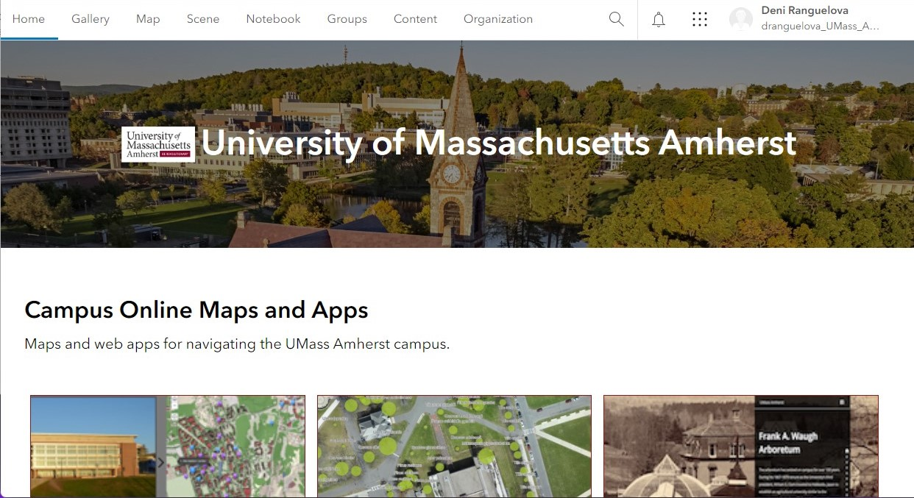

# Navigating the AGOL Interface
{: .no_toc }

Get familiar with the website layout!
{: .fs-6 .fw-300 }

  

    Table of contents
  

  {: .text-delta }
1. TOC
{:toc}

---

## Sign in
{:toc}

1. Open your browser of choice and navigate to [ArcGIS Online](https://www.arcgis.com).
1. Click "Sign In."

    

1. For UMass affiliates: at the sign-in page, click "Your ArcGIS Organization's URL."
1. Type **umass-amherst** into the text box.
1. Optionally, check "Remember this URL" to make future sign-ins easier.

    

1. Click "Continue."
1. Enter your UMass credentials to login.

If you are not a UMass affiliate or don’t have access to your login information, you can create a free account through the link at the bottom of the login screen. With a non-university account, you will need to pay for credits to run analyses in AGOL.
{: .note}

---

## Explore the AGOL Interface
{:toc}

After logging in, you will be taken to the homepage of your AGOL organization:

The top bar has a range of menu options to explore:

| **Home** | Landing page, with quick links to content published by your organization (UMass Amherst) |
| **Gallery** | In-depth look at the content published by your organization |
| **Map** | Open AGOL’s Map Viewer, where you can add data to a map, customize the way it looks, edit your data, and run spatial analyses |
| **Scene** | Open AGOL’s Scene Viewer, where you can add and display data in 3D |
| **Notebook** | Place to create and view AGOL Notebooks, Esri’s version of Jupyter notebooks; Notebooks enable you to write Python code to assist with data management, repetitive tasks, and complex analysis |
| **Groups** | AGOL makes it possible to collaborate with groups of users within or outside your AGOL organization; a common use for this feature is to create groups for classes, where students can upload their projects and homeworks into a common shared cloud space |

Within the **Groups** blue menu bar, there are additional tabs you can click on:

  
 
  * **My groups** shows the groups that you are a member of. 
  * **Featured groups** shows the groups that Esri flagged for easy discovery; they contain Esri data that people may find useful, such as basemaps, aerial imagery, government-published data, and so on. 
  * **My organization’s groups** shows groups within the organization that that have have made their content publicly available to the organization.
* **Content:** this is where you can find all the content you’ve created or that you have access to. The blue menyu bar lets you navigate between different content types:
  * **My content** contains all the items you have created or added to your AGOL account. Items can be organized in folders using the interface in the top left corner.
  * **My favorites** shows any content you have starred as a favorite - essentially, this is a great way to bookmark items you see in AGOL that you want to be able to find quickly in the future.
  * **My groups** lists all the content shared with groups you are a member of.
  * **My organization** lists all the content shared with your organization.
  * **Living Atlas** is a curated selection of public content available on AGOL, which Esri’s team has flagged as special because of its exceptional documentation, authoritative status, or high view count. 
* **Organization:** shows your subscription ID, contact info for your organization’s administrator, and the organization’s members.

| **Content** | All the items you have created or added to your AGOL account. Items can be organized in folders using the interface in the top left corner.<ul><li>**My favorites** shows any content you have starred as a favorite - essentially, this is a great way to bookmark items you see in AGOL that you want to be able to find quickly in the future.</li><li>**My groups** lists all the content shared with groups you are a member of.</li></ul> |

<table>
  <tbody>
    <tr>
      <th>Tables</th>
      <th align="center">Are</th>
      <th align="right">Cool</th>
    </tr>
    <tr>
      <td>col 3 is</td>
      <td align="center">right-aligned</td>
      <td align="right">$1600</td>
    </tr>
    <tr>
      <td>col 2 is</td>
      <td align="center">centered</td>
      <td align="right">$12</td>
    </tr>
    <tr>
      <td>zebra stripes</td>
      <td align="center">are neat</td>
      <td align="right">$1</td>
    </tr>
    <tr>
      <td>
        <ul>
          <li>item1</li>
          <li>item2</li>
        </ul>
      </td>
      <td align="center">See the list</td>
      <td align="right">from the first column</td>
    </tr>
  </tbody>
</table>

---

Take some time to explore the interface, learning where you can find certain tools and information. When you are familiar with the organization of the website, feel free to explore the next tutorials in this series.

