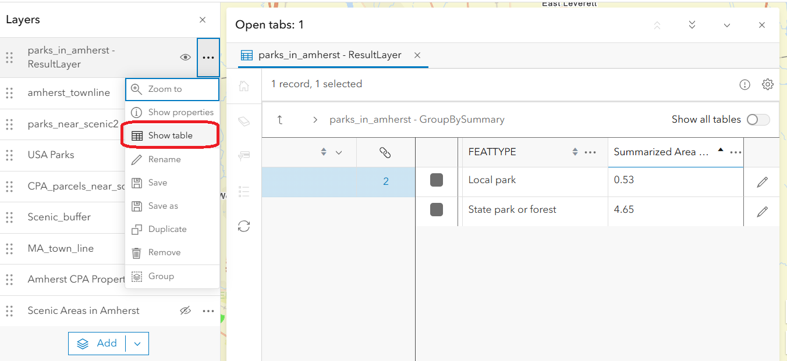

# Analyzing Spatial Data
{: .no_toc }

Learn to use AGOL tools and make insights into your data
{: .fs-6 .fw-300 }

  

    Table of contents
  

  {: .text-delta }
1. TOC
{:toc}

---

So we’ve created a new feature layer! This is cool and all, but without some sort of analysis, all we’ve really done is draw a picture. Let’s see what we can make of this data we’ve created using spatial analysis.

**Spatial analysis** is “the process of examining the locations, attributes, patterns, and relationships of features in spatial data to address a question or gain useful knowledge” [(Esri GIS Dictionary)](https://support.esri.com/en-us/gis-dictionary/spatial-analysis) – essentially, it allows us to explore the relationship between different spatial layers in a measurable and repeatable way.

All the available analysis methods in AGOL can be found in the right menu bar in the **Analysis menu** (symbolized as three circles above a polygon). In the rest of this tutorial, we will demo a few of the available tools. You are encouraged to explore other tools on your own!

---

## Spending "credits"
{:toc}

The first thing to know about running analysis tools in AGOL is that running these tools costs money. If we were working on desktop software, the cost would be borne by your computer’s processor (and, therefore, paid for through your electricity bill). Since we are using Esri’s cloud computing service, it costs Esri money every time you click “Run” on a tool. To cover this cost, every spatial analysis tool uses **credits.** 

Members of the UMass organization are automatically given a certain number of credits each year, which is more than enough for typical users. However, sometimes users accidentally run a very costly tool (geocoding is particularly expensive!) and run out of credits. If you run out, you’ll need to contact an AGOL administrator to ask for help.

If you have your own subscription to AGOL, you can [purchase AGOL credits from Esri.](https://www.esri.com/en-us/arcgis/products/credits/buy)

To check how many credits you have in your account, from the main AGOL page navigate to `Organization > Members` and search for your UMass NetID. Once viewing your profile, click `“View Settings” > “Credits”` This will show you how many credits you’ve used, and how many remain, as shown below.

---

## Compose a research question
{:toc}

For this hypothetical project, I want to find out how many of my identified scenic areas in Amherst, MA, are within (or near) polygons in Esri’s “USA Parks” layer. 

For visualization purposes, I also brought in a town parcels map to make sure that all of my scenic areas fall within the borders of the town of Amherst. I also changed the colors of the USA Parks layer and the basemap for better visualization. This is what the map looks like now (layers used in this example are highlighted in the blue boxes, ignore the others)

As we can see, there are some areas where the polygons I made overlap with the USA Parks layer. We can visually observe some spatial relationships, but let’s use some of the available spatial analysis tools to explore them scientifically!

---

## Create Buffers
{:toc}

Creating buffers generates polygons (or areas) around an input layer at a specified distance. For example, if you wanted to find out which restaurants were within 5 miles of your house, you would start by creating a 5-mile buffer around where you live.

1. In the right menu bar, open the **Analysis** menu and navigate to the Tools tab (symbolized by a hammer).
1. Under **Use proximity**, click **“Create Buffers.”** You’ll then get the following pop-up window, in which you can follow the next few steps.
    
    

1. Set the **input layer** to be whichever layer you want to draw buffers around. In my case, I am selecting the feature layer I created, “Scenic Areas in Amherst.” 
1. Use **Buffer settings** to specify the buffer distance:
    1. If you want to use the same distance for every feature, keep *distance type* as **“Value,”** enter a *distance value* (e.g. 50), and choose a *unit* from the dropdown menu. I am choosing to create a 50 meter buffer around every polygon I created. 
    1. If you want to use a field in the attribute table to create different buffer sizes for each feature, set *distance type* to **“Field”** and choose the field in the attribute table that contains the unique distance value.
1. Choose an **overlap policy** which will depend on the topic of analysis. For this case, we will choose **Dissolve**
    1. **Overlap** means that each feature will generate a discrete buffer, even if they overlap – there will be one buffer for each feature.
    1. **Dissolve** means that any overlapping buffers will be dissolved into a single shape – there may be fewer buffers than features.
1. Under **Result layer** give the output a unique name. 

    
1. Optionally, edit the **Environment settings** to change the output coordinate system or restrict the processing extent (this is a helpful thing to do if you only want to run the analysis in an area that is smaller than the full extent of the input layer).

    Click **Estimate Credits** to find out how many credits this analysis tool will cost you. If you need to reduce the credit cost, you can restrict the processing extent under Environment Settings.
    {: .warn}

1. Click **"Run"**

This is the result of the Create buffers tool: my input polygons now have 50-meter buffers surrounding them. In my case, the buffers increase the chances that I will correctly identify scenic areas that are within or near the areas in Esri’s USA Parks layer. Your new buffer layer will appear with your pre-existing layers, as shown by the arrow. You can edit symbology and appearance as with any other layer. 

---

## Find by Location
{:toc}

One of the most basic kinds of spatial analysis is to identify features that have some kind of spatial relationship with features in different layer. In GIS lingo, we would call this an *overlay operation.*

We can use the **Find by Attributes** and **Location** tools to do exactly this – specify the spatial criteria we are interested in, and then automatically identify all the features that meet that criteria. In this demo, we will look for which of our scenic area buffers intersects (i.e. touches in any way) the parks in Esri’s USA Parks layer.

1. In the `Analysis > Tools` section, under **Find Locations** click **"Find by Attributes and Location"**

    
1. The first box allows us to define the spatial or attribute criteria that the tool will use to select features. Click **“+ Build new query”** to get started.
1. Confirm that the tool is finding features from the correct input layer. If necessary, change the input in the dropdown menu.
1. Select **Spatial Expression** as the query method, then click **"Next"**

    
1. Now comes the fun part: defining the **query.** In our case, we want to identify which scenic area buffers intersect the USA parks:
    1. **Find features from:** USA Parks
    1. **Where:** all of the following are true:
    1. **Relationship:** intersects
    1. **Other layer:** Scenic Buffer
    
    
1. Once the query is set, click **"Add"**
1. Under **Result layer** give the output a unique name.
1. Optionally, edit the **Environment settings** to change the output coordinate system or restrict the processing extent (this is a helpful thing to do if you only want to run the analysis in an area that is smaller than the full extent of the input layer).
    
    Remember to click Estimate Credits to find out how many credits this analysis tool will cost you. If you need to reduce the credit cost, you can restrict the processing extent under Environment Settings.
    {: .warn}

1. When everything is set, click **"Run"**

The result is a polygon feature layer that shows *only* the parks parcels that fall within the 50m buffer to the scenic areas, which in this case consists of only 4 or 5 polygons out of the original 20 or so.

Hypothetically, you could skip the previous buffer step and instead build using the relationship **“within a distance of 50 m”** instead of **“intersect.”** In GIS, there are often many ways to accomplish the same end result!
{: .note}

---

## Summarize Within
{:toc}

Now, let’s say that we wanted to calculate the land area of the “USA Parks” features that are in the town of Amherst alone. This is a bit more complicated because it requires a few first steps before we can actually use this tool. First, we need to isolate the boundary of Amherst, MA, from the rest of the feature layer so that we can “clip” to it later. 

First, download and import a shapefile layer containing the boundaries of all towns in Massachusetts. You can find that layer on [MassGIS.](https://www.mass.gov/info-details/massgis-data-municipalities#downloads-). If needed, change the symbology to have a transparent fill color so you can still see your other layers. This layer also already exists in AGOL; you can avoid downloading it directly to your device by importing it from AGOL's gallery, or the Living Atlas (see tutorial part 4: Make a Web Map). 

1. Use the **"Find by Attributes and Location"** tool (refer to previous section) to identify the feature of Amherst and create a separate layer from it: 
    1. **Find features from:** MA_town_lines (the name of your layer may be slightly different depending on where you sourced it)
    1. **Where:** All of the following are true:
        1. NAMELSAD20 (field corresponding with town name) equals Amherst

    
1. Click **"Add."** This will create a separate layer that only contains what you identified with the query, which is the town of Amherst isolated from the rest of the state. 
1. Navigate to the **"Summarize Within"** tool

    

    1. Under **Features to Summarize** select the "USA Parks" layer
    1. Under **Summary Area** select the Amherst town boundary layer you just created
    1. Under **Calculate Statistics** you can optionally change the area units to square kilometers, depending on your project area size and preference. 
    1. Under **Group by fields** I chose to group by feature **type** which will calculate parks area by park type, AKA federal versus state versus local parks. 
    1. When everything is set, run the tool. A new layer will be created.
    1. Click on the three dots next to your results layer and click **“show table."**

    

So, what this tells us is that there are about 5.2 square km of parks in Amherst, in which 0.53 square km are local parks and 4.65 square km are state parks. Adding the instruction to group by feature (park type) allowed us to make this extra distinction, rather than simply a total area. From this information, we now know that there are no national, county or regional parks in Amherst. If you are a city planner or work in conjunction with a park service, this may be useful information! 

So now, we have learned to both identify and select features based on locations and attributes, as well as summarize statistics for a feature. Now we’ll go into a bit of pattern analysis.

---

## Calculate Density
{:toc}

This tool is pretty self-explanatory; it requires a single input containing point layers, and calculates the density of point features based on a given area. 

For this, we will abandon our Parks quest and instead return to the “US Public Schools” layer (as you may recall, this is a point layer). If you haven't gone through that part of the tutorial, first go to Living Atlas and find the layer **"U.S. Public Schools (with placekey)"** and import it to your map. For detailed steps on this, see part 4 of this tutorial "Make a Web Map"

Let’s say we want to calculate the density of public schools throughout the state of Massachusetts.

1. Use the **"Find by Attribute and Location"** tool to "clip" the public schools data to the state of Massachusetts (see earlier section for details).
    
    

   
    
    Note that it is important that you complete this step first so that you can run the “calculate density” tool with as little data as possible, while still answering our research question. It is certainly possible to calculate country-wide density and clipping to MA afterward, but this query will use astronomically more credits. Keep this in mind when doing any project. 
    {: .note}
1. The resulting layer shows US public schools clipped to the state of MA.   

    
1. Open the **"Calculate Density"** tool, in which:
    1. **Search Distance:** 50
    1. **Distance Units:** Kilometers (you can input a different distance and units if you wish)
    1. **Classify by:** equal interval (this essentially means that density classes will be created at equal intervals, rather than uniquely scaled intervals).
    1. **Number of Classes** 10
    1. **Area Unis:** Square kilometers

    

    you can skip the previous step of clipping the schools data to Massachusetts by selecting the “processing extent” in the density tool query to include only data within the MA_town_line layer, which tells the tool to only run inside another shapefile, in this case the outline of MA towns. 
    {: .note}

    
1. Run the tool, which will create a new layer. Let's look at the results. 

    

The resulting layer shows the highest density of public schools per square km occurring in the Boston area, which makes sense. There’s another concentration in Springfield. The 10 density classes you selected can be seen as the color gradients, separated by thin black lines. Open the attribute table to explore this result a little further. 

 

As you can see, the tool created 10 classes and calculated minimum and maximum density values representing public schools per square km. While it makes sense that more rural areas are less densely populated with schools, further analysis could be done using population growth datasets to identify communities in the state in need of a new school. Cool stuff!

---

## Heatmap from points
{:toc}

Another way to visualize density without using the density tool is to alter the symbology of a point layer into a heatmap. Let’s backtrack a few steps to the MA schools layer we made earlier, which looks like this:

1. Make sure the MA Schools layer is selected
1. Navigate to `Properties > Edit Layer Style.` Currently, "Location, single symbol" is selected, which presents the data as a bunch of points, as above. 
1. Instead of "Location, single symbol," click **Heatmap.** The visual result is displayed below. 

    

This visually presents the data in a new, fascinating way. This method won’t give you the numerical data that the Density tool did, but it’s still an interesting way to visualize clustering, and as you can see there are some other public school hotspots (Worcester, Fall River and New Bedford, for example) that were aggregated out of existence with the Density tool.

### Find Hotspots

If you want to continue your density analysis following the theme of a heatmap, you can use the **Find Hotspots** tool to calculate statistically significant "hot spots" or areas of significant point clustering. We won't be covering this tool in the tutorial but encourage you to explore on your own. 

---

Though this tutorial does not cover all of AGOL’s available tools, hopefully this is an effective orientation to a few different types of analysis that can spark your own interest. For a comprehensive list of tools available in AGOL visit this [Esri link.](https://doc.arcgis.com/en/arcgis-online/analyze/perform-analysis-mv.htm#ESRI_SECTION1_DA94F2AEBEE748369DA099DC71EDD408
)

Recall, performing spatial analysis requires the spending of “credits” which are available to you based on your subscription type. For UMass users, the maximum credits one can use for a single analysis is 100, which somewhat limits the size of data you can analyze and to what extent. This also applies to stored data, i.e. feature layers that you create and publish to AGOL. 
{: .danger}