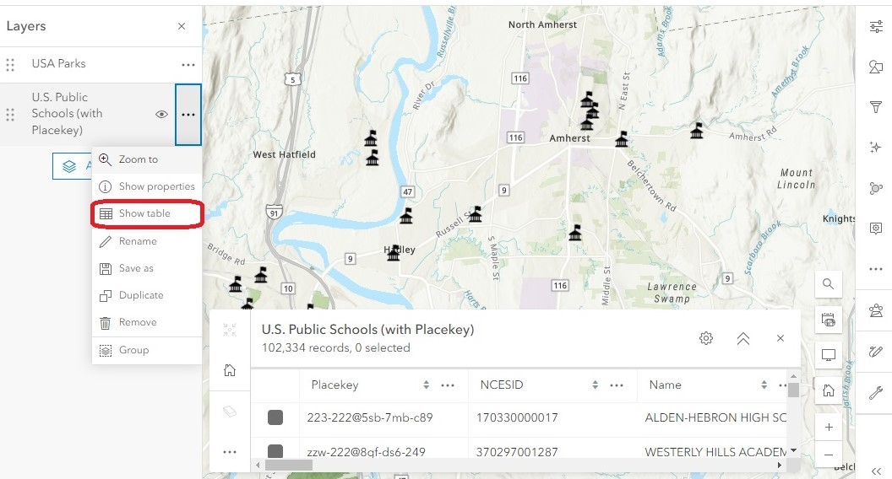
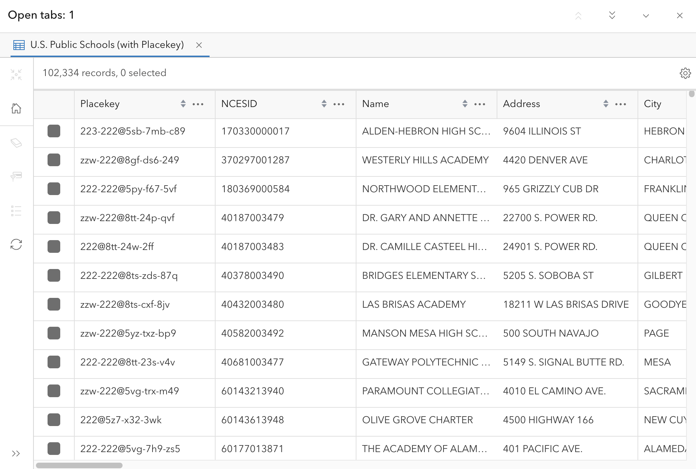
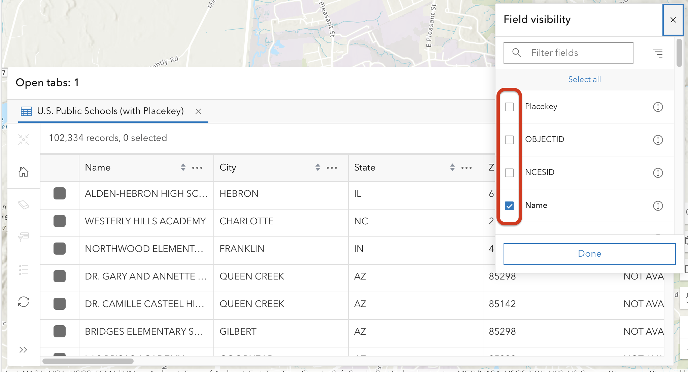
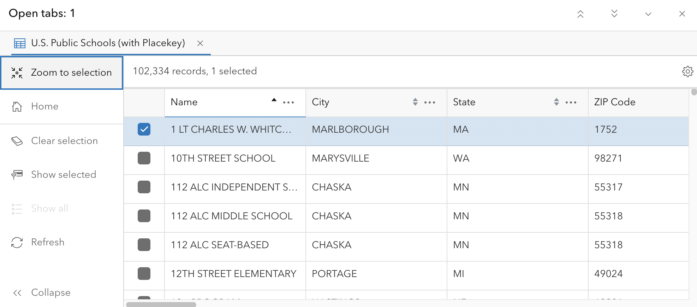
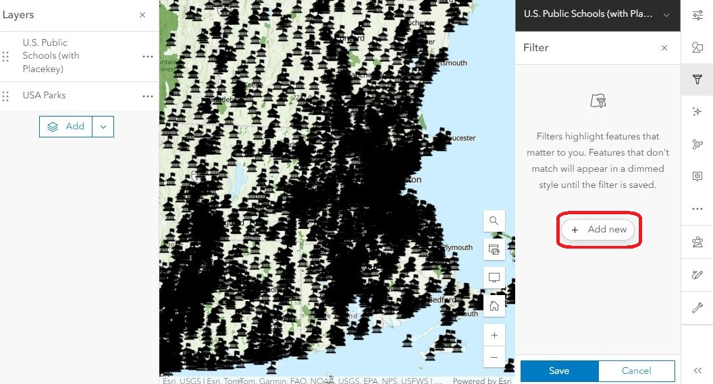
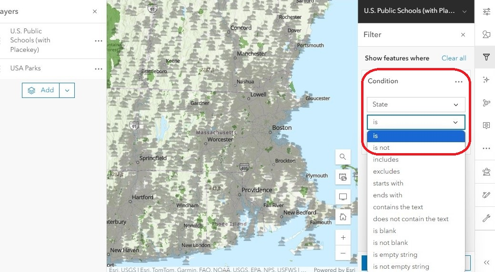
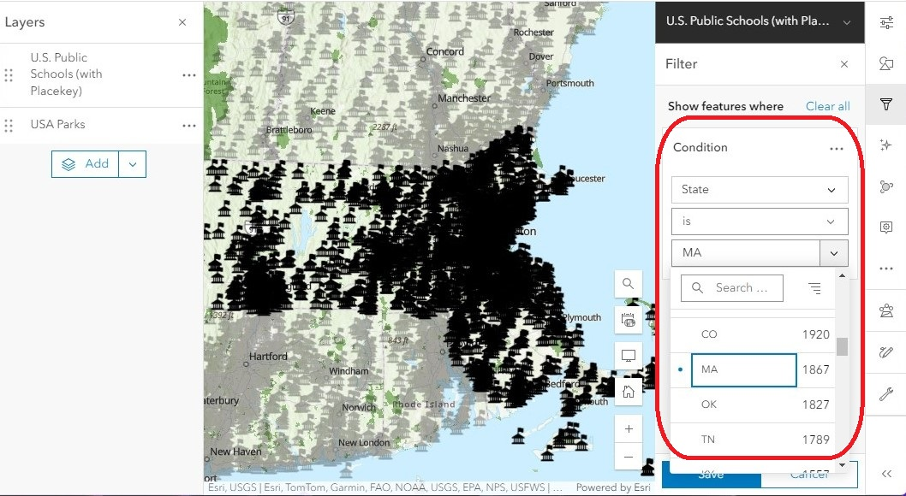
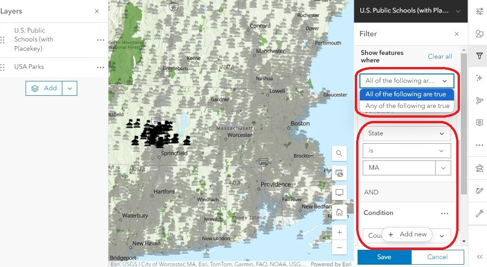

# Working with Attribute Tables
{: .no_toc }

"[Every attribute table] has beauty, but not everyone sees it." -Confucius, probably talking about GIS
{: .fs-6 .fw-300 }

  

    Table of contents
  

  {: .text-delta }
1. TOC
{:toc}

---

## Overview
{:toc}

An attribute table is essentially a spreadsheet that stores information about the features in a vector layer. 

Each **row** in the attribute table corresponds to a specific feature. If we look at a layer of U.S. Public Schools, each row represents one school. Each **column** (or “field”) contains a specific kind of information about that feature, such as the school’s name, address, type, etc. 

## Open an attribute table

1. Click on the **three dots** next to the layer name
1. Select **Show Table.** The attribute table will appear at the bottom of the screen. 

    

    

1. Use the scroll bars to browse through the information.
1. When you’re done, click the **X** at the top right corner of the attribute table to close it.

## Show and hide fields

At times you may want to show or hide fields in the attribute table to make it easier to find the information that is most relevant to you. 

In the top right corner of the table, click the **gear icon** to bring up the Field Visibility menu. Checking a field will make it visible, and unchecking it will hide it.

## Sort the attribute table

Sorting the attribute table can be useful if you are looking for a specific feature in the layer. To sort the table, click a column heading and select **Sort ascending** or **Sort descending.** This will automatically sort the table alphabetically (for text fields) or in numerical order (for number fields).

## Zoom to selection

Once you find a specific feature, you can quickly pan and zoom the map to it using the attribute table.

Click the **checkbox** next to the desired feature to select it, then in the left panel click **Zoom to selection.** The map will automatically pan and zoom to your chosen feature.

## Filters

Let’s say that we only need the information for schools in Hampshire County, Massachusetts. Looking at the entire dataset, which contains more than 102,000 features, might make it hard to find the information we need. To focus on the specific records we want, we can use a filter to specify which criteria we want to view, and exclude everything else.

1. In the Layers list, click on the schools layer to select it.
1. In the right menu bar, open the **Filter** (funnel symbol) and click **Add New**.

    

1. Use the first drop-down menu to define the field that contains the information we are looking for. Since we are looking for schools in a specific state, we will use the **“State”** field. 
1. The second drop-down menu specifies the **operator,** which tells the tool how to look for the information. To look for an exact match, we will use the **“is”** operator.

    

1. The last drop-down menu shows us all the unique values in our chosen field. From the list, select **“MA.”** Together, this builds the condition: “show us only the schools where the *State is MA.”* 

    

1. We can add more conditions to refine the filter even more. Click **Add new** below the first filter and specify the condition “where *County is Hampshire.*” 

1. Zoom out to show the US and change the relationship from "All of the following are true” to “Any of the following are true.” 
    * When *all* the conditions must be true, only schools in Hampshire County, MA will be shown – a total of 49 schools.
    * If *any* of the conditions can be true, the filter will show all the schools in any Hampshire County in the U.S., plus all the schools in Massachusetts – a total of 1, 881 schools.

    

1. Click **Save** to apply this filter to both the map and the attribute table. 

