# Creating and Importing Spatial Data
{: .no_toc }

Points, Lines, Polygons, and importing from CSV
{: .fs-6 .fw-300 }

  

    Table of contents
  

  {: .text-delta }
1. TOC
{:toc}

---

## Import Data into AGOL 
{:toc}

Earlier, we learned how to add data from existing AGOL sources into our map (for a refresher, check out the "Finding Data" section of this tutorial). Now, let’s create our own! In this section, we will go over how to import point data as a CSV file or a shapefile.

As of this writing, AGOL does not yet support raster data uploads. If you need to upload a raster dataset to AGOL, you’ll need to do so through ArcGIS Pro desktop software. For more information, check out Esri’s info on Publishing hosted imagery layers or this YouTube video, [Fastest and Easiest Way to Upload Rasters to ArcGIS Online.](https://www.youtube.com/watch?v=bQmOpcJrf0c)
{: .note}

### Import Data from CSV
{: .no_toc }

CSV (or comma-separated values) files are a simple text file format for storing tabular data. CSV is an open alternative to common proprietary formats like XLSX (Microsoft Excel), making it a convenient way to share tabular data. AGOL can automatically generate a point layer from the CSV file if it contains latitude and longitude values. 

This is an example of a CSV listing the main campuses within the UMass system, along with their latitude and longitude coordinate locations. Follow along with this section by creating your own CSV file (you can do this in Google Sheets or Microsoft Excel) or upload a CSV file of your choice, provided spatial data information such as lat/long coordinates are in the sheet.

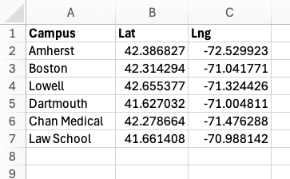

1. In the left menu bar, click the **“Add”** menu, then select **“Add layer from file.”**
   
    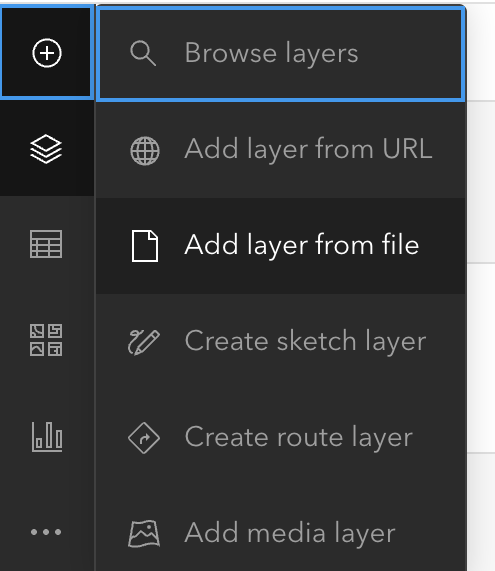
1. The *Add Layer* window appears. Choose one of the options to **upload the file** from your computer, or drag and drop the file into the window

    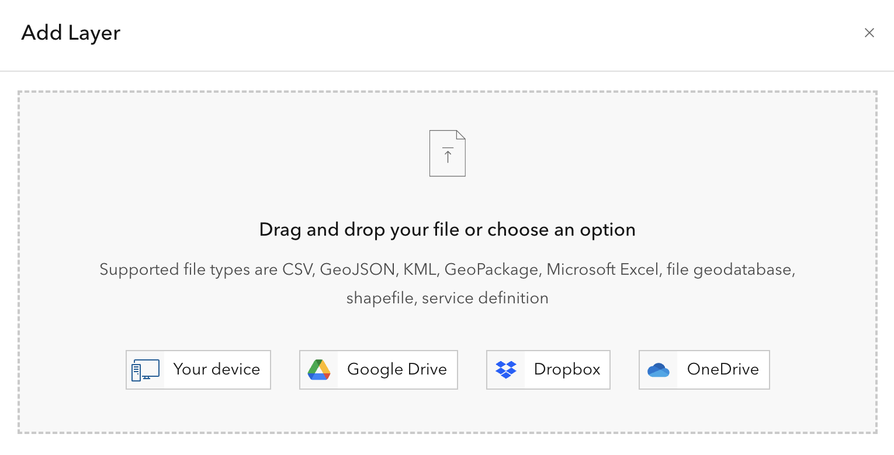
1. Choose **"Create a hosted feature layer and add it to the map"**
1. In the **“Fields”** dialog, we can specify which fields to import, what they should be called, and what kind of data they contain. These fields will be used to create the layer’s attribute table. AGOL does a good job of guessing the name and type of data, but sometimes they need to be adjusted. Once everything looks good, click **“Next.”**
    
    For more information on data types check out Esri’s documentation on [ArcGIS field data types](https://pro.arcgis.com/en/pro-app/latest/help/data/geodatabases/overview/arcgis-field-data-types.htm). 
    {.note}

    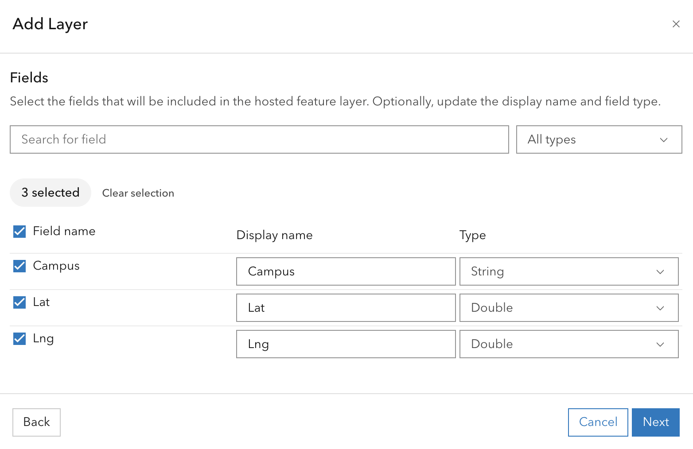
1. In the **“Location settings”** dialog, confirm that *latitude* and *longitude* are correctly mapped to their respective fields. If necessary, choose “Latitude and longitude” from the dropdown menu and map the fields manually. Once complete, click **“Next.”**

    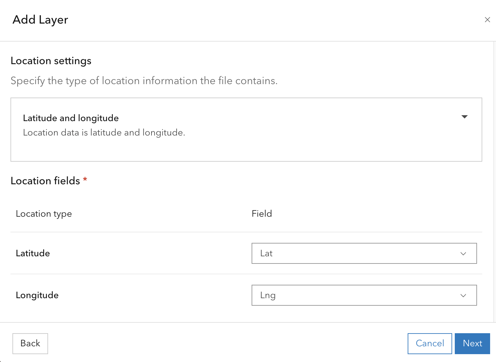
1. Give the file a unique name, then click **"Create and add to map"**
1. AGOL will automatically generate a point layer and add it to your map, based on the coordinate values in the CSV file. THe layer will be saved to your **Content** folder in AGOL. 

    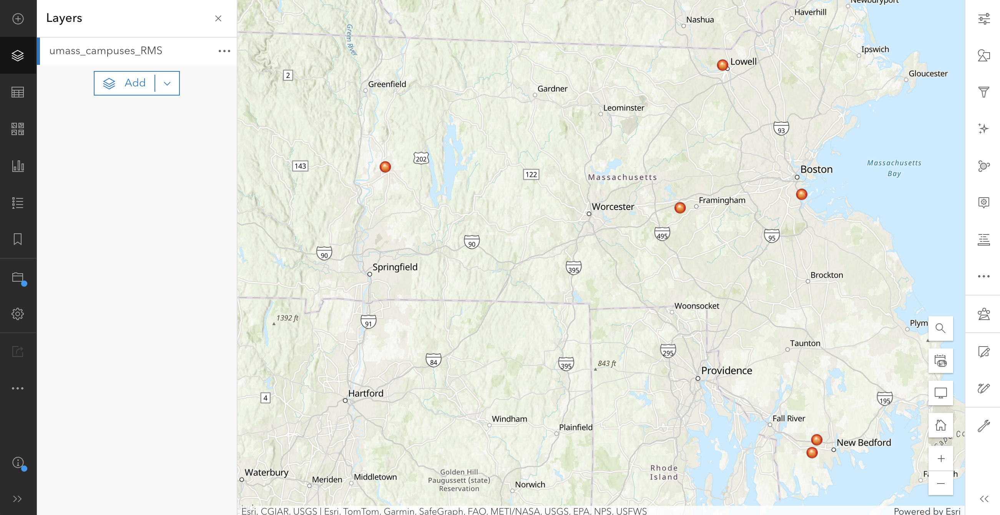

### Import a Shapefile
{: .no_toc }

Shapefiles are one of the most common data types for vector data (vectors are points, lines, or polygons). If you look for GIS data online, oftentimes you will be able to download it as a shapefile (file_name.shp).

Here we have a folder with a shapefile of counties in Massachusetts, downloaded from [MassGIS](https://www.mass.gov/info-details/massgis-data-counties):

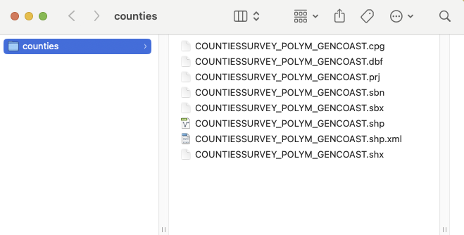

Shapefiles are actually made up of *multiple files:* the files have the same filename, but  each has its own unique extension. GIS programs like AGOL need all of these files to be kept together in order to work properly. 

1. If you downloaded the shapefile as a .zip file, you can skip to the next step. If not, select all the components of the shapefile and zip them together (if you need help zipping a file, check out our tutorials on [Zipping files in Windows or Mac](​​https://umass-gis.github.io/workshops/content/extras/)). 
1. Back in the AGOL Map Viewer, in the left menu bar, click the **“Add”** menu, then select **“Add layer from file.”**
1. The Add Layer window appears. Choose one of the options to upload the zipped file from your computer, or drag and drop it into the window. 
1. In the “File” dialog, confirm that we are attempting to upload a shapefile to AGOL.

    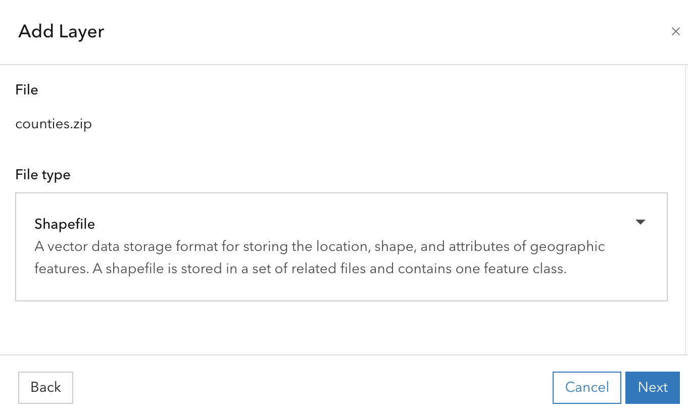
1. Give the file a unique name, then click **"Create and add to map"**

    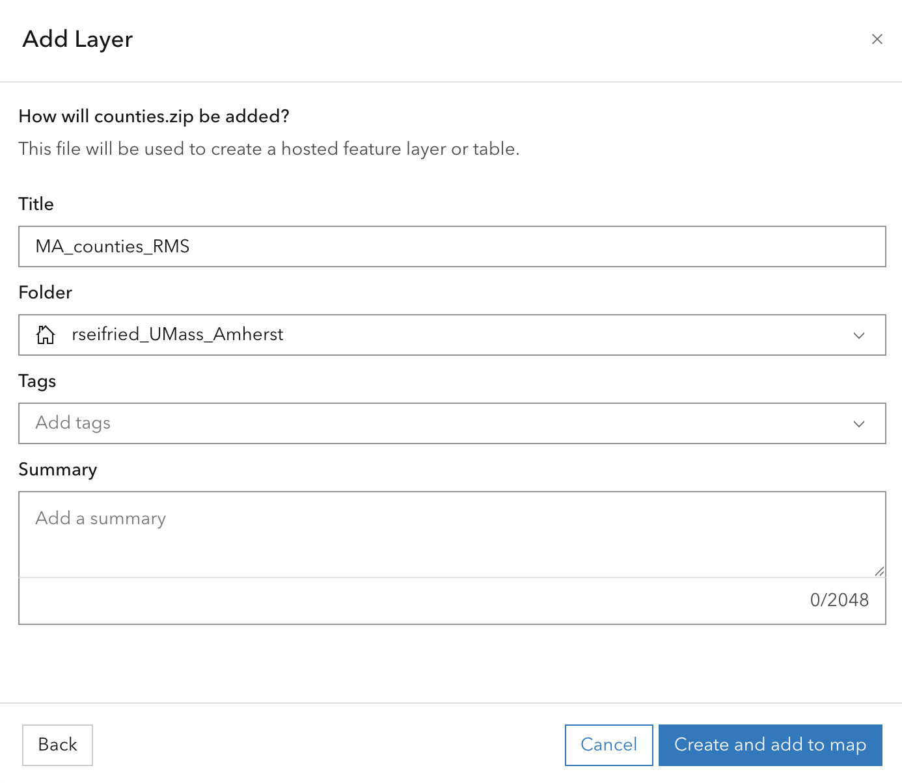
1. AGOL will automatically generate a shapefile layer and add it to your map. Similarly to before, the layer will be saved to your **Content** folder. 
    
    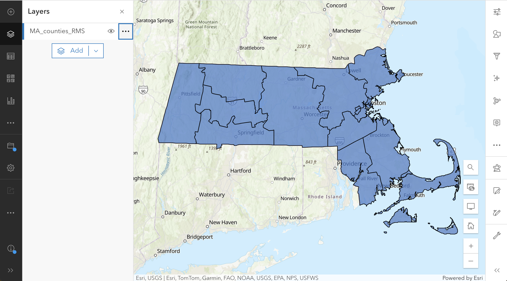

---

## Create Your Own Spatial Data
{:toc}

There may be occasions when the layers you are looking for don’t exist yet, so you’ll need to create them yourself! There are a few options for this, depending on your project’s goals and to what extent you’d like to save or share data. 

### Sketch Layers
{: .no_toc }

A sketch layer is a quick way to map items out without creating and publishing an entire feature layer. These layers exist on your map, but they are not published to your AGOL account and cannot be exported by themselves. Sketch layers will not be saved to your Content, and instead are saved within the map itself. 

To create a sketch layer:
1. In the left menu bar, click `Add > Create Sketch Layer`
    1. Alternatively, in the Layers list, click `Add > Create Sketch Layer`. 

    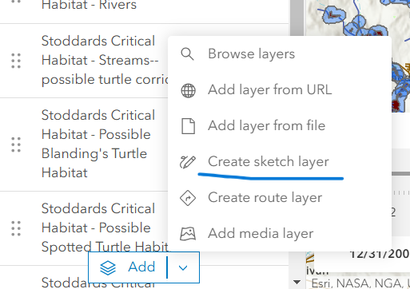
1. AGOL will create an empty sketch layer for you, opening the **Sketch** menu in the right menu bar, symbolized as a drawing pencil
    
    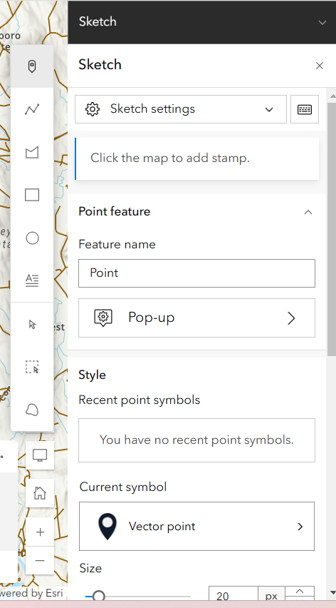
1. The first thing to consider when creating your new layer is what type of data you want to display. Will this be a point, line, or polygon layer? Choose the **vector type** you wish to create by activating the respective icon in the floating menu now available on the left side of the sketch query. 
1. Back in the **Sketch** menu, you can also edit the layer name and change the symbology (appearance) as you are creating sketches.
1. With sketch layers (as with any layer), you can change how the data is visualized. In the right menu bar, expand the **Properties** and **Effects** menus to add visual effects to your symbols, change the size and color, and more.

After activating the line icon, you can add lines to the map by clicking on a map location, then clicking in a different location to add one vertex at a time. Click-dragging your cursor will draw a continuous line rather than creating vertices manually at every click, which may be a good idea if your line is squiggly and irregular, for example, drawing a meandering river as opposed to a straight road. 
{: .note}

Don't forget to save, early and often!
{: .danger}

### Feature Layer

While sketch layers are an effective on-the-fly solution for creating immediate visualization, a feature layer is a persistent layer that stores geographic data along with attributes, allowing for editing, analysis, and sharing across multiple maps and users. If your project requires spatial analysis, collaboration and sharing with others, or more extensive field and attribute information, consider creating a feature layer instead of a sketch layer. 

Essentially, a **sketch layer** is for quick, interactive drawing on a map, while a **feature layer** is for managing and storing structured geospatial data. 
{.tip}

In this example, we will create a feature layer called “Scenic Areas in Amherst” to digitize polygons of scenic areas in Amherst.
1. To create a feature layer, you must first exit the map viewer (make sure you save your work first by clicking on the floppy disc icon in the left menu bar). In the very top left corner of the screen, click the three lines icon and select **Content**.

    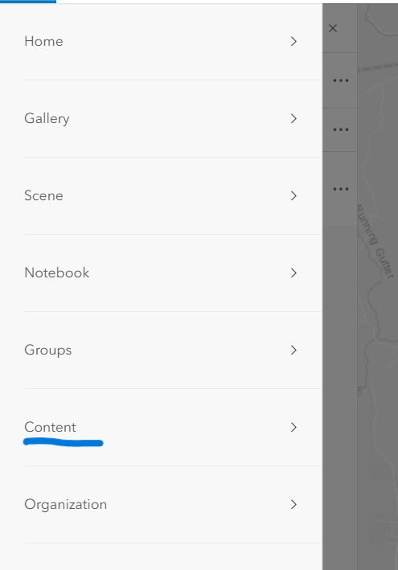
1. Click **"New Item"** in the upper left corner

    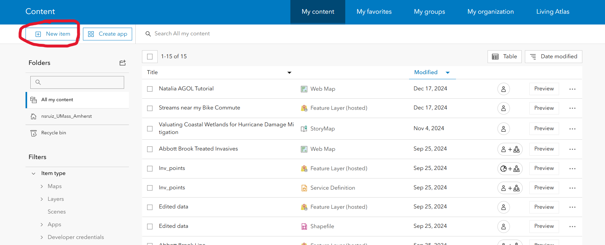
1. The pop-up will prompt you to either drag and drop a saved file from your computer, or select another option to create a file from AGOL. Click **Feature layer** to start creating an empty feature layer.

    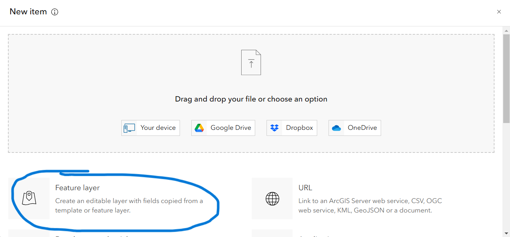
1. We have the option to create a new layer from scratch or to use an existing layer as a template. For this tutorial, we will create a new feature layer from scratch. Select **“Define your own layer,”** then click **"Next."**

    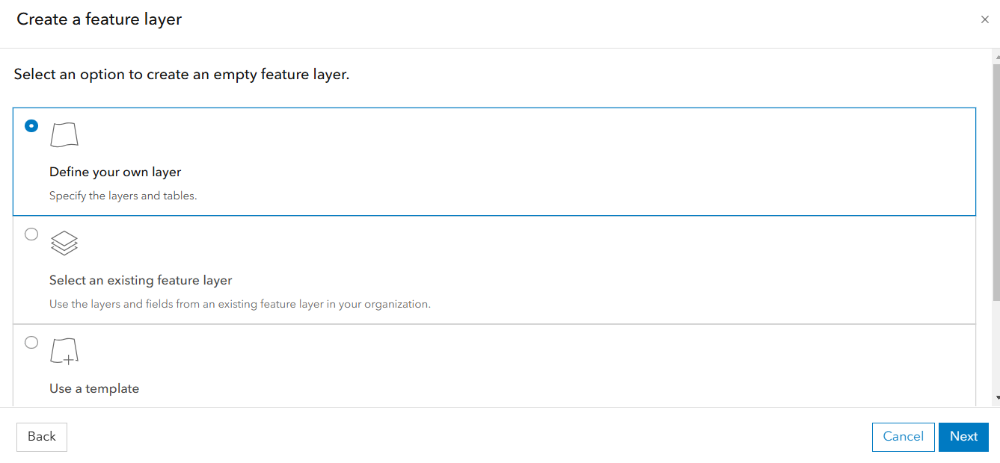
1. In the “Specify name and type” window, give the layer a name that reflects what the data will represent (e.g. “Schools” or “Parks”) and select its data type (point, line or polygon) from the drop down menu.
    1. Optionally, you can add GPS metadata fields to store coordinate data, define Z coordinates (if you are creating a 3D image), or define M values (vertices for geometric mapping). This tutorial will not be covering 3D mapping, but feel free to explore these features on your own! 
1. When you're ready, click **"Next."**

    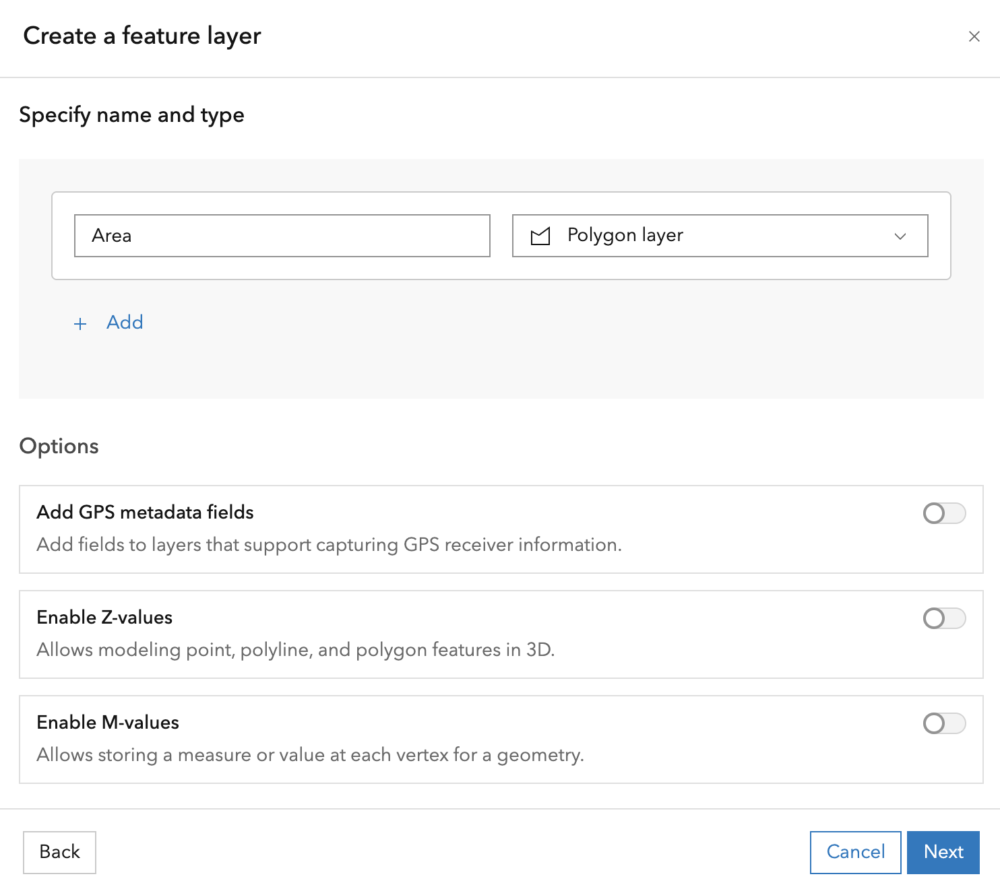
1. Give your layer a unique name, and optionally include *tags* or a *summary.* When you're done, click **"Save."**

    It is highly recommended that you fill in the tags and summary so that other users within your organization can discover and correctly interpret your feature layer. Collaboration is important! 
    {: .note}

    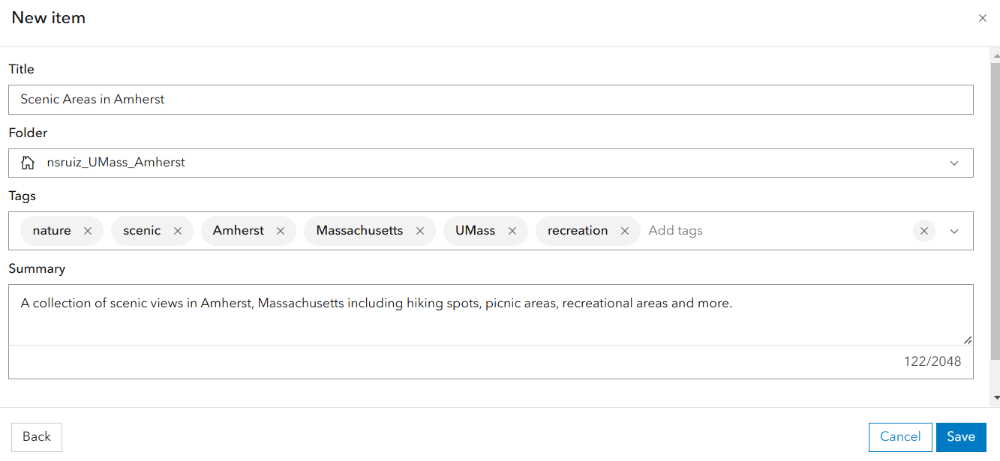
1. Right now, this is an empty feature layer, meaning it has no data associated with it. Add any desired fields to the layer’s attribute table by navigating to **Data** in the blue menu bar and then clicking the **Fields** tab. 
1. To add a field, click **Add**, then define the name of the field and choose the *data type*. Add as many fields as is necessary to your project. 
    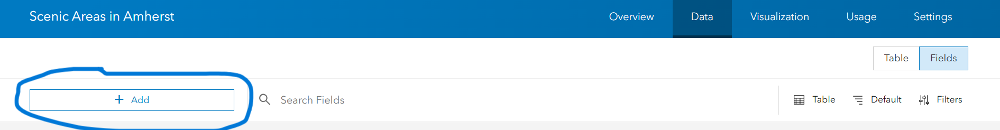
    
    Because I am looking at scenic areas in Amherst, I want to add a field that describes the name of the area I am analyzing. Thus, the data type will be text, or **“string"** in data science jargon. If I needed to create a numerical field, such as site area in kilometers, I would select **“float”** or **“double”** for the data type. 
    {: .note}
1. Return to the layer’s metadata page by clicking **Overview** in the blue menu bar. In the top right corner, click **“Open in map viewer.”** AGOL will launch Map Viewer and display the empty layer in the map.
1. To start adding features to the layer, open the **Edit** menu from the right menu bar, then activate the drawing tool by clicking **“New Feature.”** You can now start drawing new features directly into the map!
    
    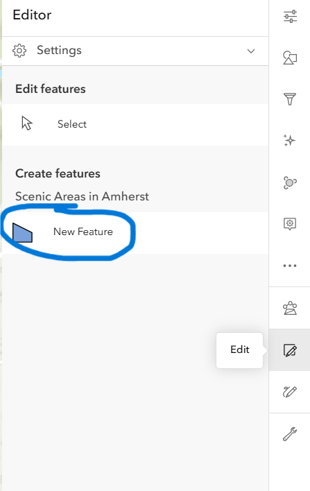
1. Once you’ve drawn a feature, AGOL prompts you to fill in whatever fields you added to the attribute table. Once you’ve done so, click **Create,** and you are ready to move on to your next feature. Don't forget to save!

---

Now you have some practice in importing data from the web, and creating your own data directly in AGOL. The next tutorial will cover analyzing your data. 

