# Creating Feature Layers
{: .no_toc }

How to import and create spatial data to make a feature layer
{: .fs-6 .fw-300 }

  

    Table of contents
  

  {: .text-delta }
1. TOC
{:toc}

---

## Overview 
{:toc}

In [Finding Data](finding-data.html), we learned how to add data from existing AGOL sources into our map.  Now, let’s create our own spatial layers! This section wil show how to create a vector layer by uploading a CSV file with coordinate information, uploading a shapefile, and creating a new vector layer from scratch.

As of this writing, AGOL does not yet support raster data uploads. If you need to upload a raster dataset to AGOL, you can use ArcGIS Pro desktop software to do so. For more information, check out Esri’s info on Publishing hosted imagery layers or this YouTube video, [Fastest and Easiest Way to Upload Rasters to ArcGIS Online.](https://www.youtube.com/watch?v=bQmOpcJrf0c)
{: .note}

---
## Import a CSV file with coordinates

CSV (or comma-separated values) files are a simple text file format for storing tabular data. CSV is an open alternative to common proprietary formats like XLSX (Microsoft Excel), making it a convenient way to share tabular data. AGOL can automatically generate a point layer from the CSV file if it contains latitude and longitude values. 

This is an example of a CSV listing the main campuses within the UMass system, along with their latitude and longitude coordinate locations. 

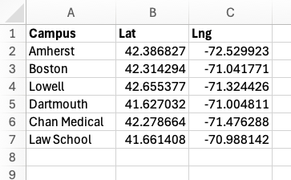

1. Follow along with this section by creating your own CSV file (you can do this in Google Sheets or Microsoft Excel) or upload a CSV file of your choice, provided spatial data information such as lat/lng coordinates are in the sheet.

1. In the left menu bar, click the **Add** menu, then select **Add layer from file**.

    

1. The ***Add Layer** window appears. Choose one of the options to upload the file from your computer, or drag and drop the file into the window

    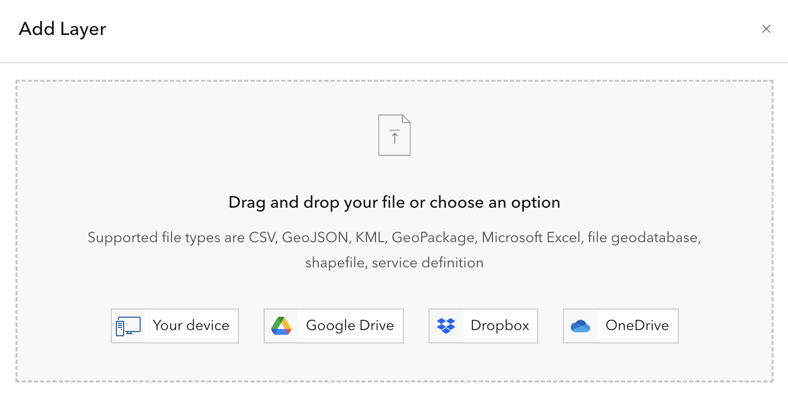

1. Choose **"Create a hosted feature layer and add it to the map"**.
1. In the **Fields** dialog, we can specify which fields to import, what they should be called, and what kind of data they contain. These fields will be used to create the layer’s attribute table. AGOL does a good job of guessing the name and type of data, but sometimes they need to be adjusted. Once everything looks good, click **Next**.

    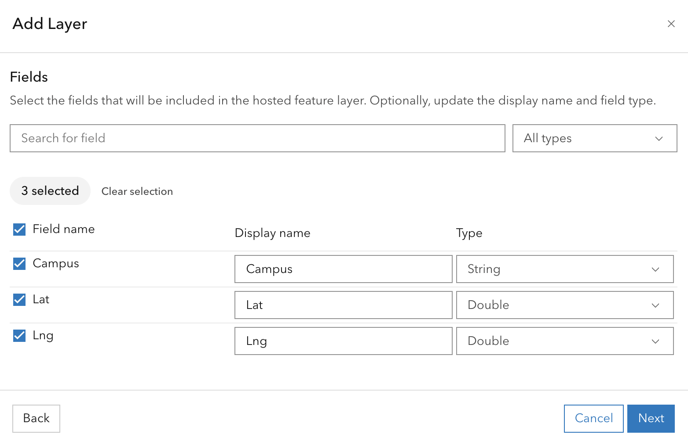

    For more information on data types, check out Esri’s documentation on [ArcGIS field data types](https://pro.arcgis.com/en/pro-app/latest/help/data/geodatabases/overview/arcgis-field-data-types.htm). 
    {: .tip}

1. In the **Location settings** dialog, confirm that latitude and longitude are correctly mapped to their respective fields. If necessary, choose **“Latitude and longitude”** from the dropdown menu and map the fields manually. Once complete, click **Next**.

    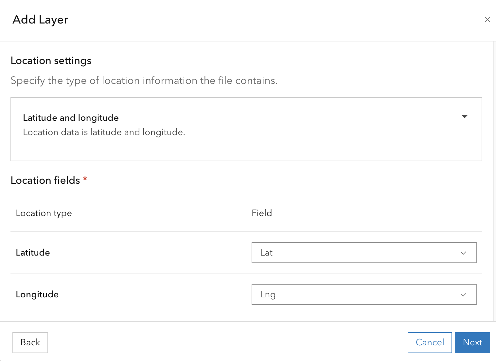

1. Give the file a unique name, then click **Create and add to map**.
1. AGOL will automatically generate a point layer and add it to your map, based on the coordinate values in the CSV file. The layer will be saved to your **Contents** folder in AGOL. 

    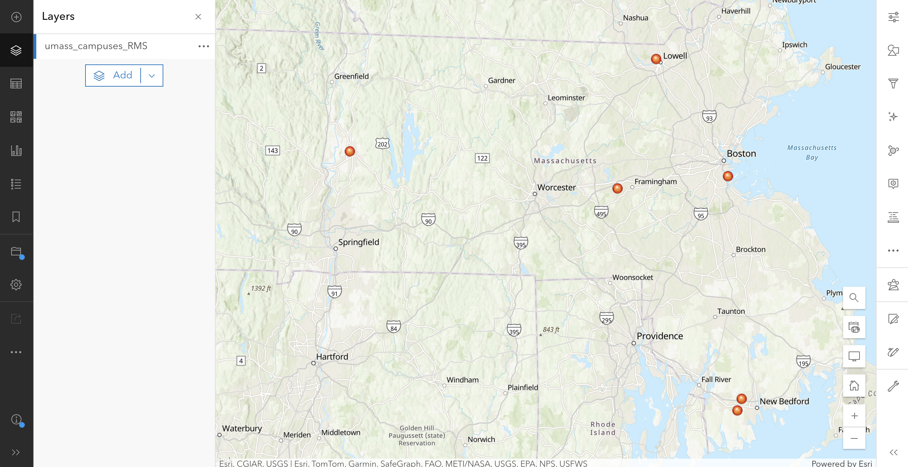

---
## Import a shapefile

Shapefiles are one of the most common data types for vector data (vectors are points, lines, or polygons). If you look for GIS data online, oftentimes you will be able to download it as a shapefile (file_name.shp).

1. Download or create a shapefile. This is an example shapefile of counties in Massachusetts, downloaded from [MassGIS](https://www.mass.gov/info-details/massgis-data-counties):

    

    Shapefiles are actually made up of *multiple files:* the files have the same filename, but  each has its own unique extension. GIS programs like AGOL need all of these files to be kept together in order to work properly. 
    {: .warn}

1. If you downloaded the shapefile as a .zip file, skip to the next step. If not, select all the components of the shapefile and zip them together.

    If you need help zipping a file, check out our tutorials on [Zipping files in Windows or Mac](../extras/). 
    {: .tip}

1. Back in the AGOL Map Viewer, in the left menu bar, click the **Add** button, then select **Add layer from file**.
1. The **Add Layer** window appears. Choose one of the options to upload the zipped file from your computer, or drag and drop it into the window. 
1. In the **File type** dialog, confirm that you are uploading a shapefile.

    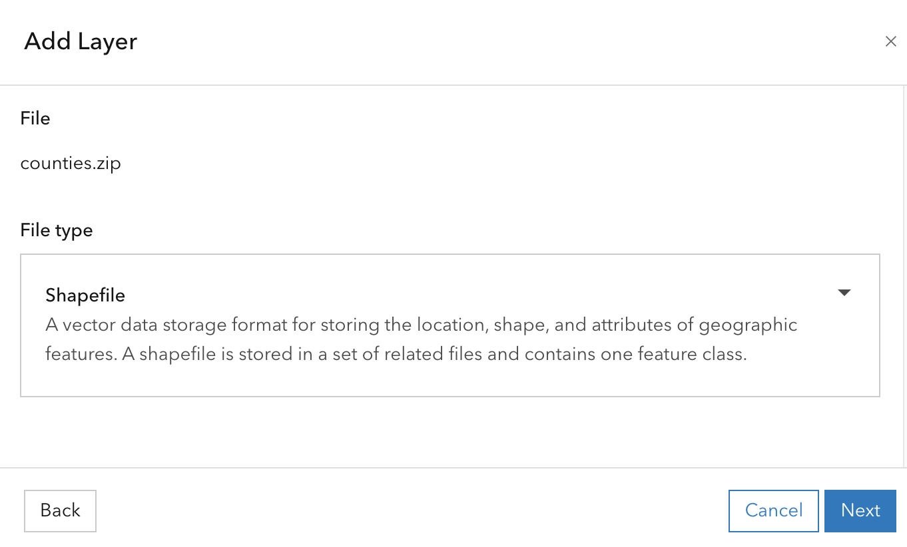

1. Give the file a unique name, then click **Create and add to map**.

    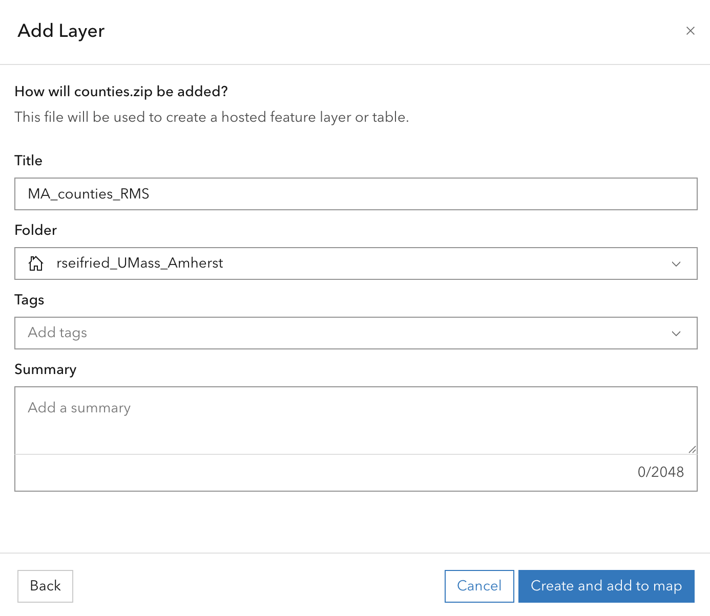

1. AGOL will automatically generate a feature layer and save it to your **Contents** folder. Click **Open in Map Viewer** to view the layer in a map. 
    
    

---

## Create a new spatial layer
{:toc}

There may be occasions when the layers you are looking for don’t exist yet, so you’ll need to create them yourself! There are a few options for this, depending on your project’s goals and to what extent you’d like to save or share data. 

### Sketch layer

A sketch layer is a quick way to map items out without creating and publishing an entire feature layer. These layers exist on your map, but they are not published to your AGOL account and cannot be exported by themselves. Sketch layers are saved within the map itself and will not be saved to your Content. 

1. In the Layers list, click **Add > Create Sketch Layer**, or in the right menu, click **Add sketch**.

     

1. An empty sketch layer will be created and the **Sketch** menu will open in the right menu bar.
    
    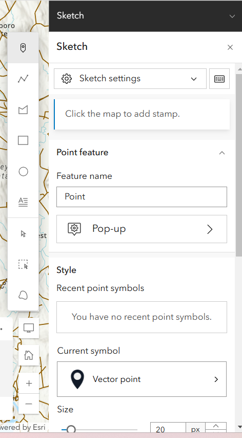

1. Decide what type of data you want to display – you can choose between point, line, polygon, rectangle, circle, or text. Choose the **sketch layer type** by activating the respective icon in the floating menu to the left of the Sketch menu. 
1. Give the sketch layer a name under **Feature name**.
1. Configure the way the sketch looks in the **Style** section.
1. For advanced style customization,in the right menu bar, expand the **Properties** and **Effects** menus to add visual effects to your symbols, change the size and color, and more.

When drawing line and polygon sketches, you can add individual vertices by clicking the map, or you draw a continuous line by click-dragging your cursor. This is helpful if you are drawing a squiggly or irregular feature, like a meandering river.
{: .tip}

Don't forget to save, early and often!
{: .warn}

### Feature layer

While sketch layers are an effective on-the-fly solution for creating immediate visualization, a feature layer is a persistent layer that stores geographic data along with attributes, allowing for editing, analysis, and sharing across multiple maps and users. If your project requires spatial analysis, collaboration and sharing with others, or more extensive field and attribute information, consider creating a feature layer instead of a sketch layer. 

Essentially, a **sketch layer** is for quick, interactive drawing on a map, while a **feature layer** is for managing and storing structured geospatial data. 
{: .note}

1. To create a feature layer, you must first exit the map viewer. First, save your work by clicking on the floppy disc icon in the left menu bar. In the top left corner of the screen, click the three lines icon and select **Content**.

    

1. In the upper left corner, click **New item**.

    

1. In the pop-up, click **Feature layer** to start creating an empty feature layer.

    
    
1. To create a new layer from scratch, click **Define your own layer**, then click **Next**.

    

1. In the **Specify name and type** window, give the layer a name that reflects what the data will represent (e.g. “Schools” or “Parks”) and select its data type (point, line or polygon) from the drop down menu.
    * Optionally, you can add GPS metadata fields to store coordinate data, define Z coordinates (if you are creating a 3D image), or define M values (vertices for geometric mapping). This tutorial will not be covering 3D mapping, but feel free to explore these features on your own! 
    * When you're ready, click **Next**.

    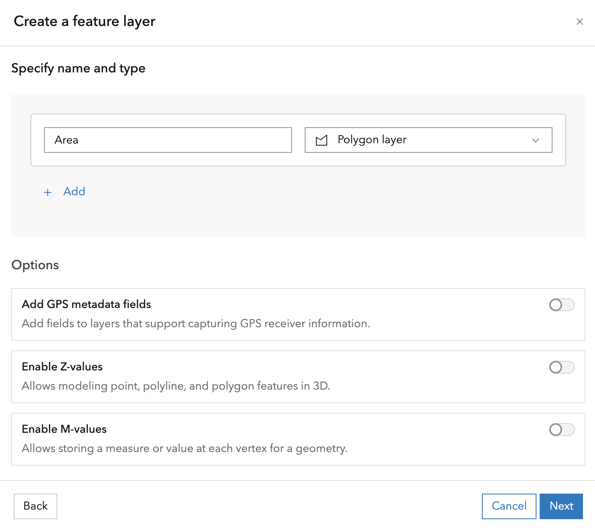

1. Give the layer a unique **title**, and optionally include **tags** or a **summary**. When you're done, click **Save**.

    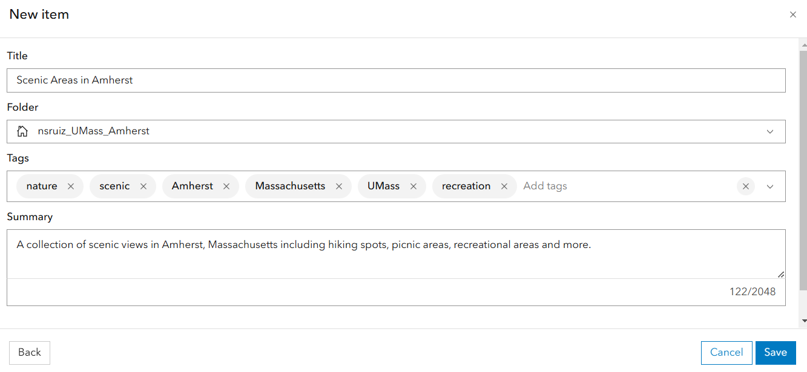

    It's a good idea to fill in the tags and summary so that other users within your organization can discover and correctly interpret your feature layer. 
    {: .note}

1. Right now, this is an empty feature layer, meaning it has no data associated with it. To add fields to the layer’s attribute table, navigate to **Data** in the blue menu bar and then click the **Fields** tab. 
1. In the top left corner, click **+ Add**, then define the name of the field and choose the **data type**. Add as many fields as you need to the table. 

    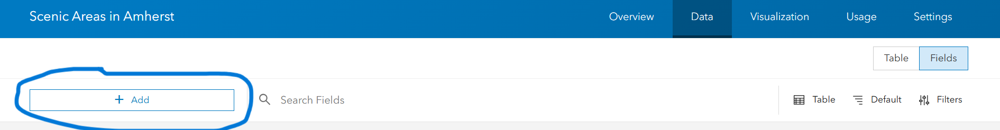

    To store text, choose **string** as the field type. For numbers without decimals, choose **integer**. For numbers with decimals, choose **double**. 
    {: .tip}
1. Return to the layer’s metadata page by clicking **Overview** in the blue menu bar. 
1. In the top right corner, click **Open in Map Viewer**. Map Viewer will launch and display the empty layer in the map.
1. To start adding features to the layer, open the **Edit** menu from the right menu bar, then activate the drawing tool by clicking **New Feature**. You can now start drawing new features directly into the map!
    
    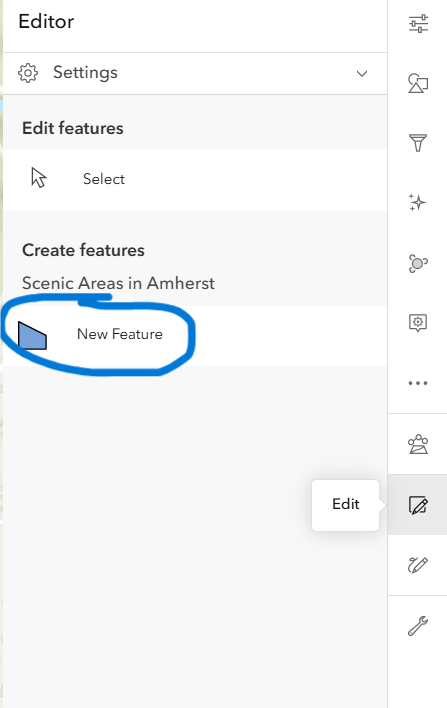

1. Once you’ve drawn a feature, you will be prompted to fill in whatever fields you added to the attribute table. Once you’ve done so, click **Create**, and you are ready to move on to your next feature. Don't forget to save your editss!

---
## Wrap-up
{: .no_toc}
Now you have some practice in importing data from a CSV file, importing data from the web, and creating your own spatial layers directly in AGOL. The next tutorial will show how to analyze your data. 

