# Altering a Layer's Symbology
{: .no_toc }

Now, the fun begins! Let's make a map. 
{: .fs-6 .fw-300 }

  

    Table of contents
  

  {: .text-delta }
1. TOC
{:toc}

---

## Change a layer's appearance
{:toc}

There are many different ways to visualize your data in a map! Let’s try changing the way our schools layer looks. Note that we’ll be focusing on a **point layer,** but you can follow a similar workflow to change the way a **polygon layer** looks, too.

### Visibility
{: .no_toc }

Click on the **three dots** next to the layer name, and then click **“Show properties.”** The Properties tab will open on the right side of the screen.

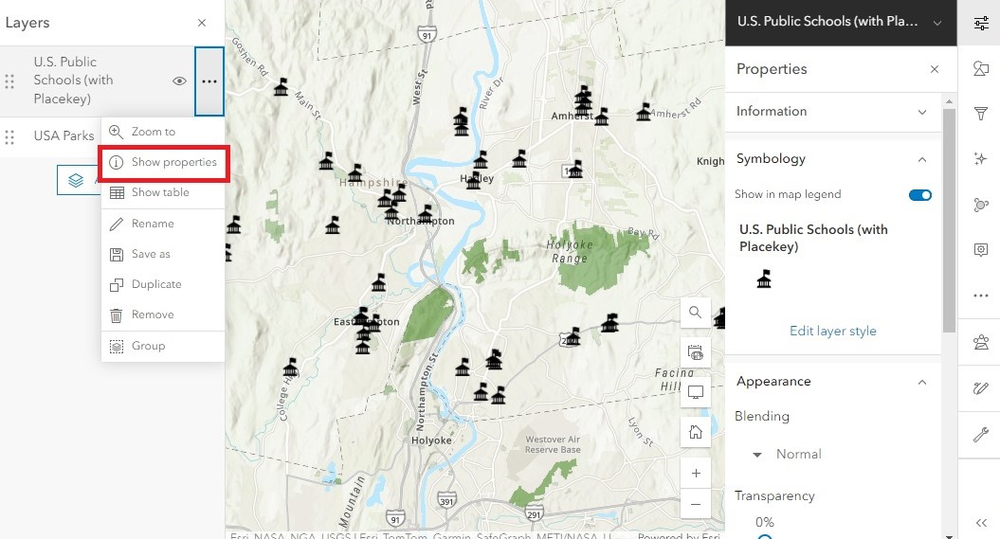

The Properties menu contains a snapshot of how the layer is being displayed on the map. This includes the current *Symbology* of the layer and other traits such as *Appearance* and *Visibility*. You can quickly modify the layer’s transparency and visible range through this menu. 

Under **Appearance,** let’s change the transparency to 50% to see how it affects the school icons:

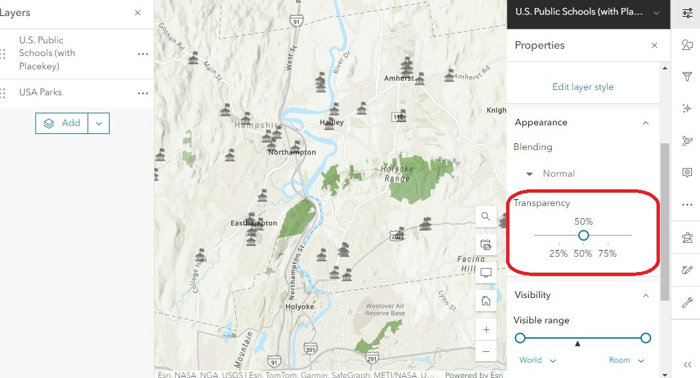

Under **Visibility**, the Visible range is used to define the zoom levels at which the layer will be visible. Drag either end of the visible range to change the layer’s visibility range. The map’s current zoom level is indicated with a black triangle underneath the bar.  If your map’s zoom level is outside the visible range, the layer will be hidden.

This setting is especially useful when publishing web maps with lots of data displayed at different scales. Try experimenting with different ranges to visualize how this affects your map as you zoom in and out.

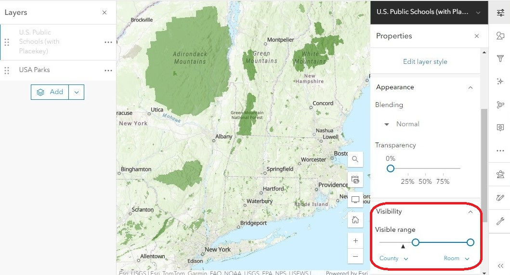

### Styles
{: .no_toc }

The Styles menu (symbolized as a triangle, square, and circle) allows us to change the way a layer’s icons appear. In the right menu bar, open the **Styles** menu.

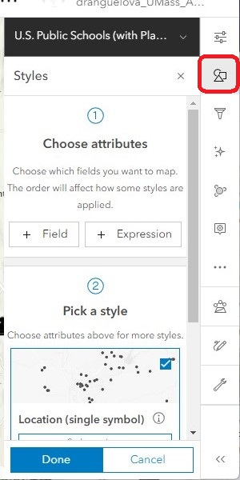

The default setting for point layers is for all the symbols to appear the same. To change the color and size of all points at the same time: 
1. under **Pick a style**, click **“Style options”** to open the Location (Single symbol) menu. 
1. Click on the symbol to open the Symbol style menu. This is where we can change the current symbol, change the size, fill color, outline color, etc.

  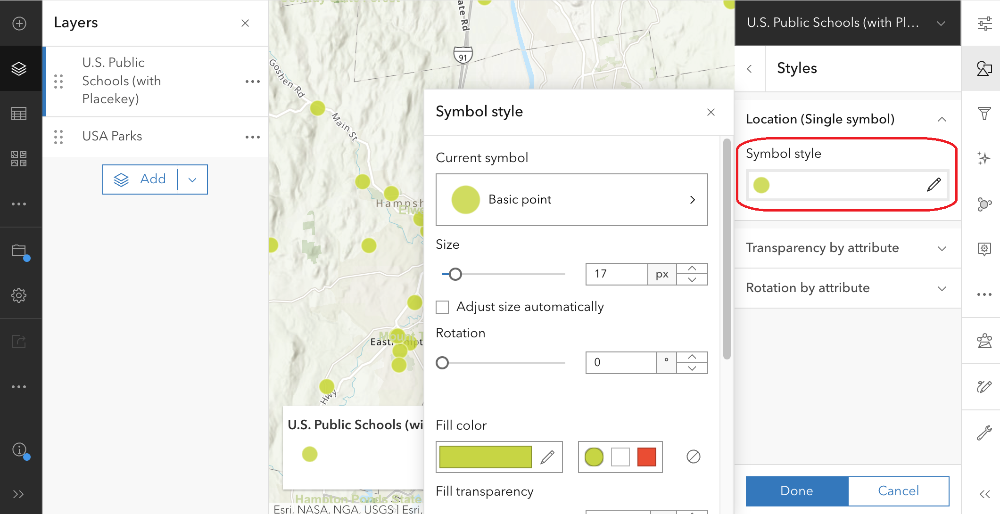
  
Oftentimes, we want to use data in the attribute table to automatically change the way the points appear in the map. Let’s say we want the icons to reflect the level of education of each school.
1. In the main **Styles** menu, under **Choose attributes**, click **“+ Field”** to open the fields menu. 
1. Check the “Level” field, then click “Add.” The school icons automatically change to colored dots, and a legend appears in the lower left corner indicating which color represents which level. This is the default style when varying symbology is used.

  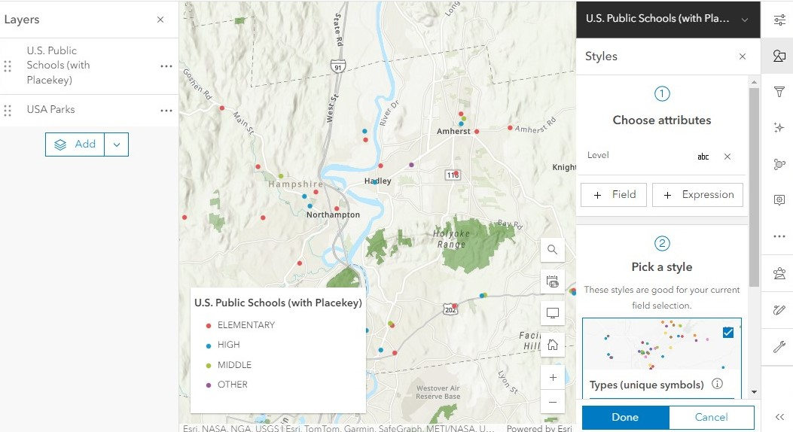

  To modify the color scheme, under `Pick a style > Types (unique symbols)`, click on **“Style options”** to open the **Types (Unique symbols)** menu. 

  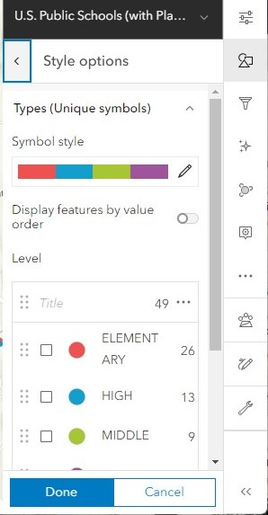
1. Click on the **“Symbol style”** color ramp. This is where we can change the current symbol, change the size, color ramp, outline color, etc.

  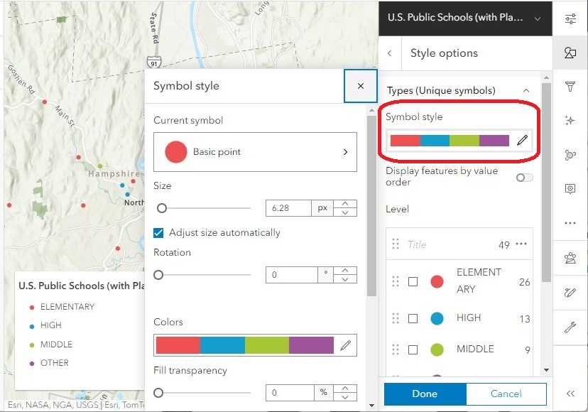
1. To change the current symbol, click on **“Basic point."**
1. In the category drop-down menu, select **“POI Basic.”**
1. Select the schoolhouse symbol, then click **“Done.”**

    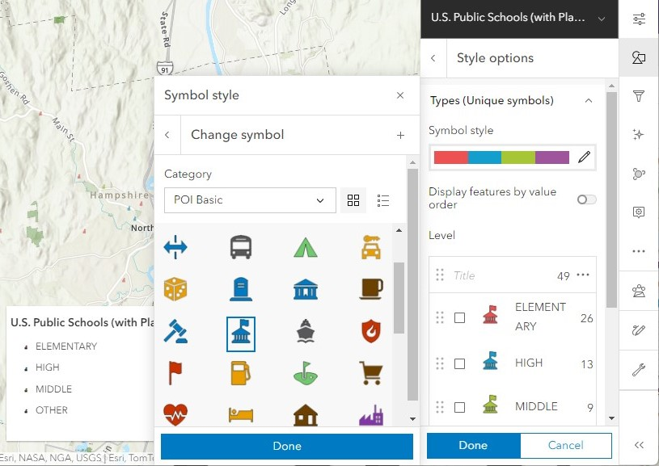
1. Change the color ramp by clicking on the **“Colors”** menu. In the category drop-down menu, you can filter specific kinds of color ramps, such as colorblind-friendly options.

  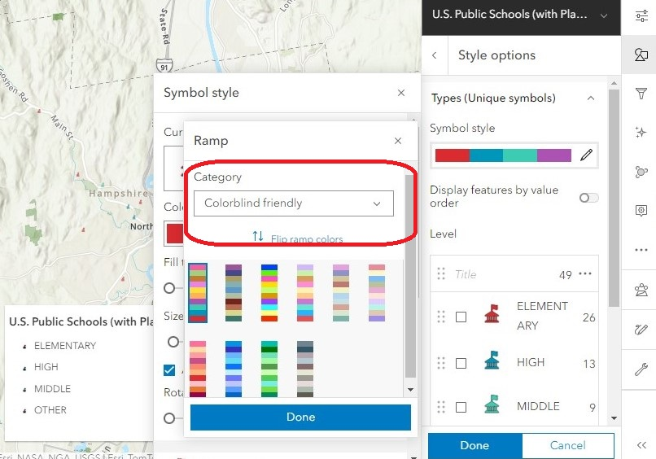
1. The last thing we’ll do is change the size of our icons to make them easier to see. Set the **“Size”** to 30 px, then close the symbol style menu.

### Effects
{: .no_toc }

Effects are another way to change a layer’s appearance. In the right menu bar, click the **Effects** menu (symbolized as a sparkle). Here you will find a variety of options to further customize a layer’s appearance, from adding glows, blurs and shadows, to changing the saturation and hue of their colors. 

Here’s an example of what the Bloom effect looks like with the schools layer:

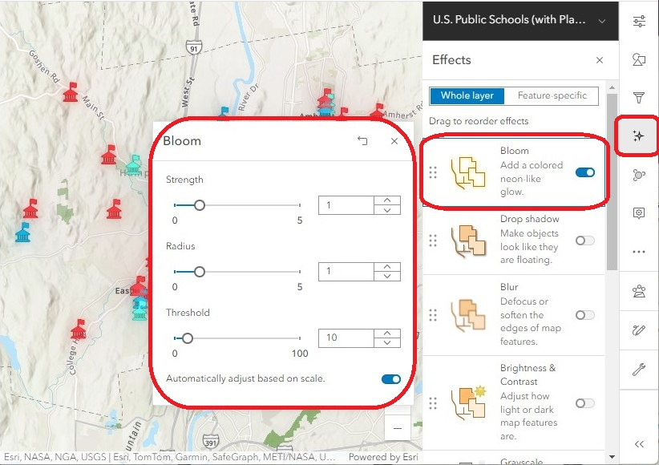

Explore the different symbology options to customize your map in a unique way!

### Pop-ups
{: .no_toc }

Clicking on a feature will bring up a pop-up window with a glimpse of that feature’s information stored in the attribute table. We can use the Pop-up menu to customize the way that information is displayed.

1. Click on a few different schools. Notice that the pop-up window displays information about each specific school we click on. This layer has a lot of attribute information, which makes the pop-up feel crowded. We can edit the pop-up to show only what we feel is relevant and leave the rest out.

  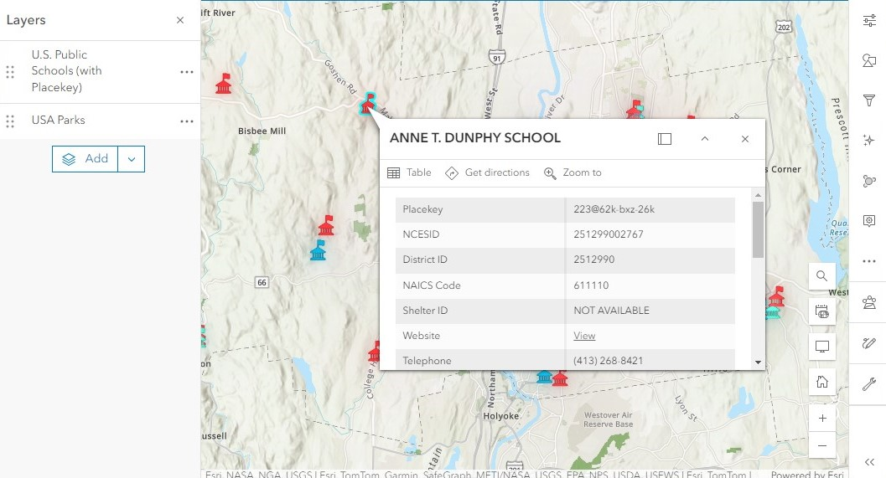
1. In the right menu bar, click on the **Pop-ups** menu.

  
1. There are a few different ways we can customize the pop-up:
    1. At the top, we can toggle the switch to **enable** or **disable** pop-ups altogether.
    1. Under Options, we can build an **attribute expression** to create custom messages based on existing data in the attribute table. This is a more advanced feature that you can explore beyond this workshop. 
    1. **Title** is used to automatically generate a heading at the top of the pop-up window. By default, the schools layer uses the {NAME} field to populate the title. To change which field shows up at the title, you can simply replace it with your field of choice. Make sure to enclose the field name in curly brackets {}. 
    1. The **Fields** list shows which fields from the attribute table are visible in the pop-up window.
1. Under **Fields list,** click **“Select fields”** to view all of the available fields.

  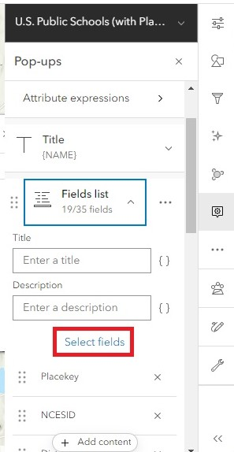
1. To reduce the clutter in the pop-up window, uncheck the following fields: Placekey, NCESID, County FIPS, NAICS Code, Source, Source Date, District ID, and Shelter ID. Click “Done.”
1. Under **Fields list,** click and hold the six dots to the left of any field name to rearrange the field order. Move the Level field to the top of the list. Notice that any changes made in the Pop-up manu are immediately applied to the open pop-up window, allowing you to preview the changes you make. 

  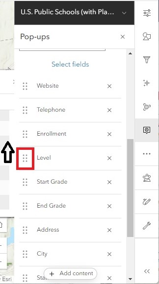
1. At the bottom of the Pop-ups menu, click “+ Add content” to include additional content like charts, images, and extra text.

  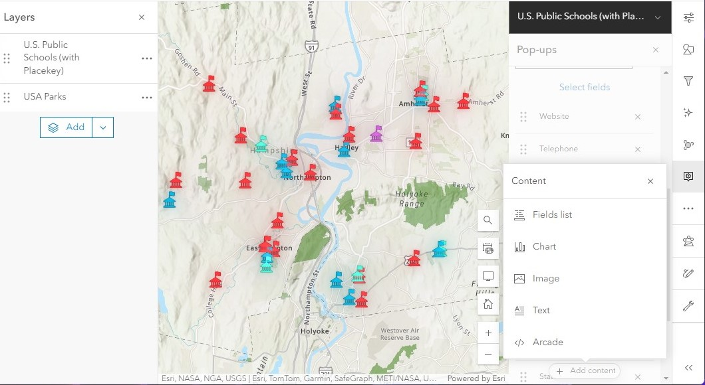

### Labels
{: .no_toc }

Labels are a useful way to show relevant information from the attribute table directly on the map.
1. In the right menu bar, open the **Labels** menu (symbolized by a tag). 

  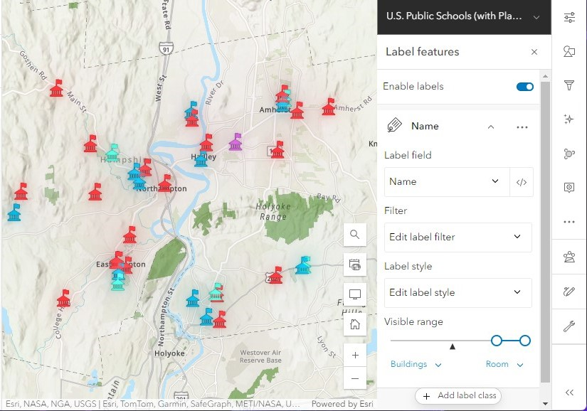
1. In the **Label field** drop-down menu, select the field in the attribute table that will be used to populate the labels. The default for the schools layer is “Name,” which makes sense to leave as is.
1. Labels have their own visibility range. The default is usually set to a smaller zoom scale because labels tend to take up a lot of space, and the map can become crowded if many labels are being displayed at one time. Drag the **Visible range** slider so that the map’s current zoom level is within the range. Each school is now labeled using its corresponding information from the “Name” field in the layer’s attribute table. Since some of the labels are hard to see, let’s edit the label style.

  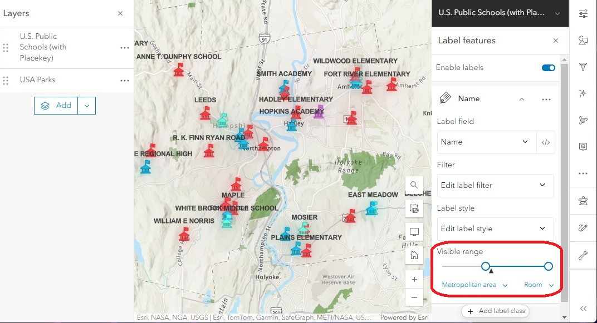
1. Under **Label style,** click **“Edit label style”** to open the Label style menu.
1. Apply a halo effect by toggling on **Halo.** This adds a white background behind the label text to make it easier to read.
1. Under **Placement,** change the drop-down to “Center center.” This moves the position of the labels to be displayed on top of each point.

  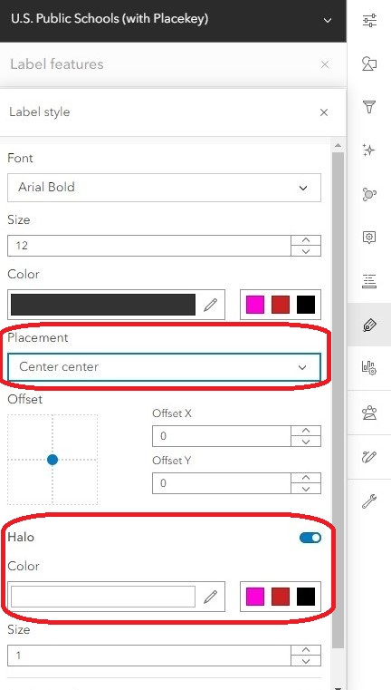
1. Continue experimenting with these settings to find a style that you like for your labels!

