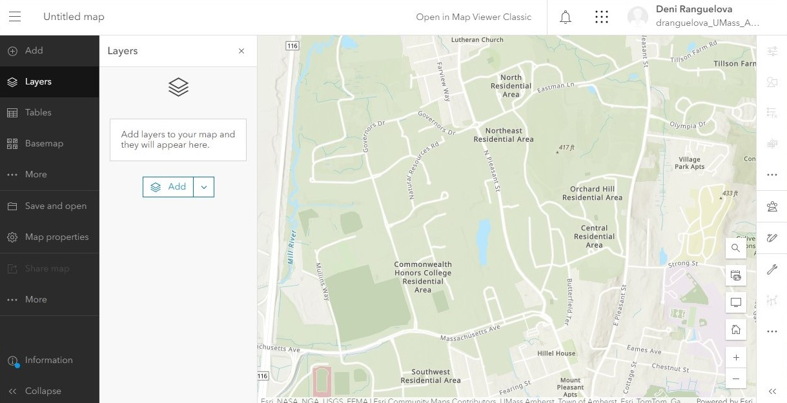
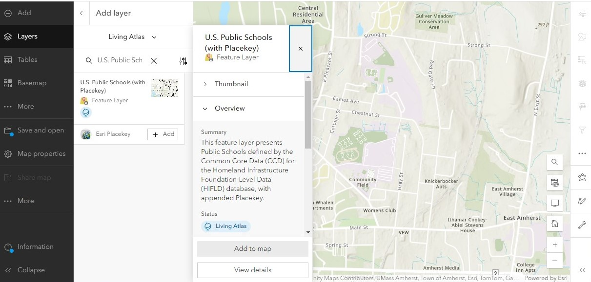
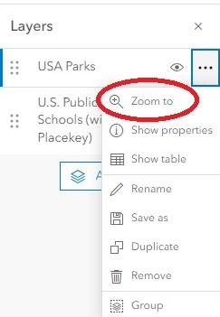
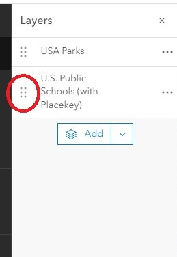
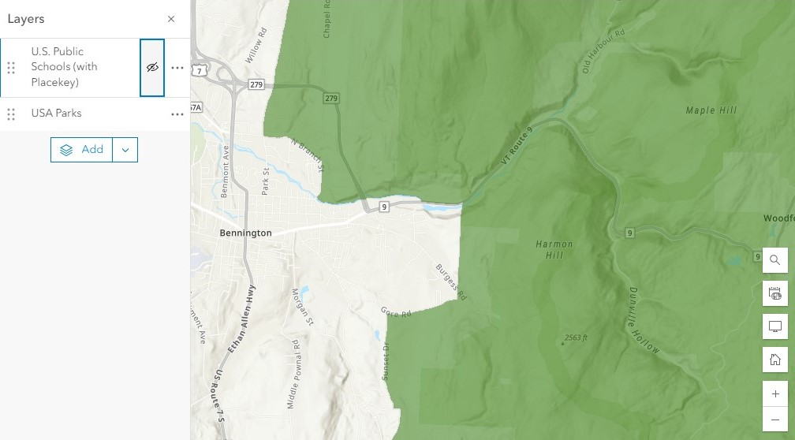
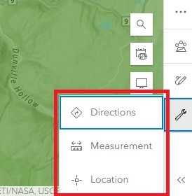
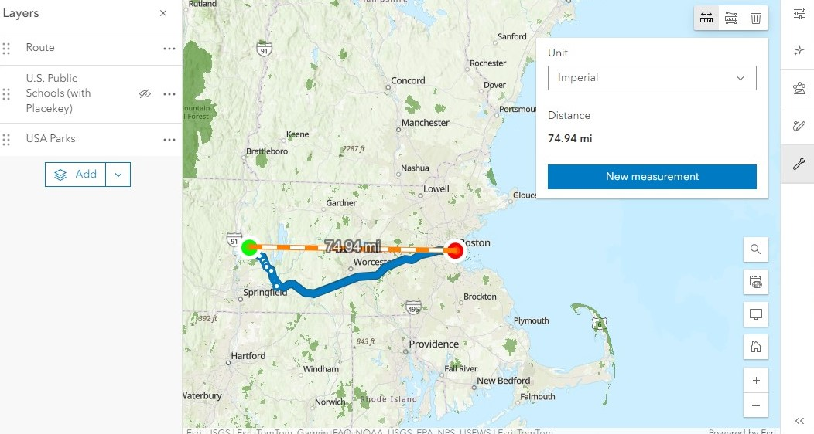
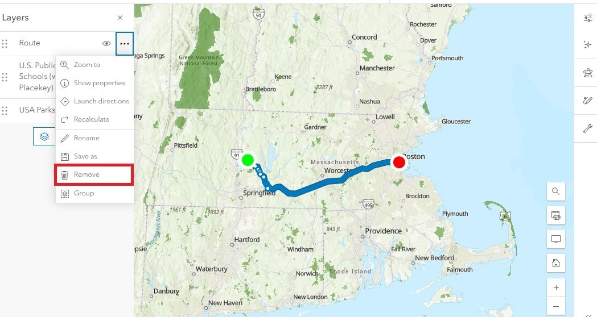

# Using AGOL's Map Viewer
{: .no_toc }

Let's get familiar with AGOL's built-in web map viewer. 
{: .fs-6 .fw-300 }

  

    Table of contents
  

  {: .text-delta }
1. TOC
{:toc}

---

## Open Map Viewer
{:toc}

To get started with making a web map, click **Map** in the top menu bar to launch the AGOL Map Viewer.

Within the map interface, there are two vertical menu bars on the left and right sides of the map.
* The **left menu bar** contains tabs for adding data, viewing and organizing layers and tables, changing the basemap, viewing any charts you may have created for your data, viewing the legend, and saving and sharing the map.
* The **right menu bar** has tabs that allow you to change the appearance of your data, edit your data, and analyze your data.

---

## Add a layer from AGOL 
{:toc}

### What are layers?
{: .no_toc }

It can be helpful to think of GIS as a layer cake, which allows us to take the real world and turn it into a collection of abstract, spatial data layers. As in the image below, layers that are at the bottom of the list are drawn at the bottom of the cake. Layers at the top of the list are drawn on top.

<figcaption><a href="https://saylordotorg.github.io/text_essentials-of-geographic-information-systems/s05-03-geographic-information-systems.html">Campbell and Shin 2011: Figure 1.8</a></figcaption>

### Add a Layer
{: .no_toc}

Let’s add a layer from AGOL. For this demo, we will be looking at <u>public schools</u> and <u>parks</u> in the United States, but feel free to search for any layer you like.

**Add the first layer:**
1. In the left menu, navigate to the **Layers** tab.
1. Click the **Add** button.
1. The default search setting is set to **My Content.** Change it to **Living Atlas** to browse through Esri’s curated datasets. 
1. Use the search bar to look for "U.S. Public Schools (with Placekey)." 
1. When you find the layer, click **Add to Map**. 

    

**Add a second layer:**

1. Search for “USA Parks.” Add that to your map as well.
1. Click the **back arrow** to exit out of the search menu. 

Your map should now have two layers spanning the entire United States: one showing the location of public schools and towns (points) and another showing parks (polygons).

---

## Navigate around the map
{:toc}

In this interface, you can **click and drag** the map to move around and see different locations. 

### Zoom in and out

Use the scroll wheel on the mouse to **zoom in and out**. You can also zoom in and out using the + and - buttons in the lower right corner of the map.

Notice that as you zoom into the map, you can see more details about the specific area you’re viewing, such as roads and town names that are not present at a zoomed-out level. This is also the case with more complex layers. If a layer has many points in the same area, not all of them will be visible when the map is zoomed out.

### Zoom to the extent of a layer

You can also quickly zoom in or out to see an entire layer in the map:
1. In the **Layers** tab, click the **three dots** next to a layer's name.
1. Click **Zoom to** to zoom to the extent of the whole layer. In this case, the mpa should zoom out to show the entire US. 

### Reorder layers

Layers in GIS function like layers in a cake. Layers at the bottom of the list are drawn at the bottom and can therefore be "covered" by any layers above it in the case of spatial overlap. 

1. In the **Layers** tab, click and drag the **six dots** to the left of the layer name.
1. Reorder the layers in the list to change the drawing order in the map.

### Hide a layer

You can also hide layers temporarily so you can focus on other layers by clicking the **eyeball symbol** to the right of the layer name.

### Use basic map tools

In the right menu, click the **wrench icon** to access these Map Tools: **Directions, Measurement** or **Location.**

The **Directions** tool works the same way as any navigation app on your phone. Input a Start and End location, and the tool will automatically calculate the estimated drive time, distance, and directions from the first location to the second. You can also add multiple destinations, change your departure time, and change the method from “driving time” to another transportation method. Notice that this tool outputs a new layer into your layers list called "Route." Every time you run this tool, it will be saved as a new Route layer.

The **Measure** tool gives a rough distance between two points. Simply click at your starting location and double-click at your end location to calculate the distance. 

Because we are not using specific addresses or latitude/longitude coordinates but are relying on a rough mouse click, this will not be 100% accurate.
{: .note}

The **Location** tool displays a pop-up window in the top right corner of the map which shows the coordinates of the location where your cursor is hovering. You can change the units from XY (the latitude and longitude) to decimal degrees or another coordinate system.

### Remove a layer

Done with a layer? you can remove it from the map at any time.
1. In the **Layers** tab, click the **three dots** to the right of a layer name
1. Click **“Remove.”**

  

Remember that while Living Atlas layers are easy to find and re-add to your map, layers that you create from a map tool like Directions will need to be re-calculated if you decide you want to add them back in.
{: .warn}

