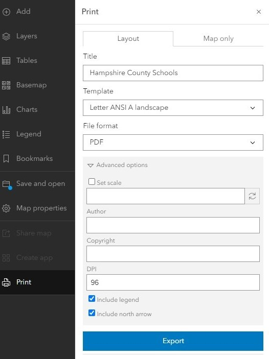

# Sharing Web Maps and AGOL Projects
{: .no_toc }

Because Esri has rules, and we shall follow them. 
{: .fs-6 .fw-300 }

  

    Table of contents
  

  {: .text-delta }
1. TOC
{:toc}

---

Let’s say you’ve finished an AGOL project and want to share it with peers, or let’s say you are working collaboratively on a project and want to give editing permission to others. AGOL lets you do this, with some limitations. 

---

### Save and Export Your Web Map
{: .no_toc }

It is always a good idea to save our work. Save early, save often!

To share a web map you've worked on, start inside the map viewer. In the left menu bar, click the **Save and Open menu** (symbolized as a folder). Click **“Save as”** to give the map a title, then **“Save”** to save it to your AGOL content space. The next time you navigate to the **Contents** in your AGOL account, you will see your map saved there for future use.

To export a copy of the map as an image, in the left menu bar click the **Print** menu. 

Optionally give the map a title, specify the size and orientation of the output image, and choose the exported file format. 

Under **Advanced options,** we can include metadata (author, copyright), change the export resolution (DPI) or output spatial reference, and toggle on the legend and north arrow.

When your settings are to your liking, click the blue **“Export”** button. Your file will appear in the **Exports tab,** where you can then download it to your computer. Below is an example of an exported map, including necessary map elements such as a legend, North arrow, scale bar and title.

---

## Sharing within your organizaton
{:toc}

Your "organization" in the case of UMass, refers to all UMass users. This means your classmates, professors, faculty and staff who are able to access AGOL through the UMass portal. To share a project with your organization:

1. First, exit the map viewer if you have it open, and navigate to your **Content** page. 

    
1. Select the items you'd like to share by clicking on the checkbox to the left of the iten name.
1. Click the **"share"** button. The following pop-up will appear:

    
1. Select **"organization"** 

Now, anyone with a UMass AGOL account will be able to see and use your data! 

---

## Sharing across organizations
{:toc}

Unfortunately, AGOL currently does not support sharing data across different organizations unless it’s through an official collaboration. AGOL administrators can create a group that allows other organizations’ members to join. Reach out to Joe Kopera (jkopera@umass.edu) or Becky Seifried (rseifried@umass.edu) if this is something you’d like to inquire about.

Likewise, sharing data is not possible if the entity you are sharing it with does not have the same type of license as you. For the purposes of this tutorial, we are assuming that you will be sharing projects within the UMass organization exclusively. 

---

Now you should have a basic understanding of navigating AGOL’s interface, importing layers from outside sources, creating your own layers, and performing basic spatial analysis. Visit the [GIS Help Desk](https://gis.library.umass.edu/learning-gis/get-help/) to learn more, and start putting your skills into practice. Happy mapping! 

