# Making a Web Map in AGOL
{: .no_toc }

Now, the fun begins! Let's make a map
{: .fs-6 .fw-300 }

  

    Table of contents
  

  {: .text-delta }
1. TOC
{:toc}

---

## Open Map Viewer
{:toc}

To get started with making a web map, click **Map** in the top menu bar to launch the AGOL Map Viewer.

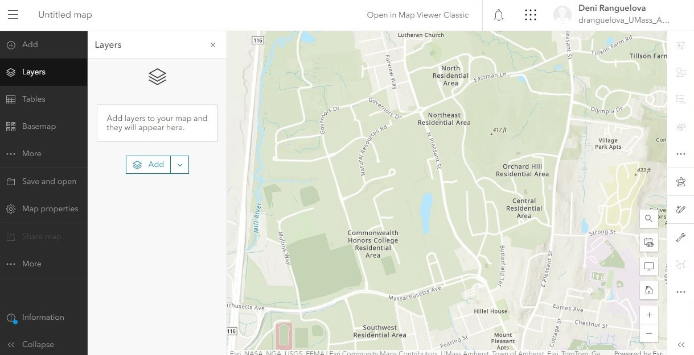

Within the map interface, there are two vertical menu bars on the left and right sides of the map.
* The **left menu bar** contains tabs for adding data, viewing and organizing layers and tables, changing the basemap, viewing any charts you may have created for your data, viewing the legend, and saving and sharing the map.
* The **right menu bar** has tabs that allow you to change the appearance of your data, edit your data, and analyze your data.

---

## Add a layer from AGOL 
{:toc}

### What are layers?
{: .no_toc }

It can be helpful to think of GIS as a layer cake, which allows us to take the real world and turn it into a collection of abstract, spatial data layers. As in the image below, layers that are at the bottom of the list are drawn at the bottom of the cake. Layers at the top of the list are drawn on top.

<figcaption><a href="https://saylordotorg.github.io/text_essentials-of-geographic-information-systems/s05-03-geographic-information-systems.html">Campbell and Shin 2011: Figure 1.8</a></figcaption>

### Add a Layer
{: .no_toc}

Let’s add a layer from AGOL. For this demo, we will be looking at <u>public schools</u> and <u>parks</u> in the United States, but feel free to search for any layer you like.

**Add the first layer:**
1. In the left menu, navigate to the **Layers** tab.
1. Click the **Add** button.
1. The default search setting is set to **My Content.** Change it to **Living Atlas** to browse through Esri’s curated datasets. 
1. Use the search bar to look for "U.S. Public Schools (with Placekey)." 
1. When you find the layer, click **Add to Map**. 

    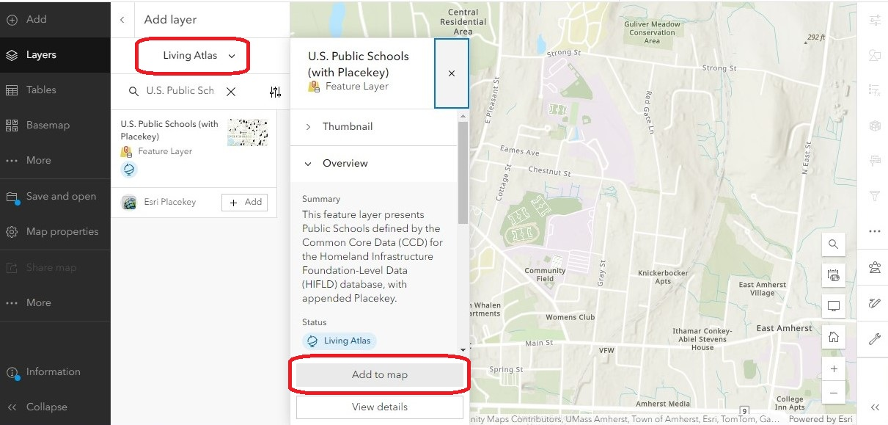

**Add a second layer:**

1. Search for “USA Parks.” Add that to your map as well.
1. Click the **back arrow** to exit out of the search menu. 

Your map should now have two layers spanning the entire United States: one showing the location of public schools and towns (points) and another showing parks (polygons).

---

## Navigate around the map
{:toc}

In this interface, you can **click and drag** the map to move around and see different locations. 

### Zoom in and out
{: .no_toc }

Use the scroll wheel on the mouse to **zoom in and out**. You can also zoom in and out using the + and - buttons in the lower right corner of the map.

Notice that as you zoom into the map, you can see more details about the specific area you’re viewing, such as roads and town names that are not present at a zoomed-out level. This is also the case with more complex layers. If a layer has many points in the same area, not all of them will be visible when the map is zoomed out.

### Zoom to the extent of a layer
{: .no_toc }

You can also quickly zoom in or out to see an entire layer in the map:
1. In the **Layers** tab, click the **three dots** next to a layer's name.
1. Click **Zoom to** to zoom to the extent of the whole layer. In this case, the mpa should zoom out to show the entire US. 

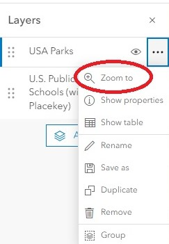

### Reorder layers
{: .no_toc }

Layers in GIS function like layers in a cake. Layers at the bottom of the list are drawn at the bottom and can therefore be "covered" by any layers above it in the case of spatial overlap. 

1. In the **Layers** tab, click and drag the **six dots** to the left of the layer name.
1. Reorder the layers in the list to change the drawing order in the map.

### Hide a layers
{: .no_toc }

You can also hide layers temporarily so you can focus on other layers by clicking the **eyeball symbol** to the right of the layer name.

### Use basic map tools
{: .no_toc }

In the right menu, click the **wrench icon** to access these Map Tools: **Directions, Measurement** or **Location.**

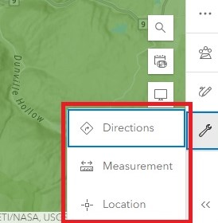

The **Directions** tool works the same way as any navigation app on your phone. Input a Start and End location, and the tool will automatically calculate the estimated drive time, distance, and directions from the first location to the second. You can also add multiple destinations, change your departure time, and change the method from “driving time” to another transportation method. Notice that this tool outputs a new layer into your layers list called "Route." Every time you run this tool, it will be saved as a new Route layer.

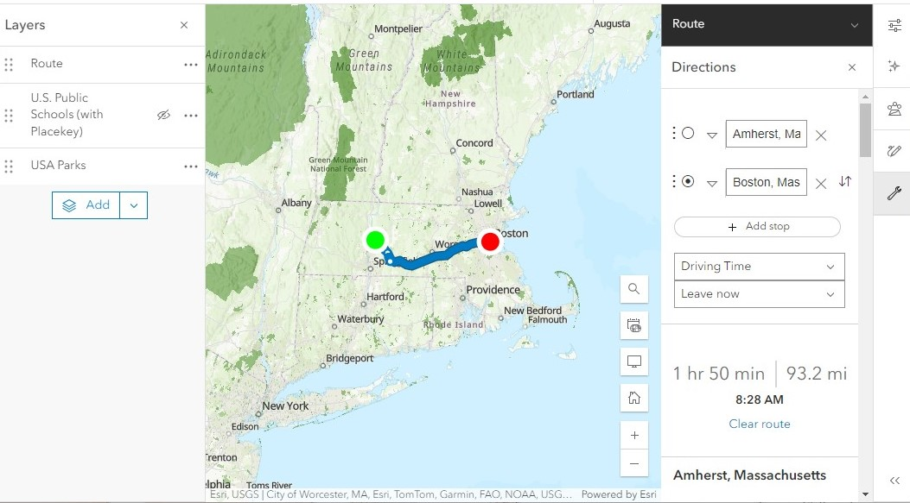

The **Measure** tool gives a rough distance between two points. Simply click at your starting location and double-click at your end location to calculate the distance. 

Because we are not using specific addresses or latitude/longitude coordinates but are relying on a rough mouse click, this will not be 100% accurate.
{: .note}

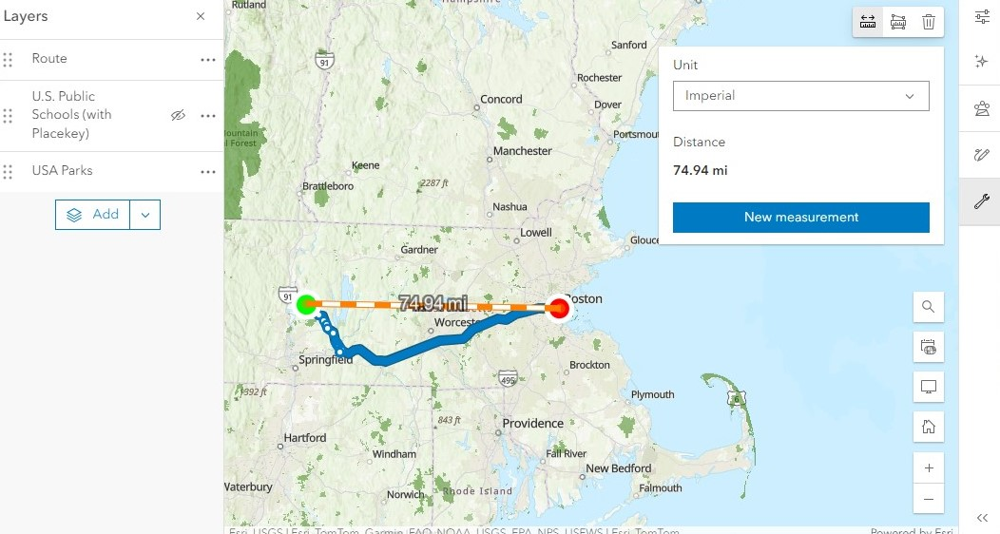

The **Location** tool displays a pop-up window in the top right corner of the map which shows the coordinates of the location where your cursor is hovering. You can change the units from XY (the latitude and longitude) to decimal degrees or another coordinate system.

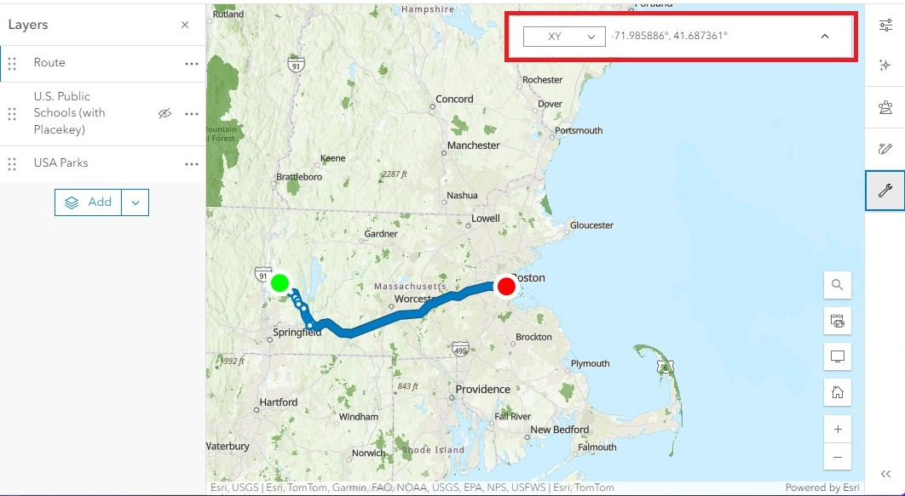

### Remove a layer
{: .no_toc }

Done with a layer? you can remove it from the map at any time.
1. In the **Layers** tab, click the **three dots** to the right of a layer name
1. Click **“Remove.”**

  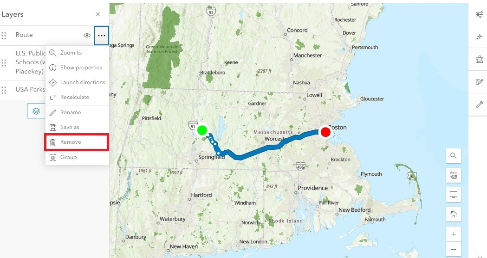

Remember that while Living Atlas layers are easy to find and re-add to your map, layers that you create from a map tool like Directions will need to be re-calculated if you decide you want to add them back in.
{: .warn}

---

## Explore the attribute table
{:toc}

An attribute table is essentially a spreadsheet that stores information about the features in a vector layer. 

Each **row** in the attribute table corresponds to a specific feature. If we look at the U.S. Public Schools layer, each row represents one school. Each **column** (or “field”) contains a specific kind of information about that feature, such as the school’s name, address, type, etc. 

### Open an attribute table
{: .no_toc }
1. Click on the **three dots** next to the layer name
1. Select **Show Table.** The attribute table will appear at the bottom of the screen. 

    

    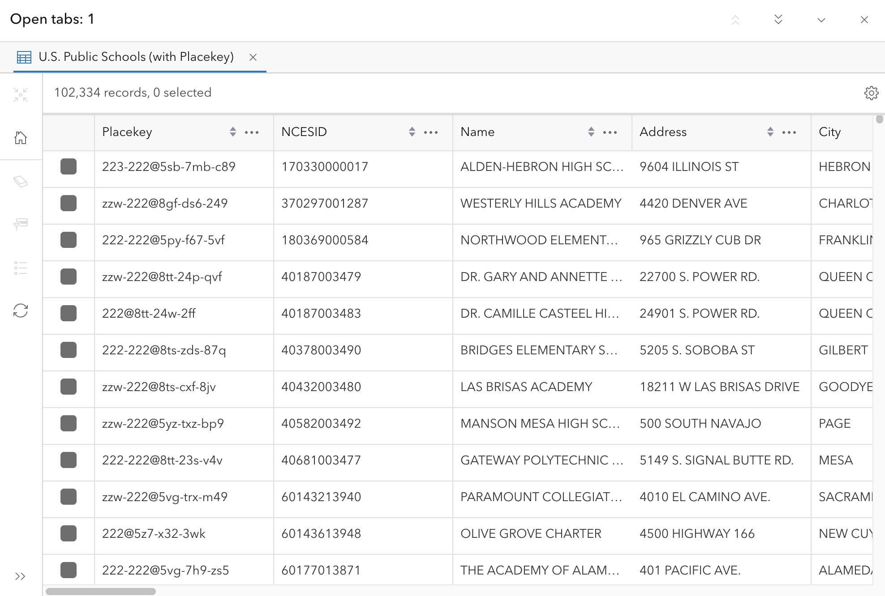

1. Use the scroll bars to browse through the information.
1. When you’re done, click the **X** at the top right corner of the attribute table to close it.

### Show and hide fields
{: .no_toc }

At times you may want to show or hide fields in the attribute table to make it easier to find the information that is most relevant to you. 

In the top right corner of the table, click the **gear icon** to bring up the Field Visibility menu. Checking a field will make it visible, and unchecking it will hide it.

### Sort the attribute table
{: .no_toc }

Sorting the attribute table can be useful if you are looking for a specific feature in the layer. To sort the table, click a column heading and select **Sort ascending** or **Sort descending.** This will automatically sort the table alphabetically (for text fields) or in numerical order (for number fields).

### Zoom to selection
{: .no_toc }

Once you find a specific feature, you can quickly pan and zoom the map to it using the attribute table.

Click the **checkbox** next to the desired feature to select it, then in the left panel click **Zoom to selection.** The map will automatically pan and zoom to your chosen feature.

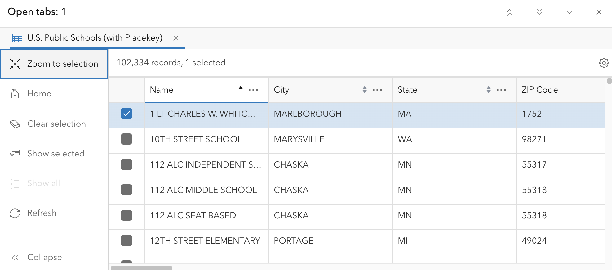

### Filters
{: .no_toc }

Let’s say that we only need the information for schools in Hampshire County, Massachusetts. Looking at the entire dataset, which contains more than 102,000 features, might make it hard to find the information we need. To focus on the specific records we want, we can use a filter to specify which criteria we want to view, and exclude everything else.

1. In the Layers list, click on the schools layer to select it.
1. In the right menu bar, open the **Filter** (funnel symbol) and click **Add New**.

    

1. Use the first drop-down menu to define the field that contains the information we are looking for. Since we are looking for schools in a specific state, we will use the **“State”** field. 
1. The second drop-down menu specifies the **operator,** which tells the tool how to look for the information. To look for an exact match, we will use the **“is”** operator.

    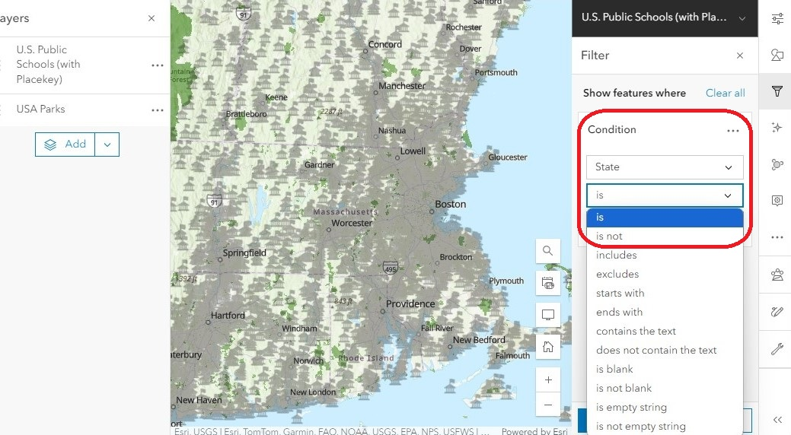

1. The last drop-down menu shows us all the unique values in our chosen field. From the list, select **“MA.”** Together, this builds the condition: “show us only the schools where the *State is MA.”* 

    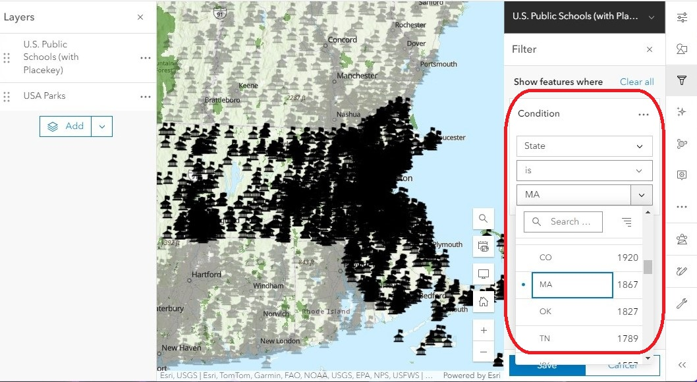

1. We can add more conditions to refine the filter even more. Click **Add new** below the first filter and specify the condition “where *County is Hampshire.*” 

    

1. Zoom out to show the US and change the relationship from "“All of the following are true” to “Any of the following are true.” 
    * When *all* the conditions must be true, only schools in Hampshire County, MA will be shown – a total of 49 schools.
    * If *any* of the conditions can be true, the filter will show all the schools in any Hampshire County in the U.S., plus all the schools in Massachusetts – a total of 1, 881 schools.
1. Click **Save** to apply this filter to both the map and the attribute table. 

---

## Change a layer's appearance
{:toc}

There are many different ways to visualize your data in a map! Let’s try changing the way our schools layer looks. Note that we’ll be focusing on a **point layer,** but you can follow a similar workflow to change the way a **polygon layer** looks, too.

### Visibility
{: .no_toc }

Click on the **three dots** next to the layer name, and then click **“Show properties.”** The Properties tab will open on the right side of the screen.

The Properties menu contains a snapshot of how the layer is being displayed on the map. This includes the current *Symbology* of the layer and other traits such as *Appearance* and *Visibility*. You can quickly modify the layer’s transparency and visible range through this menu. 

Under **Appearance,** let’s change the transparency to 50% to see how it affects the school icons:

Under **Visibility**, the Visible range is used to define the zoom levels at which the layer will be visible. Drag either end of the visible range to change the layer’s visibility range. The map’s current zoom level is indicated with a black triangle underneath the bar.  If your map’s zoom level is outside the visible range, the layer will be hidden.

This setting is especially useful when publishing web maps with lots of data displayed at different scales. Try experimenting with different ranges to visualize how this affects your map as you zoom in and out.

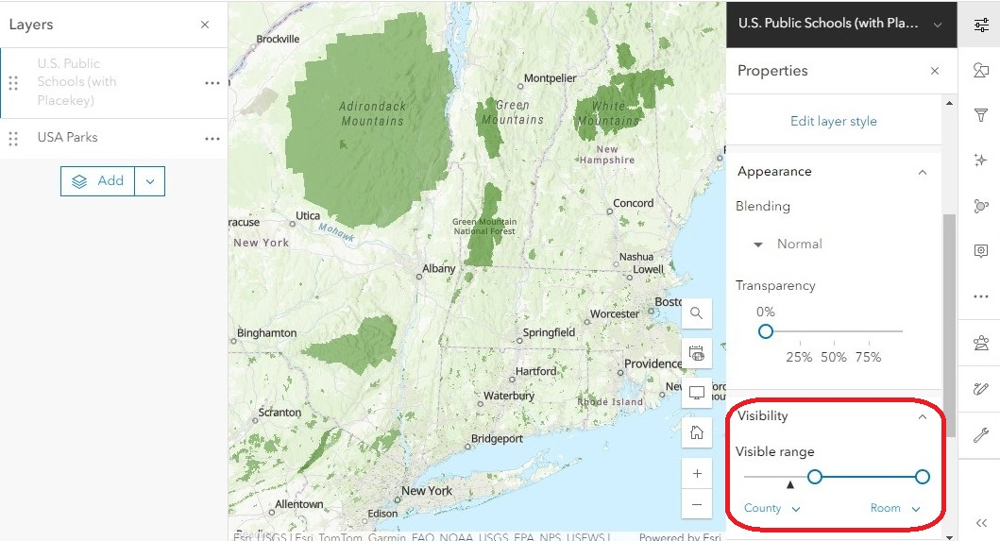

### Styles
{: .no_toc }

The Styles menu (symbolized as a triangle, square, and circle) allows us to change the way a layer’s icons appear. In the right menu bar, open the **Styles** menu.

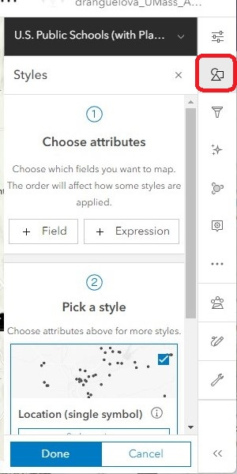

The default setting for point layers is for all the symbols to appear the same. To change the color and size of all points at the same time: 
1. under **Pick a style**, click **“Style options”** to open the Location (Single symbol) menu. 
1. Click on the symbol to open the Symbol style menu. This is where we can change the current symbol, change the size, fill color, outline color, etc.

  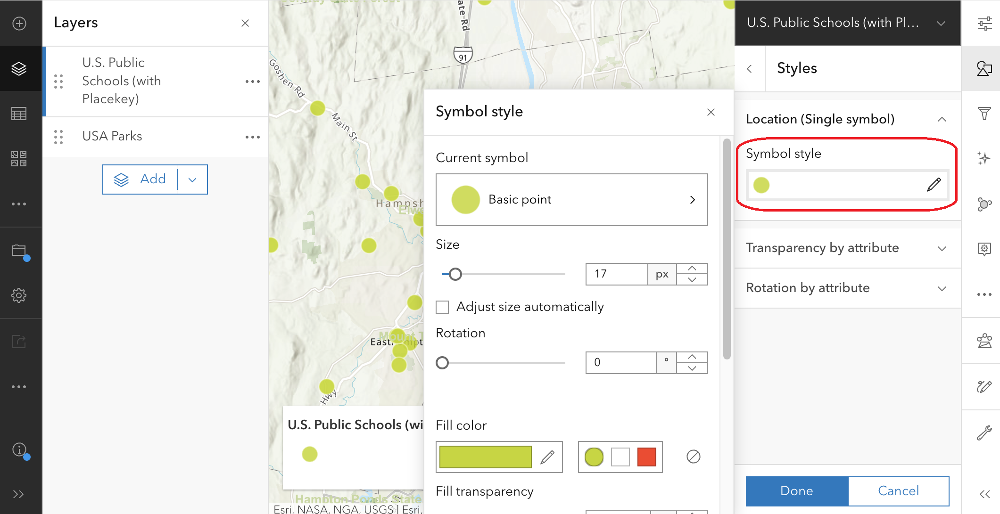

Oftentimes, we want to use data in the attribute table to automatically change the way the points appear in the map. Let’s say we want the icons to reflect the level of education of each school.
1. In the main **Styles** menu, under **Choose attributes**, click **“+ Field”** to open the fields menu. 
1. Check the “Level” field, then click “Add.” The school icons automatically change to colored dots, and a legend appears in the lower left corner indicating which color represents which level. This is the default style when varying symbology is used.

  

  To modify the color scheme, under `Pick a style > Types (unique symbols)`, click on **“Style options”** to open the **Types (Unique symbols)** menu. 

  
1. Click on the **“Symbol style”** color ramp. This is where we can change the current symbol, change the size, color ramp, outline color, etc.

  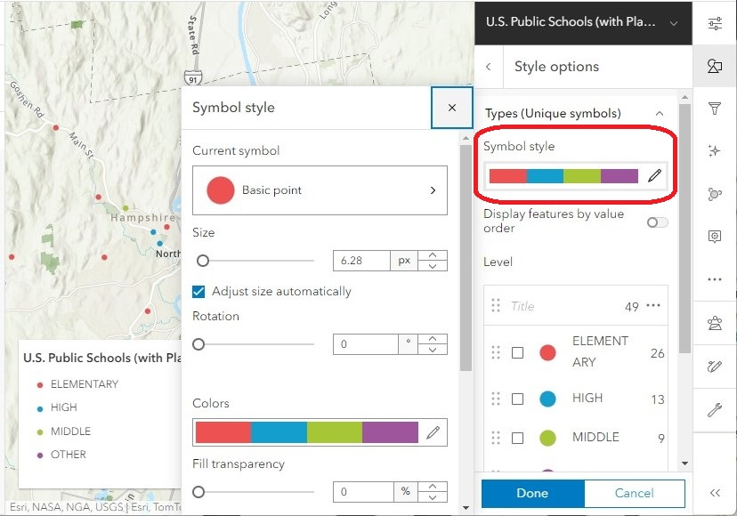
1. To change the current symbol, click on **“Basic point."**
1. In the category drop-down menu, select **“POI Basic.”**
1. Select the schoolhouse symbol, then click **“Done.”**

  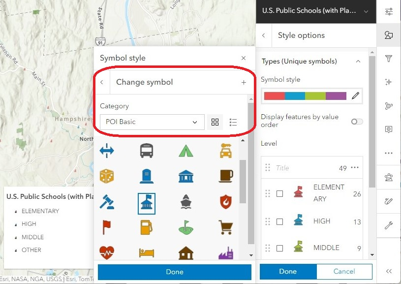
1. Change the color ramp by clicking on the **“Colors”** menu. In the category drop-down menu, you can filter specific kinds of color ramps, such as colorblind-friendly options.

  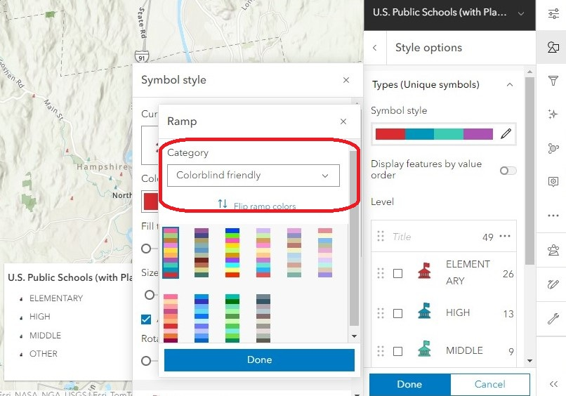
1. The last thing we’ll do is change the size of our icons to make them easier to see. Set the **“Size”** to 30 px, then close the symbol style menu.

  Back in the Style options menu, under Level, notice that the default order of the schools is Elementary > High > Middle, with several additional categories after that. This is because the default order is dictated by the number of features within each category, ordered from most numerous to least numerous. In our case, it would make more sense for the icons to be ordered `Elementary > Middle > High > Other.` To change the order in which school types are displayed:
1. click and hold the six dots next to a level type and drag the item up or down the list.
1. To remove the schools from extraneous levels (like “Prekindergarten” or “Not reported”), click the **checkbox** next to its name and select **“Remove.”**

### Effects
{: .no_toc }

Effects are another way to change a layer’s appearance. In the right menu bar, click the **Effects** menu (symbolized as a sparkle). Here you will find a variety of options to further customize a layer’s appearance, from adding glows, blurs and shadows, to changing the saturation and hue of their colors. 

Here’s an example of what the Bloom effect looks like with the schools layer:

Explore the different symbology options to customize your map in a unique way!

### Pop-ups
{: .no_toc }

If you are looking for information about a single feature in a layer, clicking that feature will bring up a pop-up window with a glimpse of that feature’s information stored in the attribute table. We can use the Pop-up menu to customize the way that information is displayed.

1. Click on a few different schools. Notice that the pop-up window displays information about each specific school we click on. This layer has a lot of attribute information, which makes the pop-up feel crowded. We can edit the pop-up to show only what we feel is relevant and leave the rest out.

  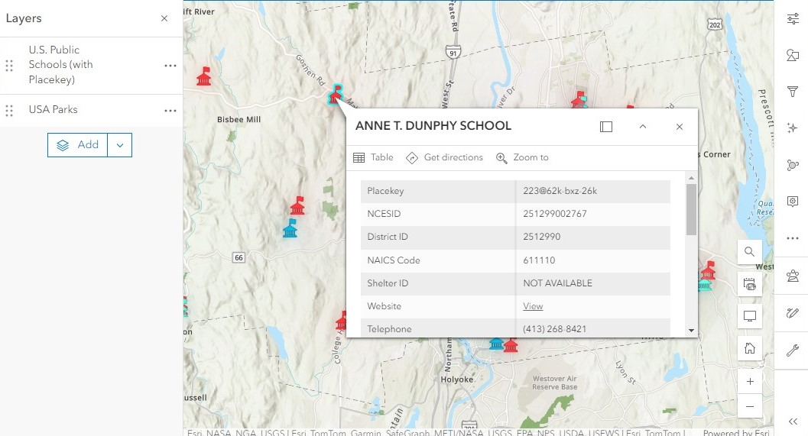
1. In the right menu bar, click on the **Pop-ups** menu.

  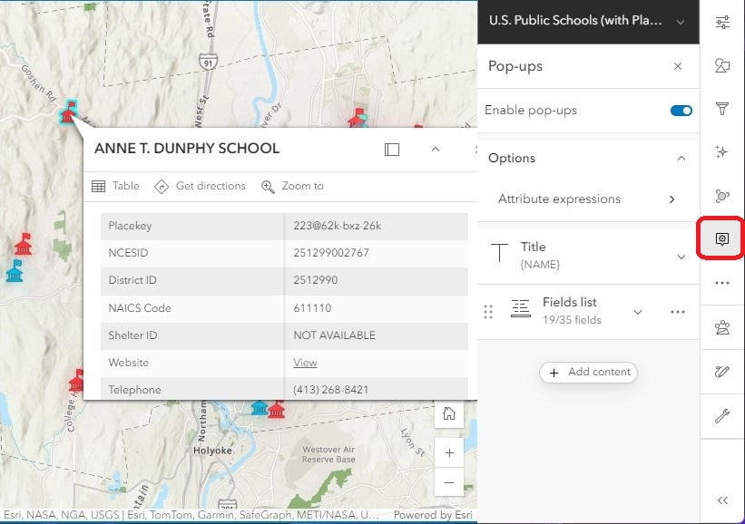
1. There are a few different ways we can customize the pop-up:
    1. At the top, we can toggle the switch to **enable** or **disable** pop-ups altogether.
    1. Under Options, we can build an **attribute expression** to create custom messages based on existing data in the attribute table. This is a more advanced feature that you can explore beyond this workshop. 
    1. **Title** is used to automatically generate a heading at the top of the pop-up window. By default, the schools layer uses the {NAME} field to populate the title. To change which field shows up at the title, you can simply replace it with your field of choice. Make sure to enclose the field name in curly brackets {}. 
    1. The **Fields** list shows which fields from the attribute table are visible in the pop-up window.
1. Under **Fields list,** click **“Select fields”** to view all of the available fields.

  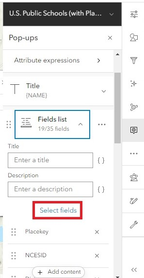
1. To reduce the clutter in the pop-up window, uncheck the following fields: Placekey, NCESID, County FIPS, NAICS Code, Source, Source Date, District ID, and Shelter ID. Click “Done.”
1. Under **Fields list,** click and hold the six dots to the left of any field name to rearrange the field order. Move the Level field to the top of the list. Notice that any changes made in the Pop-up manu are immediately applied to the open pop-up window, allowing you to preview the changes you make. 

  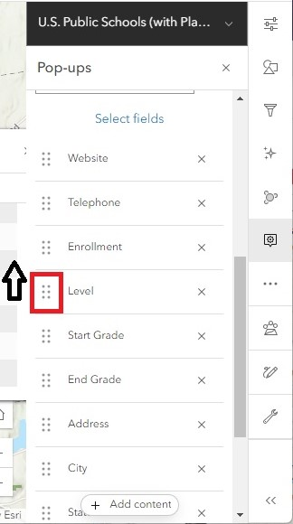
1. At the bottom of the Pop-ups menu, click “+ Add content” to include additional content like charts, images, and extra text.

  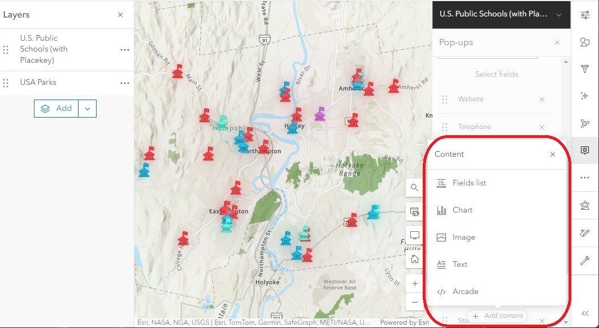

### Labels
{: .no_toc }

Labels are a useful way to show relevant information from the attribute table directly on the map.
1. In the right menu bar, open the **Labels** menu (symbolized by a tag). 

  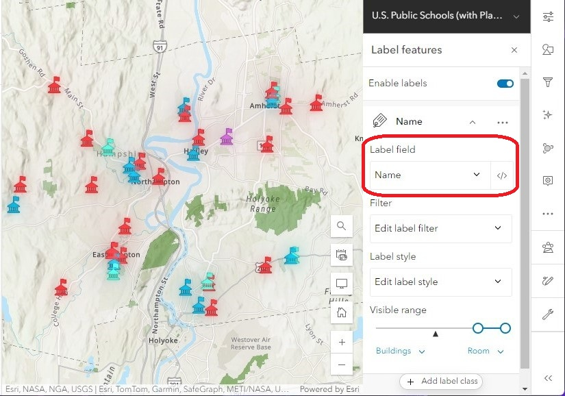
1. In the **Label field** drop-down menu, select the field in the attribute table that will be used to populate the labels. The default for the schools layer is “Name,” which makes sense to leave as is.
1. Labels have their own visibility range. The default is usually set to a smaller zoom scale because labels tend to take up a lot of space, and the map can become crowded if many labels are being displayed at one time. Drag the **Visible range** slider so that the map’s current zoom level is within the range. Each school is now labeled using its corresponding information from the “Name” field in the layer’s attribute table. Since some of the labels are hard to see, let’s edit the label style.

  
1. Under **Label style,** click **“Edit label style”** to open the Label style menu.
1. Apply a halo effect by toggling on **Halo.** This adds a white background behind the label text to make it easier to read.
1. Under **Placement,** change the drop-down to “Center center.” This moves the position of the labels to be displayed on top of each point.

  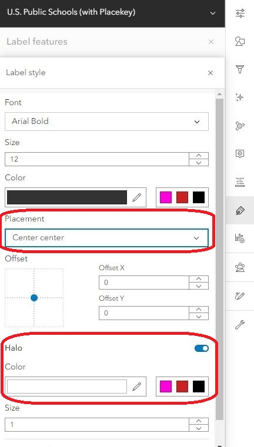
1. Continue experimenting with these settings to find a style that you like for your labels!

### Save and Export Your Map
{: .no_toc }

It is always a good idea to save our work. Save early, save often!

In the left menu bar, click the **Save and Open menu** (symbolized as a folder). Click **“Save as”** to give the map a title, then **“Save”** to save it to your AGOL content space. The next time you navigate to the **Contents** in your AGOL account, you will see your map saved there for future use.

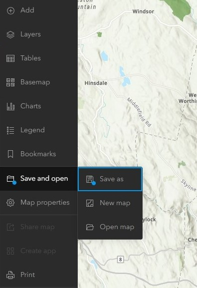

To export a copy of the map as an image, in the left menu bar click the **Print** menu. 

Optionally give the map a title, specify the size and orientation of the output image, and choose the exported file format. 

Under **Advanced options,** we can include metadata (author, copyright), change the export resolution (DPI) or output spatial reference, and toggle on the legend and north arrow.

When your settings are to your liking, click the blue **“Export”** button. Your file will appear in the **Exports tab,** where you can then download it to your computer. Below is an example of an exported map, including necessary map elements such as a legend, North arrow, scale bar and title.

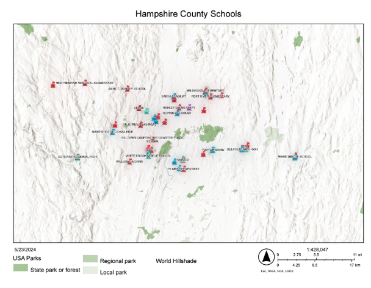

---

Now, you've made your first web map using data brought in from AGOL's databases. But what about creating our own spatial data? Check out the next tutorial in this series to learn how to import and use your own data. 

