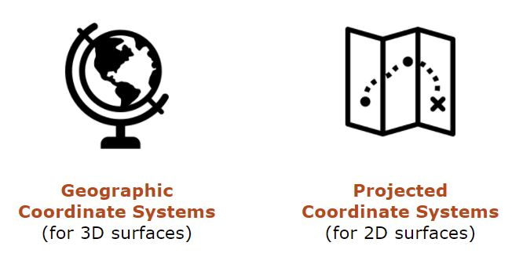

# Coordinate Systems
{: .no_toc }

One of the most mind-bending aspects of GIS, coordinate systems are key to how geospatial data works
{: .fs-6 .fw-300 }

  

    Table of contents
  

  {: .text-delta }
1. TOC
{:toc}

---
## Overview
{:toc}

Coordinate reference systems (CRS) allow us to locate any place on the earth’s surface.

At their most basic, a coordinate pair consists of two numbers: an **X value (longitude)** and a **Y value (latitude)**. The CRS is the key to understanding what those numbers mean. The same location could have thousands of different coordinate pairs - one for every CRS that exists today!

It is a good idea to use the same system for all the data in your project. This section will show you how to identify a data layer's CRS and how to change it, if necessary.
{: .note}

There are two kinds of  systems:
* **Geographic coordinate systems** are best suited for 3D surfaces like globes.
* **Projected coordinate systems** are designed to display locations on flat surfaces like maps and computer screens.

---
## Geographic vs. projected coordinate systems
{:toc}

View this information as a slideshow:
<iframe src="https://docs.google.com/presentation/d/e/2PACX-1vSGEAMvj797ZfrIWaxbA-2QcR96BZvFSvNuqk1BX9_KRXmUMBonSbD8msN2btH0UT2QRwFgAtOt9gcb/embed?start=false&loop=false&delayms=3000" frameborder="0" width="480" height="389" allowfullscreen="true" mozallowfullscreen="true" webkitallowfullscreen="true"></iframe>

---
## Identify a layer's CRS
{:toc}

The quick way to find out a layer's CRS is to open it in QGIS and look at its information in the `Properties` window. These steps work for both vector and raster data.

Refer back to the [Getting Started page](https://umass-gis.github.io/workshops/content/basics-qgis/getting-started.html#explore-the-qgis-interface) to familiarize yourself with the QGIS interface.

### Step 1: Open the layer in QGIS
{:.no_toc}

There are several ways to open a layer in QGIS:
1. In the Browser Panel, navigate to the layer, then drag and drop it into the Map View.
1. For vectors: click `Layer > Add Layer > Add Vector Layer...` or click the `Add Vector Layer...` button. In the window that opens, to the right of the `Vector Dataset(s)` box, click the three buttons `...` to open the file explorer. Navigate to the file, click `Open`, then `Add`.
1. For rasters: click `Layer > Add Layer > Add Raster Layer...` or click the `Add Raster Layer...` button. Follow the steps above.

### Step 2: Open the layer's Properties window
{:.no_toc}

In the Layers Panel, right-click the layer's name and select `Properties...` Information about the CRS will appear in the top part of the window.

In this example, the CRS is [EPSG:26986 - NAD83 / Massachusetts Mainland - Projected](https://epsg.io/26986), which the Commonwealth of Massachusetts uses for most of its GIS data. We know this is a **projected** CRS because it has "projected" in the name, but also because the unit is meters. Only projected CRS's use standard units of measurement, like feet, meters, etc.

---
## Change a layer's CRS
{:toc}

Generally, it is a great idea for all your data to have the same CRS. 

Streamlining your data's coordinate systems helps avoid issues that stem from CRS mishaps (see [Troubleshooting](#troubleshooting) below), and it also helps you get into the habit of double- and triple-checking that your coordinate systems are in order.

Let's say you downloaded a data layer from the state government. You checked the layer's Properties information and found out that its CRS is [EPSG:26986 - NAD83 / Massachusetts Mainland - Projected](https://epsg.io/26986). However, all your other data is in [EPSG:32618 - WGS 84 / UTM zone 18N](https://epsg.io/32618). 

### Vectors: Export the layer
{:.no_toc}

The quickest way to change the CRS of a vector layer is to make a copy by exporting it. During the export process, you have the option to define a new CRS for the new layer.

In the Layers Panel, right-click the layer's name and click `Export > Save Features As...` Fill out the dialog window:
* **Format**: ESRI Shapefile is the default option, but you can change this if you prefer a different format
* **File name**: click the three dots `...` to the right of the box, navigate to your output folder, and type in a name for the output file. Make sure to add the proper extension (.shp for shapefiles).
* **CRS**: click the globe icon to the right of the box, then type **32618** into the filter bar in order to quickly locate the CRS you want. Select it and click `OK`.

Leave the rest of the fields as their default values, and click `OK`.

### Rasters: Reproject the layer
{:.no_toc}

While it's possible to use the export tool to make a copy of a raster layer in a new CRS, the tool does not work well in most cases. The better option is to reproject it – a more refined process that helps ensure the accuracy of the copied data.

In the menu bar, click `Raster > Projections > Warp (Reproject)...` Fill out the dialog window:
* **Input layer**: select the raster layer you want to copy
* **Source CRS**: leave this blank - the tool will figure it out
* **Target CRS**: click the globe icon to the right of the box, then type **32618** into the filter bar in order to quickly locate the CRS you want. Select it and click `OK`.
* **Resampling method to use**: the specific method to choose depends on what kind of raster you are working with.
  * **Nearest Neighbor**: if the raster has categorical data (where the pixels represent discrete values like RGB colors in a photograph) and the computer should keep the values exactly the same in the new version.
  * **Bilinear** (faster) or **cubic** (more intense): if the raster has continuous data (where the values in the pixels are measurements, like rainfall data, elevations, etc.) and the computer needs to be able to blend the output values to create new ones. 

Read more about raster resampling methods in this [StackExchange post](https://gis.stackexchange.com/questions/10931/what-is-lanczos-resampling-useful-for-in-a-spatial-context)
{: .note}

By default, the tool will save the new layer to a temporary file. This is a handy way to check that everyone worked according to plan before you save a copy to your hard drive (using the [export method discussed above](#vectors)).

Alternatively, near the bottom of the window in the `Reprojected` box, you can ask the tool to save the file directly to your computer. Click the three dots `...` to the right of the box, navigate to your output folder, and type in a name for the output file. Make sure to add the proper extension (.tif is a good file type for rasters). When you're all set, click `Run`.

---
## Change the map view's CS
{:toc}

---
## Troubleshooting
{:toc}

Faulty coordinate systems are very often to blame for a GIS that stops working properly. 

These are some of the most common issues that pop up. If your data isn't displaying properly, check to see if one of these could be the cause:
* the data layer's CS information is wrong,
* the data layer's CS information is missing,
* the Map View is set to a different CS than the data layer,
* there are multiple data layers and they all have different CS's.

---
## Resources

These are some of my favorite coordinate system tools:

* [EPSG.io](https://epsg.io/): search for information about over 6,000 coordinate systems
* [FCC DMC-to-Decimal converter](https://www.fcc.gov/media/radio/dms-decimal): quickly convert coordinates from Degrees Minutes Seconds to Decimal Degrees (and vice versa)
* [Rick King's State Plane Coordinate System](https://www.ret3.net/p/state-plane-coordinate-system.html): look up the State Plane and UTM Zones for each county in the U.S.
