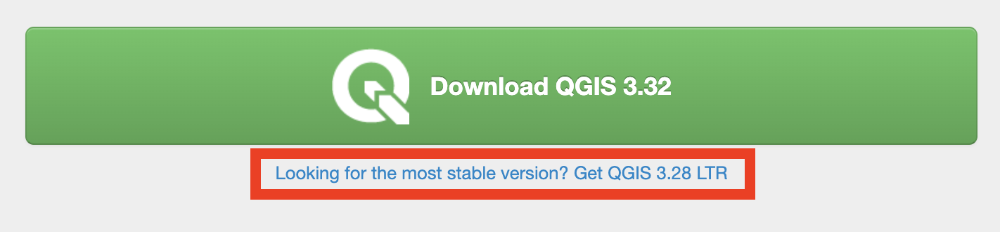
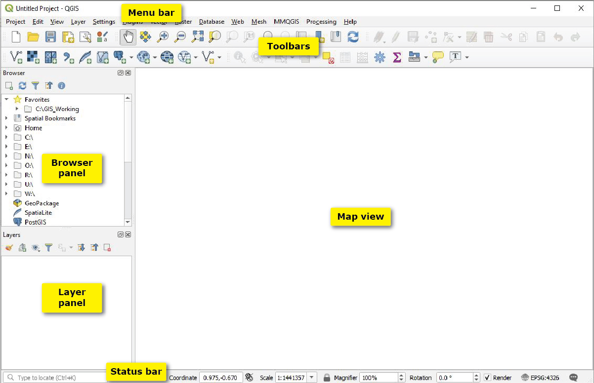
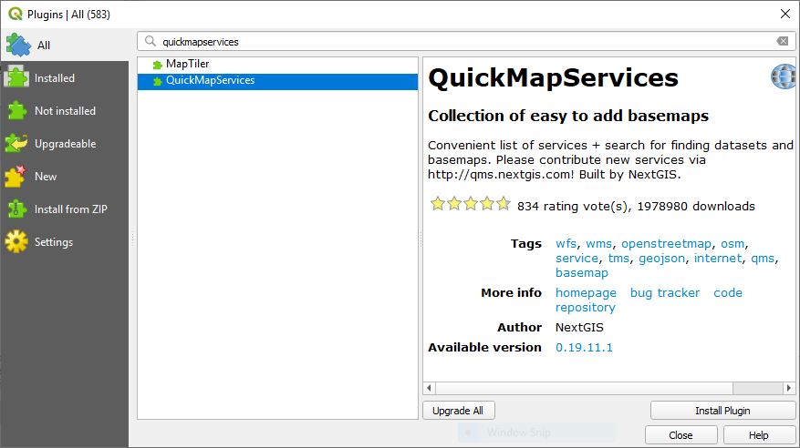
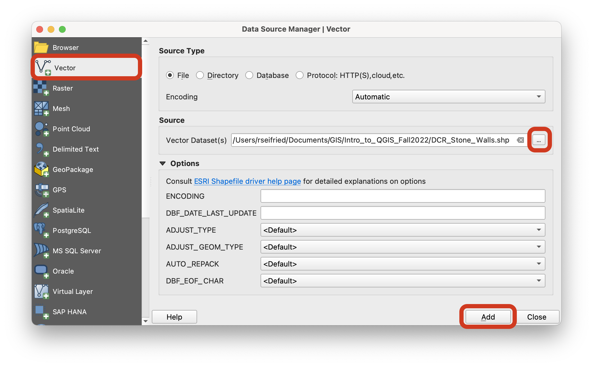
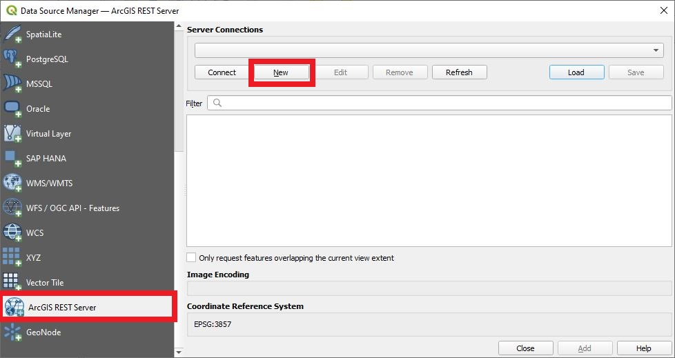
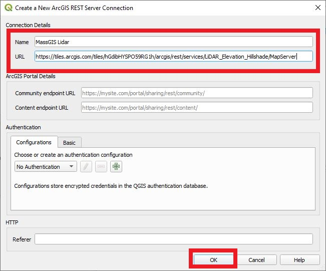
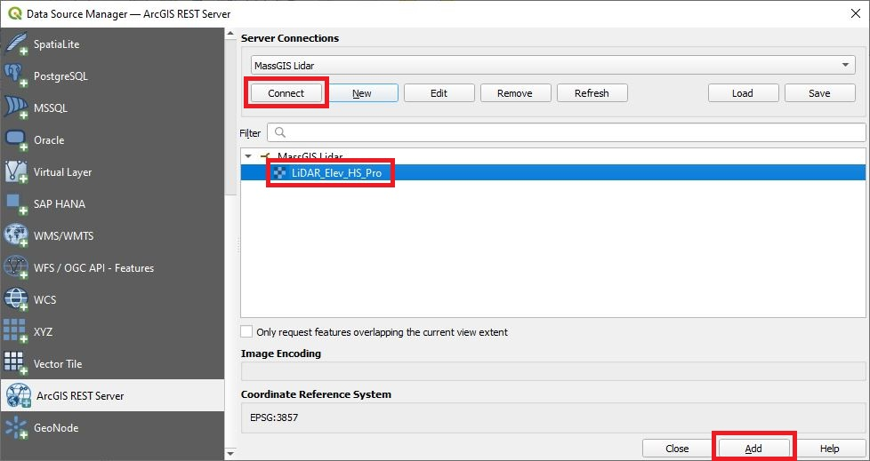
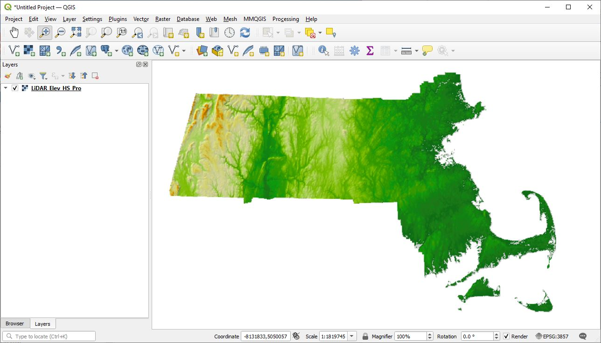

# Getting Started
{: .no_toc }

Install QGIS and become familiar with the interface
{: .fs-6 .fw-300 }

  

    Table of contents
  

  {: .text-delta }
1. TOC
{:toc}

---
## Install QGIS
{:toc}

QGIS is a free and open-source software that runs on Mac, Windows, and Linux operating systems. In order to complete the exercise part of this workshop, you will need to download the software and install it on your personal computer.

[Download QGIS](https://www.qgis.org/){: .btn .btn-primary}

**Note**: I recommend downloading the long-term release (LTR), which is more stable. 

---
## Download the demo data
{:toc}

If you want to play around with example data, download this data pack. It contains several vector files in shapefile format, and the readme.txt file has links to a raster you can download or add to a QGIS session as a web layer. You will need to unzip the file before you can access its contents in QGIS.

[Get the demo data](https://github.com/umass-gis/workshops/blob/main/content/basics-qgis/data/Data_Demo_Fall2022.zip){: .btn .btn-primary }

**Mac users**: Double-click the file to unzip it automatically. 
**Windows users**: Right-click the file and use a tool like 7-Zip to extract the files.

---
## Explore the QGIS interface
{:toc}

Once QGIS installs, launch the program. In the menu bar, click `Project > New` to start a new session. The program should look like the interface below. If additional panels are open, you can close them by clicking the X in the upper right corner.

### Recommended panels
{: .no_toc }

You can turn on/off different panels by clicking `View > Panels`, or by right-clicking in the gray toolbar area. Make sure these two panels are checked on:

* Browser panel
* Layers panel

### Recommended toolbars
{: .no_toc }

The toolbars are the fun part of QGIS, giving you quick access to lots of tools that the program offers. You can turn on/off different toolbars by clicking `View > Toolbars`, or by right-clicking in the gray toolbar area. These are the recommended essential toolbars to turn on:

* Attributes toolbar
* Manage Layers toolbar
* Map Navigation toolbar
* Selection toolbar
* Project toolbar

---
## Install helpful plugins
{:toc}

On its own, QGIS is a fairly bare-bones program that can do basic GIS-y things, but certainly not all the things that proprietary software can do. Plugins extend the functionality of QGIS. Plugins are free and open-source, just like QGIS!

In the menu bar, click `Plugins > Manage and Install Plugins...` Type the plugin name (or a keyword) into the search bar, highlight the plugin, and click `Install Plugin`.

### Recommended plugins
{: .no_toc }

| Plugin | Description | Install Location |
| :----- | :---------- | :--------------- |
| **MMQGIS** | A suite of vector analysis tools, some of which are built into QGIS but have different underlying algorithms. It's worth experimenting with both! | `MMQGIS` drop-down menu |
| **QuickMapServices** | Easy way to add basemaps from dozens of providers. An alternative to adding individual layers as WMS or ArcGIS REST Servers. | `Web > QuickMapServices`. To add more basemap options, open `Settings` and navigate to the `Visibility` tab; make sure all the sources are checked on. |
| **QuickOSM** | Allows you to search and download free vector data from OpenStreetMap. An easy way to use this plugin is to navigate the map to your area of interest, then change the query area from "In" to "Canvas Extent." The tool will download all the OSM data in your area of interest! | `Vector > QuickOSM > QuickOSM...` |
| **SRTM-Downloader** | An easy way to download individual SRTM tiles (elevation data) for your study area. Requires creating a free account at [http://urs.earthdata.nasa.gov//users/new](http://urs.earthdata.nasa.gov//users/new). | `Plugins > SRTM-Downloader` |

---
## Add a local layer
{:toc}

Let's assume you have a geospatial data layer downloaded onto your hard drive.

There are several ways to open a layer in QGIS:
1. **Drag-and-drop from file explorer**: In a system folder window (Windows Explorer or Mac Finder), navigate to the data, then drag and drop it into the QGIS Map View. For shapefiles, you'll have to grab the file that ends with .shp!
1. **Drag-and-drop from the Browser Panel**: In the Browser Panel, navigate to the layer, then drag and drop it into the Map View.
1. **Add via the Data Source Manager**: To launch, click `Layer > Data Source Manager`. In the window that opens, click the type of dataset you want to add - vector, raster, delimited text, etc. To the right of the **Source** box, click the three buttons `...` to open the file explorer. Navigate to the file, click `Open`, then `Add`.

---
## Add a web layer
{:toc}

We live in an age of cloud-based data, and thankfully it is super easy to add a hosted web layer to a QGIS session:
1. Find a hosted layer from a GIS data source, like [MassGIS](https://www.mass.gov/info-details/massgis-data-layers). Look for language like "view this layer in GIS" or "Map service" or "REST Server".
1. Figure out what kind of data this is:
    1. **Web Map Service (WMS) or Web Map Tile Service (WMTS)** - very common service standard for rasters and vectors that allows users to view the data, but usually not to query or manipulate it.
    1. **Web Feature Service (WFS)** - service for feature data that allows users to query and manipulate the layer.
    1. **ArcGIS REST Server Layer** - a URL pointing to a dataset that is hosted on ArcGIS Online.
1. Click `Layer > Add Layer > Data Source Manager` and navigate to the tab that corresponds to your data type.
1. Click `New`.
1. Give the service a `Name` of your choosing, then copy-paste the `URL` of the service layer. Click `OK`.
1. Click `Connect` to establish a connection to the service layer, then select the layer you want to add to your map. Click `Add`.
1. Close the window and bask in the glory of your web layer!

In this example, I am adding a connection to the [Lidar Elevation and Shaded Relief](https://arcg.is/0r4yDy) tile service by MassGIS, which is hosted on ArcGIS Online. The service layer URL can be found in the bottom right corner of the website, under the heading "URL".

---
## Get more help
{:toc}

That's it for the basics! The QGIS user community maintains a [helpful collection of resources](https://docs.qgis.org/latest/en/docs/index.html) that is worth checking out for more guidance.
