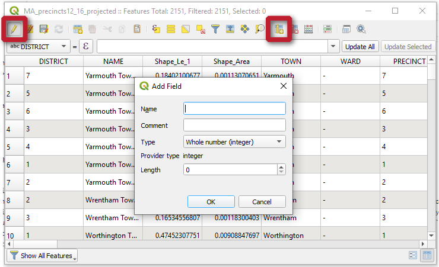

# Q&A
{: .no_toc }

Questions from the workshop
{: .fs-6 .fw-300 }

  

    Table of contents
  

  {: .text-delta }
1. TOC
{:toc}

---

## Learning about QGIS
{:toc}

### Where can I learn more about QGIS?
{:toc}

Check out the [Learning GIS](https://gis.library.umass.edu/learning-gis/) section of the UMass Amherst Libraries’ GIS Hub - there are tons of links to courses you can take here at UMass, plus training you can do on your own time. 

The QGIS user community has two resources that could be helpful, [A Gentle Introduction to GIS](https://docs.qgis.org/3.10/en/docs/gentle_gis_introduction/) for an overview of the basics, and the [QGIS Training manual](https://docs.qgis.org/3.10/en/docs/training_manual/index.html) for step-by-step instructions. 

A self-paced course that I’d recommend is Frank Donnelly's [QGIS Tutorial](https://atcoordinates.info/qgis-tutorial/). This is a full-day workshop that you can work through on your own. And for specific QGIS tutorials, check out Ujaval Gandhi’s [QGIS Tutorials and Tips](https://www.qgistutorials.com/en/).

### Can I transfer my QGIS skills to ArcGIS?
{:toc}

QGIS and ArcGIS are the most common desktop GIS applications out there. They do have some differences that can make switching between them a small challenge:
* QGIS runs on plugins. It’s a lightweight software that comes with a few key processing tools, but you’ll need to install plugins to expand its functionality. By contrast, almost all the tools you’ll ever need are built directly into ArcGIS.
* A tool in QGIS might have a different name in ArcGIS (and vice versa).
* A tool in QGIS might not even exist in ArcGIS (and vice versa). 

That said, both programs have roughly the same interface: a map area, a bunch of toolbars, a table of contents, and lots of built-in tools for running spatial analyses. In this sense, if you learn how to use one software, you’ll already have a head start in learning the other.

---
## Working with data
{:toc}

### Where can I find data for my project?
{:toc}

The [Data](https://gis.library.umass.edu/data/) section of the UMass Amherst Libraries’ GIS Hub has lots of ideas for where to look for data, organized by subject and region. You are always welcome to reach out to me at [rseifried@umass.edu](mailto:rseifried@umass.edu) or [book a consultation](https://libcal.library.umass.edu/appointments/gis) if you’d like one-on-one help looking for data.

### Is vector or raster a better format for my data?
{:toc}

The [Data Types section](https://umass-gis.github.io/workshops/content/basics-qgis/gis-basics.html#data-types) reviews some of the key differences between vectors and rasters. Generally, vectors are better if you want to:
* map shapes, since vectors are scalable and adjust visually when you zoom in/out, or
* store more than one kind of information about each shape. 

Rasters are better if you want to:
* map a single kind of information over large areas (e.g. elevation, rainfall, land use).

### How do I keep track of the metadata for the files I create?
{:toc}

Metadata is the explanatory text that accompanies a file, letting people know information about it like who created it and when, why, etc. Here are some easy ways to keep track of metadata:
1. Take notes on a piece of paper while you work with QGIS. Things to note: where you’re keeping files on your computer, tools that you’re experimenting with, the names of files you create and information about how you created them (tools, processes, edits you made), etc.
1. Create a Word document to keep track of your GIS notes and save it in your project folder, or use Google Docs if you plan to work on different computers and need to be able to access your notes from anywhere.
1. When you’re all done working on a folder or a file, create a .txt file (with a text editor like Notepad) to type up your final notes and save it in the project folder. Check out these tips from Cornell on [how to write a readme file](https://data.research.cornell.edu/content/readme). 

For more advanced metadata writing, you could try using specialized software. While QGIS does not have a built-in metadata editor, there are [several plugins](https://plugins.qgis.org/plugins/tags/metadata/) that could be installed to help with that process. They all have their own pros/cons and are probably best suited to more advanced users. For the sake of comparison, it’s worth mentioning that ArcGIS desktop software does have this built-in metadata editing functionality (see the [documentation for ArcGIS Pro](https://pro.arcgis.com/en/pro-app/help/metadata/view-and-edit-metadata.htm)).

### How do I match a historical map to a geographical location?
{:toc}

This is a process called *georeferencing*. To georeference a map in QGIS, you’ll need to install the [Georeferencer plugin](https://docs.qgis.org/3.10/en/docs/user_manual/plugins/core_plugins/plugins_georeferencer.html). Then you can follow this fun exercise from the QGIS Training Manual that goes through the steps to [georeference a map](https://docs.qgis.org/3.10/en/docs/training_manual/forestry/map_georeferencing.html), or follow along with my [Georeference a Historical Map](https://umass-gis.github.io/workshops/content/georeferencing/) tutorial on this site.

### How do I access Google Earth imagery?
{:toc}

One of the recommended plugins (QuickMapServices) allows you to load Google Earth imagery. There are instructions about how to install the plugin on the [Get Started page](https://umass-gis.github.io/workshops/content/basics-qgis/getting-started.html#install-helpful-plugins). Once it’s installed and you’ve adjusted the settings to show all sources, you can load Google Earth imagery by clicking `Web > QuickMapServices > Google`.

### Can I use QGIS with R?
{:toc}

Great news - there's a plugin for that! Use the plugin manager to add the `Processing R Provider` plugin. The [plugin website](https://north-road.github.io/qgis-processing-r/) has more documentation, and the [QGIS training manual](https://docs.qgis.org/3.22/en/docs/training_manual/processing/r_intro.html) has additional step-by-step instructions with screenshots for how to use this plugin in QGIS. Note that R must be installed on your computer.

### Can I use QGIS with High Performance Computing Clusters (HPCCs)?
{:toc}

Desktop QGIS software is really best suited for working with GIS data on a single computer, such as your personal laptop or a remote desktop that you’re accessing through a VPN.  

If you’re interested in working with GIS data at a bigger scale (i.e. the *big data* scale), you’ll likely want to use different tools that require a more advanced technical skillset to deploy. For example, a common open-source setup is [PostgreSQL](https://www.postgresql.org/) with [PostGIS](https://postgis.net/). These articles could be helpful resources if you’d like to dive into this topic further: "Geospatial Big Data Handling with High Performance Computing: Current Approaches and Future Directions" ([Li 2019](https://arxiv.org/abs/1907.12182v1)) and "Parallel Processing Strategies for Big Geospatial Data" ([Werner 2019](https://doi.org/10.3389/fdata.2019.00044)).

---

## Working in QGIS
{:toc}

### Do the Project CRS and data layer CRS need to match?
{:toc}

Does it need to? No. 

Are some of your layers not showing up, or does the map look wrong in some way? It could certainly help! 

As long as the **datum** of the two CRS’s is the same, then QGIS shouldn’t have a problem projecting your layers “on-the-fly” so that they align with the Project CRS. However, if your layer CRS is in datum A, and your Project CRS is in datum B, it might not display properly. Two solutions to this:
1. [ Export a copy of the layer and change the CRS](https://umass-gis.github.io/workshops/content/basics-qgis/coordinate-systems.html#change-a-layers-crs) to match your project.
1. [Change the Project CRS](https://umass-gis.github.io/workshops/content/basics-qgis/coordinate-systems.html#change-the-project-crs) to match your data layer. 

Two of the common datums you’ll see when working with data from Massachusetts are WGS84 and NAD83. They typically play nicely together, but it’s typically a good idea to sync all your data to the same CRS.

### Can I edit the attribute table outside of QGIS?
{:toc}

Alas, no - edits to the data stored inside the attribute table need to be made in QGIS. 

However, one workaround is to keep your data in a separate table (like an Excel spreadsheet), and join it to the data layer whenever you want to visualize it in a map. They key is that both the data layer and the spreadsheet need to have a [unique ID](https://en.wikipedia.org/wiki/Unique_identifier) field that the computer can use to match the records to each other. Check out the QGIS User Manual for step-by-step instructions for [joining a table to a data layer](https://docs.qgis.org/3.16/en/docs/user_manual/working_with_vector/vector_properties.html#joins-properties). 

To export the attribute table:
1. Right-click the layer in the Layers Panel.
1. Select `Export > Save Features As…`.
1. Change the `Format` to **Comma Separated Value [CSV]**.

### How do I add a new column to the attribute table?
{:toc}

There are two ways to add a new column (or *field*) to an attribute table.

#### Option 1: New Field
{:.no_toc}

1. Open the attribute table and toggle on editing mode by clicking the `pencil button`.
1. Click the `New field` button (table with a yellow column) and fill out the `Add field` dialog. Make sure the `Type` is set to the data type you want - you won’t be able to change this. Click `OK`. The new field is added to the right side of the attribute table.
1. As long as you’re still in editing mode, you can manually enter information into any of the new squares.
1. Or, you can use the field calculator (abacus button) to quickly calculate values for all the records at the same time - just make sure `Update existing field` is checked and that you’ve selected the name of the field you just created.

#### Option 2: Field Calculator
{:.no_toc}

If you already know what information is going to go in the new field, you can use the Field Calculator to add the field *and* calculate the values all in one go. You can practice this method in the [Visualize the census data](https://umass-gis.github.io/workshops/content/basics-qgis/exercise.html#visualize-the-census-data) part of the exercise.

1. Open the attribute table and toggle on editing mode by clicking the `pencil button`.
1. Click the field calculator button (abacus). Make sure `Create a new field` is checked. Fill out the `Output field name` and `Output field type`. Fill out the `Expression` box with a code that the tool will use to calculate values for all your records at the same time. When it looks good, click `OK`. 

### How do I make an interactive map with pop-ups?
{:toc}

There is an open-source plugin called [qgis2web](https://github.com/tomchadwin/qgis2web) that is designed exactly for this purpose - to help users turn their QGIS map into an interactive map hosted on the web. The plugin will export your map as a JavaScript file that can be hosted on a server and shared publicly. To get started, check out this tutorial by Ujaval Gandhi on [Web Mapping with qgis2web](https://www.qgistutorials.com/en/docs/web_mapping_with_qgis2web.html).
