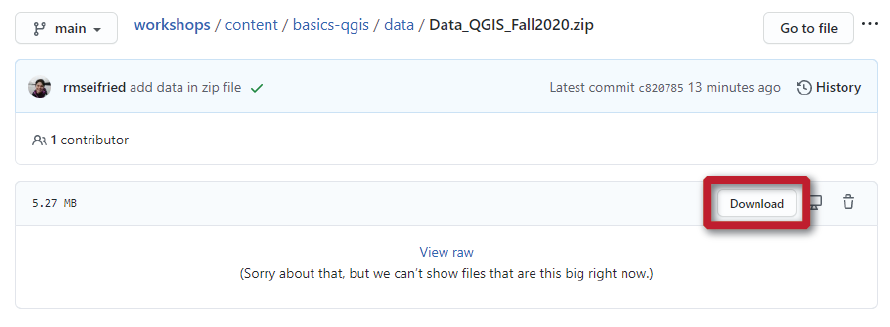
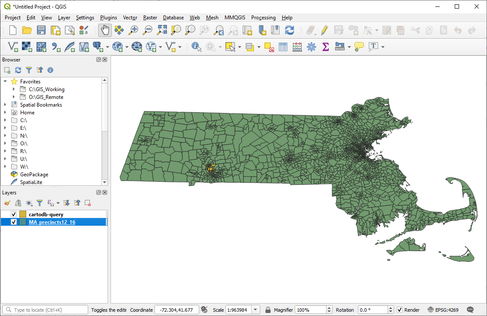
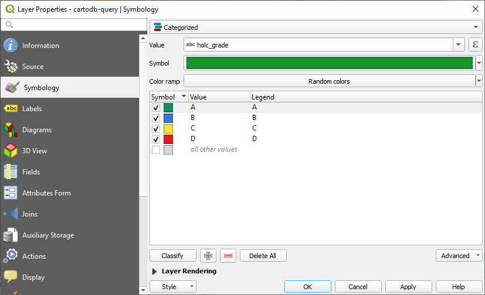

# Tutorial
{: .no_toc }

Explore the cities of Holyoke and Chicopee in western Massachusetts to learn how their demographic makeup has changed in the last 80 years
{: .fs-6 .fw-300 }

  

    Table of contents
  

  {: .text-delta }
1. TOC
{:toc}

---
## Setup
{:toc}

This tutorial will give you a chance to practice the lessons covered in this workshop:
* becoming familiar with the QGIS interface
* opening data layers
* organizing data on your hard drive
* managing CRS's
* changing layer symbology
* exporting a map

### Data Source 1
{:.no_toc}

Holyoke and Chicopee were mapped by Home Owners' Loan Corporation between 1935 and 1940 - the very program that originated the term “redlining” to describe reputedly ‘hazardous’ neighborhoods that mortgage lenders should avoid at all costs. The project [Mapping Inequality](https://dsl.richmond.edu/panorama/redlining/) has georeferenced the maps and made them available to the public as downloadable data (in shapefile and geoJSON format). The website is an interactive mapping platform that is a great learning tool in itself, but we're going to download just a selection of this data.

### Data Source 2
{:.no_toc}

In order to explore how the population of Holyoke and Chicopee have changed over time, we'll take a look at the most recent election data from the precincts in these areas, along with data from the 2010 Decennial Census. The project [OpenPrecincts](https://openprecincts.org/ma/) is a great place to look for processed election data. The level of processing is variable by state, but for Massachusetts the data is excellent. The same data (for MA) can be found on the Metric Geometry and Gerrymandering Group's (MGGG) [GitHub repository](https://github.com/mggg-states/MA-shapefiles).

### 1. Download the data
{:.no_toc}

 
[Get the data pack](https://github.com/umass-gis/workshops/blob/main/content/basics-qgis/data/Data_QGIS_Fall2020.zip){: .btn .btn-purple }

This link will take you to a page on GitHub. Click the `download` button to save it to your computer.

### 2. Unzip the file
{:.no_toc}

The file you download is zipped, so you'll need to unzip it before you can continue. 

**Windows users**: check out Microsoft's support page, [Zip and Unzip Files](https://support.microsoft.com/en-us/windows/zip-and-unzip-files-8d28fa72-f2f9-712f-67df-f80cf89fd4e5). 
**Mac users**: simply double-click the zip file to decompress it.

### 3. Create a workspace for your data
{:.no_toc}

This is a great time to start practicing good data management! Refer back to the slides on [Data Organization](https://umass-gis.github.io/workshops/content/basics-qgis/gis-basics.html#data-organization) for inspiration.

In an ideal world, you'll create a folder just for this tutorial somewhere on your hard drive. Ideas for what to name the folder:
* QGIS_Workshop_Oct2020
* Holyoke_Chicopee_Tutorial_2020_1027
* Basics_of_QGIS_Fall20
* GIS_Data_Is_Awesome

*Just kidding, don't use that last one!*

### 4. Rename the original data folder
{:.no_toc}

Move the unzipped folder to that new workspace and rename it. The goal is to preserve a copy of the original data and let your future self know what the folder contains. Something like:
* Data_Original
* Raw
* Downloaded_Versions

---
## Open the data layers in QGIS
{:toc}

There are two shapefiles in the data pack you downloaded. Follow the instructions on the [Getting Started](https://umass-gis.github.io/workshops/content/basics-qgis/getting-started.html#open-a-layer) page to load the two shapefiles into a new map session in QGIS.

If you get a warning message asking you to **Select Transformation for [data layer]**, just click `OK`. 

Your map session should look something like this (probably with different colors!):

Make sure to save your map session often. This will save you a lot of heartache if you make a lot of changes and then your power goes out!
{: .danger}

---
## Check their CRS's
{:toc}

Follow the instructions on the [Coordinate Systems](https://umass-gis.github.io/workshops/content/basics-qgis/coordinate-systems.html#identify-a-layers-crs) page to identify the CRS's of the two data layers. 

Quiz time!
{: .label .label-blue }

What is the CRS of the layer MA_precincts12_16?

 
It's EPSG:4269 - NAD83.

 

What is the CRS of the layer cartodb-query?

 
It's EPSG:4326 - WGS84.

 

What is the Project CRS?

 
This should match the CRS of whichever layer you added first.

 

Bonus: Are these geographic or projected coordinate systems?

 
Both CRS's are geographic coordinate systems! Giveaways: the CRS unit is degrees, and in the Status Bar the coordinates are +/- values between 0 and 180.

---
## Sync their CRS's
{:toc}

Spoilers ahead!
{: .label .label-red }

Let's sync the CRS's of the two data layers and the Map View so they are all calling on the WGS84 datum. This is a good choice if you plan to use the free base imagery available through the [QuickMapServices plugin](https://umass-gis.github.io/workshops/content/basics-qgis/getting-started.html#install-helpful-plugins), since it generally should work if the Project CRS is based on the WGS84 datum.

### Change a layer's CRS
{:.no_toc}

The `cartodb-query` layer is okay as it is. Although its CRS is a geographic coordinate system (rather than projected, which is better for map-making), QGIS won't have any trouble readjusting it to look correct once we update the Project CRS.

As long as all your data layers have the same datum, QGIS can "project them on-the-fly" so that they appear to have the same CRS. Issues are much more likely if your data layers have different datums.
{: .note}

Follow the instructions on the [Coordinate Systems](https://umass-gis.github.io/workshops/content/basics-qgis/coordinate-systems.html#change-a-layers-crs) page to export a new version of the `MA_precincts12_16` layer with a CRS of [EPSG:32618 - WGS 84 / UTM zone 18N](https://epsg.io/32618). You can remove the original `MA_precincts12_16` layer when you're done.

Remember to create a new folder within your project space that is dedicated to new files you've created. You could call it "Data_Processed" or just "Processed," or whatever else will help you remember that these are your original files.
{: .warn}

### Change the Project CRS
{:.no_toc}

Follow the instructions on the [Coordinate Systems](https://umass-gis.github.io/workshops/content/basics-qgis/coordinate-systems.html#change-the-project-crs) page to update the Project CRS to [EPSG:32618 - WGS 84 / UTM zone 18N](https://epsg.io/32618).

Now that everything is synced to a CRS that calls on the WGS84 datum, you can go ahead and load some rad, free base imagery! Follow the instructions on the [Getting Started](https://umass-gis.github.io/workshops/content/basics-qgis/getting-started.html#install-helpful-plugins) page to install the QuickMapServices plugin and add a basemap of your choice.

<figcaption>All the happy WGS84 layers, with OSM Standard imagery</figcaption>

Save that map!
{: .danger}

---
## Change their symbology
{:toc}

Take a moment to explore the two data layers. Open their attribute tables to find out what kind of data they contain – and which fields you might want to use to visualize the data. 

Remember that categorical data (codes, groups) can be symbolized using the `Categorized` function, while measurement data (counts, distances, population) should be visualized using the `Graduated` function.
{: .note}

### Visualize the HOLC grades
{:.no_toc}

Take another look at the HOLC maps on the [Mapping Inequality](https://dsl.richmond.edu/panorama/redlining/#loc=13/42.18/-72.628&mapview=graded&city=holyoke-chicopee-ma) website. Notice the color scheme the cartographers used: 
* Grade A = green
* Grade B = blue
* Grade C = yellow
* Grade D = red

Which field in the cartodb-query's attribute table contains this information?

 
holc_grade

 

In the Layers panel, right-click the layer `cartodb-query` and click `Properties`, then navigate to the `Symbology` tab. Right now, the symbology type is set to **Single symbol**. Change this to **Categorized**. For the `Value` field select the field you want to symbolize, then click the `Classify` button in the lower left corner to load all the possible values. 

Change the color for each grade to match the HOLC maps. There are several ways to do this:
* Highlight the item in the Symbology window, then click the small drop-down arrow to the right of the color swath above it. 
* Double-click each small color patch to pull up the Symbol Selector. Make sure `Fill` is selected, then click the small drop-down arrow to the right of the color swath. 
* Alternatively, select `Simple fill` if you want to customize the fill type, change the outline (stroke) color and width, and so on.

You can adjust the transparency of the layer by expanding `Layer Rendering` in the Symbology window, then adjusting the `Opacity` slider. 0% is totally transparent, and 100% is totally opaque.
{: .note}

Finally, remove `all other values` by highlighting it and clicking the red minus icon, then click `OK`.

### Visualize the census data
{:.no_toc}

The other data layer has many, many more fields that could be used for visualization. In fact, the attribute table is a bit overwhelming. There are dozens of fields, but they all have coded titles that don't make much sense on their own.

To decode the table, take a look at the metadata about the file on the [MGGG's GitHub repository](https://github.com/mggg-states/MA-shapefiles). (Note that the first group of metadata fields is for a different shapefile... keep scrolling until you see the information about the 2012-2016 shapefile). Which of the fields do you think would be interesting to map?

For now, let's explore the demographic information that this file contains. Let's say we're interested in mapping the percentage of the population that does/doesn't identify as *non-hispanic white*. A quick way to do this would be to divide the field `NH_WHITE: White, non-hispanic, population in 2010 Census` by the field `TOTPOP: Total population in 2010 Census`.

Follow these steps to calculate a new field in the attribute table:
* Open the attribute table for the layer `MA_precincts12_16`
* Click the pencil icon to start editing
* Click the `Open Field Calculator` button
* Make sure `Create a new field` is checked
* Change the `Output field name` to **Per_Whi**
* Change the `Output field type` to **Decimal Number (real)**
* In the `Expression` box, type this formula: **"NH_WHITE" / "TOTPOP"**
* Click `OK`

Make sure to save your edits and un-click the pencil icon to stop editing.
{: .warn}

Now you can use this new field to change the symbology for the layer. Open the Symbology window and change the symbology type to **Graduated**. For  `Value`, select the new field you just created, then click the `Classify` button in the lower left corner to load all the possible values. Pick a `color ramp` that you like best. 

Hint: You can also experiment with different `Modes`, which change how the data is grouped. Try changing the mode, then clicking `Apply` to see how it affects the data visualization.

When you're all set, click `OK`.

<figcaption>Visualizing the HOLC categories</figcaption>

<figcaption>Visualizing demographic data</figcaption>

### Explore the two layers
{:.no_toc}

*Finally!* This is the part where the magic starts to happen. Spend some time investigating the spatial relationship between these two layers. 

* What patterns seem to stand out?
* Are there any apparent clusters in terms of either HOLC grades or demographic makeup? Any outliers?
* How would you describe the relationship between the historical HOLC designation of neighborhoods in these cities and the demographic makeup of their residents today?

Don't forget to save your map!
{: .danger}

---
## Wrap-Up
{:toc}

Congratulations! You've successfully downloaded geospatial data, brought it into QGIS, synced the CRS's of all the layers and the map session, and played around with different ways to visualize the data.

Visualizing layers on a map is just the first step. Once you've got the basics of GIS down, you can learn to harness the real powers of the software – spatial analysis, map-making, and data-sharing.
