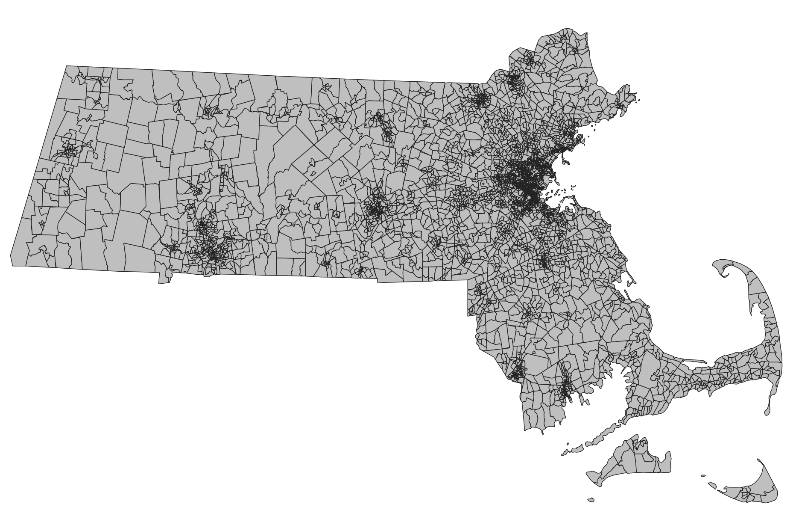
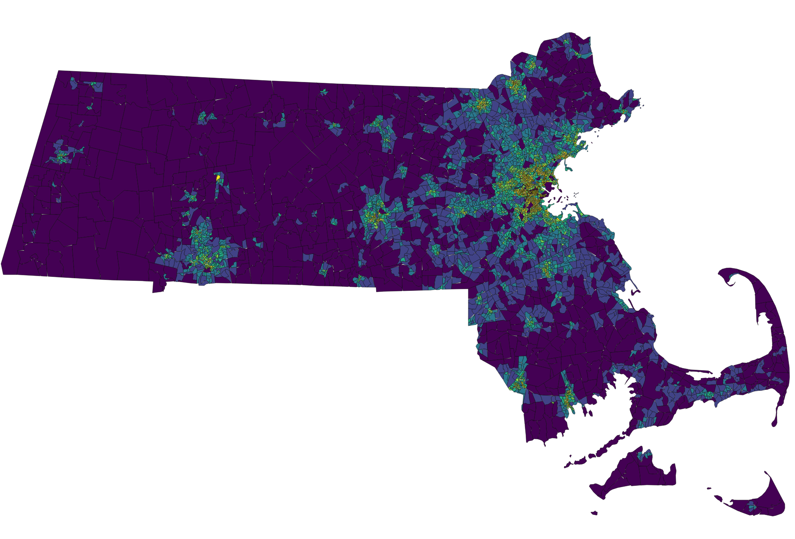

# Visualizing Data
{: .no_toc }

Change the way data appears to explore spatial patterns
{: .fs-6 .fw-300 }

  

    Table of contents
  

  {: .text-delta }
1. TOC
{:toc}

---
## Overview
{:toc}

The way geospatial data is styled - including its color, shape, and size - is called its **symbology**.

At its most basic, symbology can be set so that all the data appears exactly the same way. For example, we might map the US Census block groups in Massachusetts, and all the block groups are the same color: gray with a black outline.

More advanced symbology will draw on the *data itself* to style the layer. For example, we might apply a color spectrum so that block groups with lower population densities are **purple** and higher population densities are **yellow**.

---
## Vector symbology
{:toc}

Vectors are neat because any data in their **attribute tables** can be used to change the symbology.

<iframe src="https://docs.google.com/presentation/d/e/2PACX-1vRxmJZRxpq-L3hWxxARiIXQRCM0IPN8URktRQGBevJKTpeCaOtVnMO9SpROoJpY6yLUKeUpE1cEQf2B/embed?start=false&loop=false&delayms=3000" frameborder="0" width="576" height="359" allowfullscreen="true" mozallowfullscreen="true" webkitallowfullscreen="true"></iframe>

---
## Raster symbology
{:toc}

Raster values can also be used to change the way the data is visualized.

<iframe src="https://docs.google.com/presentation/d/e/2PACX-1vQ_WVGpS3BfDRHK5lzek-6lnlZoJposG7lSgcvTctvm11yTyJyYG1nnw0BWegourEt9qGjhx28JwJA4/embed?start=false&loop=false&delayms=3000" frameborder="0" width="576" height="359" allowfullscreen="true" mozallowfullscreen="true" webkitallowfullscreen="true"></iframe>
