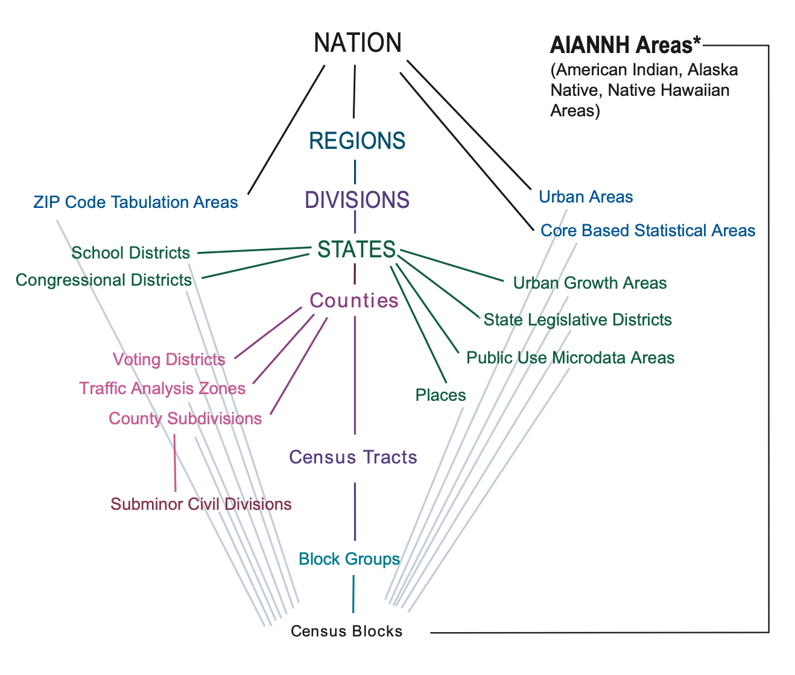

# Census Geographies
{: .no_toc }

How U.S. Census data is organized spatially
{: .fs-6 .fw-300 }

  

    Table of contents
  

  {: .text-delta }
1. TOC
{:toc}

---
## Hierarchy
{:toc}

The [Geography Program](https://www.census.gov/programs-surveys/geography.html) is key to how the U.S. Census Bureau collects and shares data. The Census' geographic units range from the lowest resolution (nation) to the highest resolution (blocks). Different datasets are available at each of these levels.

 
*[U.S. Census Bureau 2020: Standard Hierarchy of Census Geographic Entities](https://www.census.gov/programs-surveys/geography/guidance/hierarchy.html)*

The first step when looking for Census data is to figure out what scale is appropriate for your research study. Do you need the highest possible resolution of data (the census block)? Or is generalized data more appropriate? Once you figure out which geographical unit you are interested in, you can go ahead and start mapping!

---
## GEOIDs

The key thing to remember is that every spatial unit - be it a county, a town, a census block, or so on - has a unique identifier called a [GEOID](https://www.census.gov/programs-surveys/geography/guidance/geo-identifiers.html). GEOIDs appear consistently across all U.S. Census Bureau's products to make comparing and joining data possible.

For example:
* The GEOID for the state of Texas is 48.
* The GEOID for Harris County, TX, is the state code (48) + the county code (201), or 48201.
* The GEOID for census tract 2231 in Harris County, TX, is the state code (48) + the county code (201) + the tract code (223100), or 48201223100.

GEOIDs allow users to join a GIS file (of the geographic boundaries) with a data table (containing the Census data) in order to explore the data spatially.

---

## TIGER/Line vs. Cartographic Boundaries
 
[Download Census GIS files here](https://www.census.gov/programs-surveys/geography.html){: .btn .btn-primary .fs-4 }

If you plan to create your own maps in GIS software, you'll need to download the appropriate GIS boundary file. The Census Bureau's Geography Program offers two basic types of boundary files: **TIGER/Line files** and **Cartographic Boundaries**. Boundary files don't contain any census data, while others are curated versions that have been pre-joined to the Census tables to make mapping easier.

This table summarizes the boundary files that are available in shapefile (.shp) format. The Census Bureau also provides curated data that has been pre-joined to the Census table to make mapping easier (called "TIGER/Line with Selected Demographic and Economic Data"), but these are only available in geodatabase (.gdb) format, which is a proprietary file format that can only be used with ArcGIS software.

|  | TIGER/Line Shapefiles | Cartographic Boundary Shapefiles |
| :--- | :--- |
| Best for... | Most mapping projects; this is the most comprehensive dataset | Thematic mapping of large areas |
| Type of data | Boundaries, roads, address information, water features, and more | Small-scale (limited detail) boundaries clipped to shoreline |
| Level of detail | Full detail (not generalized) | Less detail (generalized) |
| Descriptive attributes | Extensive | Limited |
| Vintages available | 2006-2021 | 1990, 2000, 2010, 2013-2020 |

*Information from [TIGER Data Products Guide](https://www.census.gov/programs-surveys/geography/guidance/tiger-data-products-guide.html)*

Fun fact! TIGER stands for Topologically Integrated Geographic Encoding and Referencing.
{: .note}
