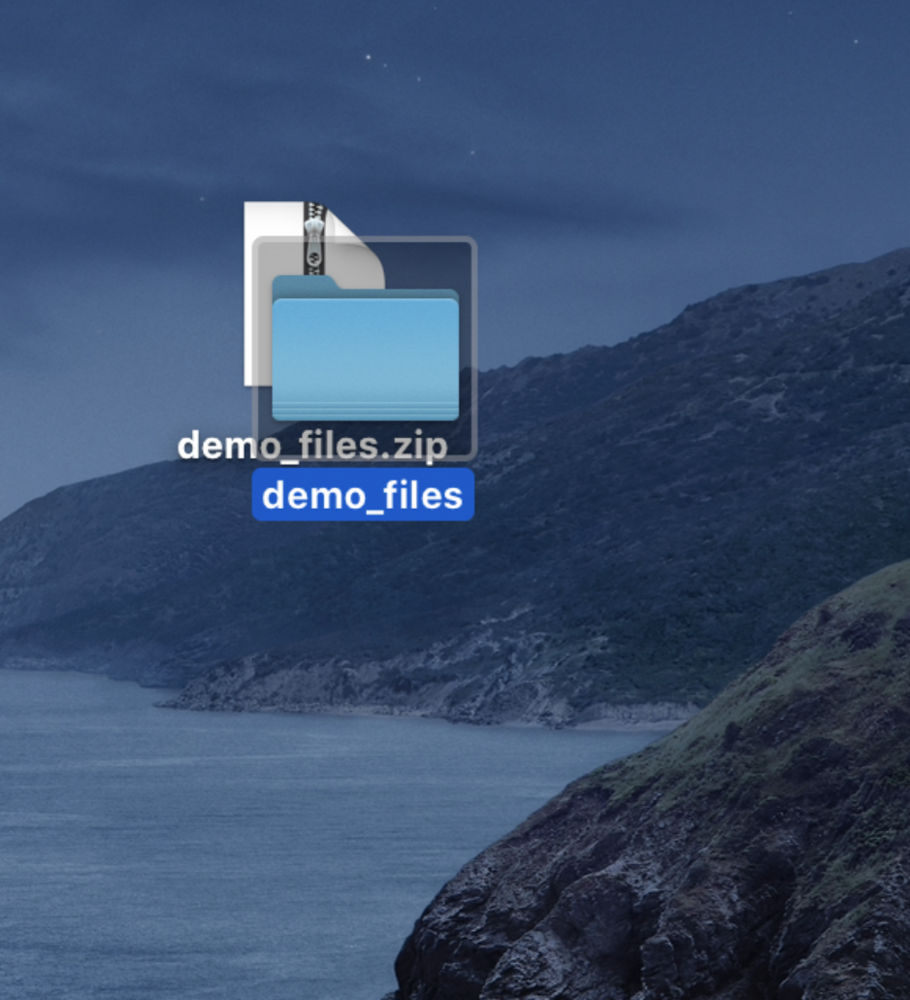
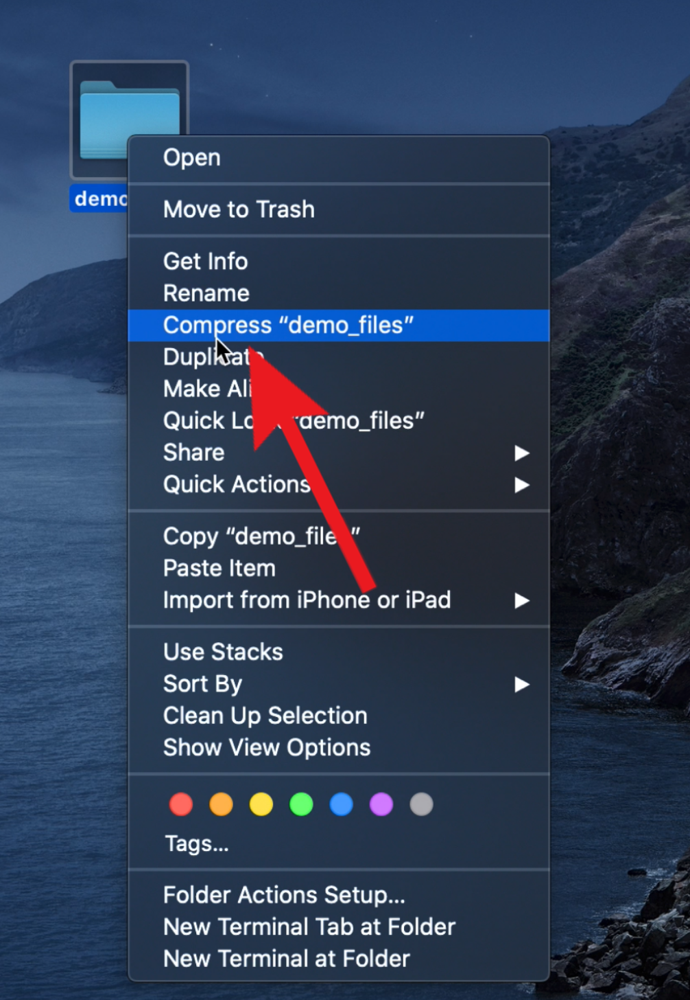
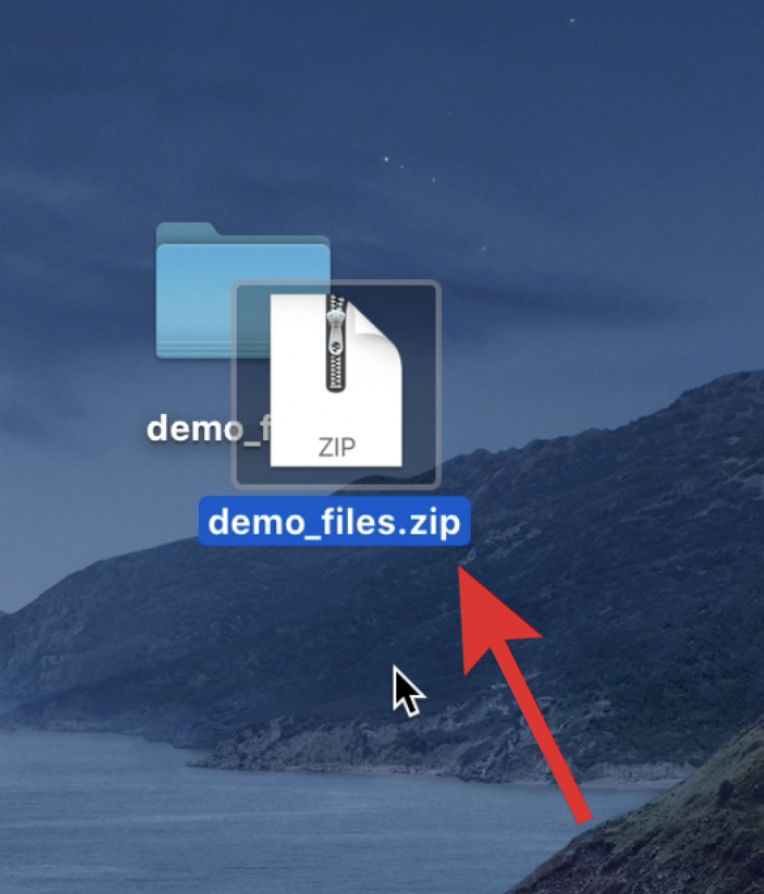

# Zipping Files in Mac

Zip files act like folders and may contain one or more compressed files. To access and use the files, the zip file must be “unzipped”. When creating a zip file, multiple files are combined into one .zip file, and the overall file size is reduced. Creating a ZIP file is helpful when you need to:
* Share more than one or two files with someone (over email, OneDrive, Google Drive, etc.)
* Reduce the total size of an email attachment
* Share a shapefile (since a shapefile is actually made up of multiple files)
* Backup a folder to save in OneDrive or Google Drive

---
## Unzip a File
{:toc}

1. **Double-click** the ZIP file, and the contents will be extracted to the ZIP files’ original location.

    

## Create a Zip File
{:toc}

**Video**: [How to create a ZIP file on Mac OS](https://www.youtube.com/watch?v=q9Noa2cVtFA&t=57s)

1. To create a ZIP file, **right-click** a folder or file, and select **“Compress”**.

    

1. A new ZIP file will appear in the same location as the original file. Repeat the same process with multiple files and/or folders selected to add them to a new ZIP file.

    
