# Tutorial
{: .no_toc }

Practice georeferencing an image in QGIS
{: .fs-6 .fw-300 }

  

    Table of contents
  

  {: .text-delta }
1. TOC
{:toc}

---
## Overview
{:toc}

Historical maps and photos are invaluable resources for exploring past landscapes. By visually comparing a historical image with a modern version, you can identify changes in natural resources, infrastructure, built environments, and toponyms. These resources become even more useful when georeferenced, because they can be layered on top of modern images with just the click of a button.

Sometimes you might come across an image that hasn’t been georeferenced yet and you aren’t able to upload it to an online georeferencer. That’s where QGIS comes in!

The goal of this exercise is to practice georeferencing a historical map in QGIS. If you are working with historical data (or just want to build up a collection of historical images), this is a great skill to learn so that you can start working with your own maps and photos.

You can refer to these resources for extra help along the way:
* [QGIS Documentation for the Georeferencer Plugin](https://docs.qgis.org/3.16/en/docs/user_manual/working_with_raster/georeferencer.html)
* [Esri’s Fundamentals of georeferencing a raster dataset](https://desktop.arcgis.com/en/arcmap/latest/manage-data/raster-and-images/fundamentals-for-georeferencing-a-raster-dataset.htm)

---
## Find an image to georeference

### 1. Download a scanned historical map
{: .no_toc }

In a web browser, open the map of Amherst in the 1873 Atlas of Hampshire County [State Library of Massachusetts Real Estate Atlases, Flikr site](https://www.flickr.com/photos/mastatelibrary/8880758314/in/album-72157633789629824/).

In the bottom-right corner, click the download button and select `Original (7255 x 4772)`. Save the image to a folder on your hard drive.

### 2. Flip the image
{: .no_toc }

The original version of the image is oriented sideways. To make it easier to georeference, open the image in an image editing program, rotate the image, and save it. 

**Windows users**: Paint may work better than the default Photos app - although you can rotate images in Photos, the Georeferencer tool may still import the photo in the original sideways aspect. 
**Mac users**: Preview should do the trick.

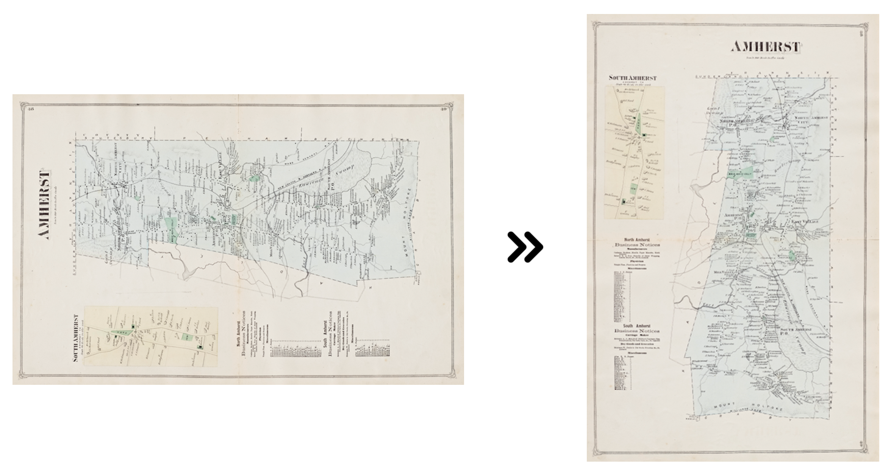

### 3. Create a workspace for your data
{: .no_toc }

This is a great time to start practicing good data management! In an ideal world, you’ll create a folder just for this tutorial somewhere on your hard drive. Then cut-and-paste or drag-and-drop the map into this folder.

Ideas for what to name the folder:
* QGIS_Workshop_Apr2021
* Amherst_Georeferencing_2021_0406
* Georeferencing_Workshop_Spring21

To learn more about good data management principles, check out this unit on [Data organization](https://umass-gis.github.io/workshops/content/basics-qgis/gis-basics.html#data-organization).

---
## Identify an appropriate target layer(s)
{:toc}

To georeference the map, you will use two layers: (1) a town boundary file from MassGIS and (2) the OpenStreetMap Standard imagery. The town boundary will give you potential GCPs along the edges of the town, and the OSM imagery will give you additional GCPs at visible features like road intersections.

### 1. Download the town polygon shapefile from MassGIS.
{: .no_toc }

In a web browser, open [MassGIS Oliver](http://maps.massgis.state.ma.us/map_ol/oliver.php). In the `Available Data Layers` panel, expand `Political / Administrative Boundaries > MA Town Boundaries`.

Right-click `Massachusetts Town Survey Boundaries` and select `View Metadata` – this will open a new tab with information about the layer and links to download the data. Find the link to download the shapefile and save it to your hard drive.

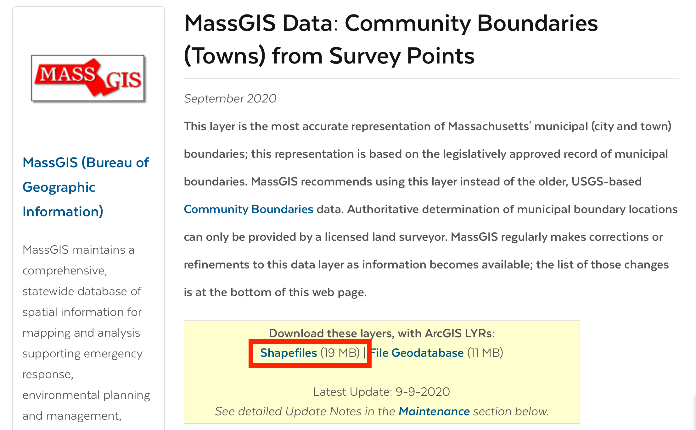

### 2. Unzip the file
{: .no_toc }

The file you download is zipped, so you’ll need to unzip it before you can continue.

**Windows users**: check out Microsoft's support page, [Zip and Unzip Files](https://support.microsoft.com/en-us/windows/zip-and-unzip-files-8d28fa72-f2f9-712f-67df-f80cf89fd4e5). 
**Mac users**: simply double-click the zip file to decompress it.

### 3. Add the town boundary shapefile to QGIS
{: .no_toc }

If you haven't done so already, launch QGIS and start a new project.

Add the file `TOWNSSURVEY_POLY.shp` to the map session. There are three ways to add a shapefile:
* Drag the shapefile into the map session from the File Explorer (Windows) or a Finder window (Mac).
* Navigate to the file in the `Browser panel` in QGIS and drag it from there.
* Click the `Add Vector Layer…` button, and to the right of “Vector Dataset” use the `Browse (…)` button to navigate to the file. Click `OK` if a transformation window appears.

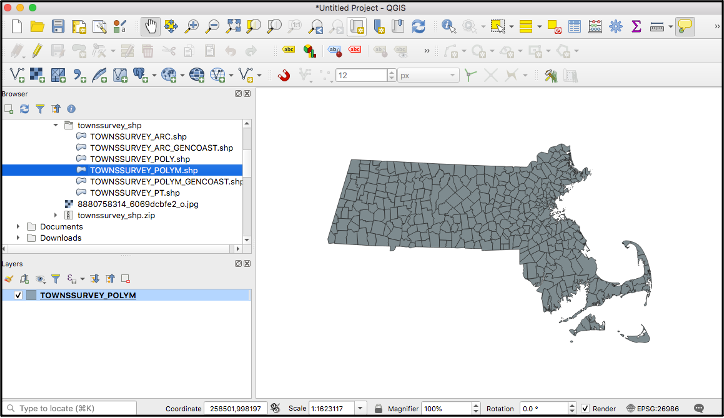

### 4. Change the layer's symbology
{: .no_toc }

In the `Layers` panel, right-click the layer and select `Properties`. Navigate to the `Symbology` tab.

Highlight `Simple Fill`. Use the drop-down button to the right of `Fill color` to set the fill to transparent. Change the `Stroke color` and `Stroke width` to your color of choice - the goal is to make them easy to see when the georeferencing starts.

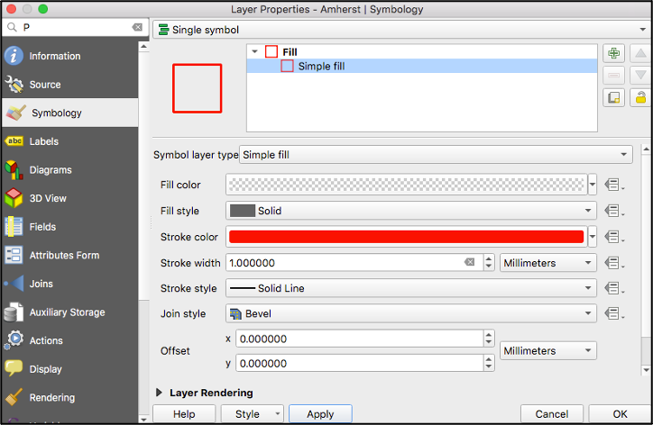

### 5. Load the OpenStreetMap web service layers
{: .no_toc }

If you haven't already done so, install the QuickMapServices plugin ([instructions here](https://umass-gis.github.io/workshops/content/basics-qgis/getting-started.html#install-helpful-plugins)).

Add OpenStreetMap to the map session. In the top menu, click `Web > QuickMapServices > OSM > OSM Standard`.

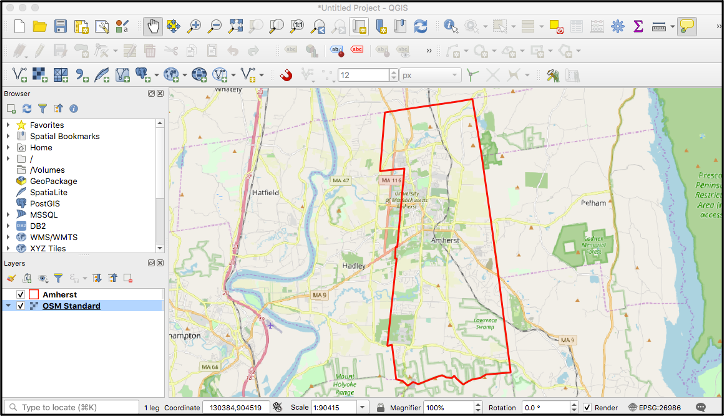

---
## Set the Project Coordinate Reference System (CRS)
{:toc}

Now that the target datasets are loaded, it's time to set the project CRS to the one you want assigned to the georeferenced map.

For this exercise, you will use a WGS84 projection because OSM imagery uses the **WGS84 datum**, which means it will play nicely with our session. **UTM Zone 18N** is appropriate because it is centered on the state of Massachusetts.

Follow [these steps](https://umass-gis.github.io/workshops/content/basics-qgis/coordinate-systems.html#change-the-project-crs) to change the Project CRS to [EPSG:32618 - WGS84 / UTM Zone 18N](https://epsg.io/32618).

Keep in mind that most MA state data uses the NAD83 datum, so if you are using data from MassGIS as the target dataset, you will want to choose a NAD83 projection instead.
{: .note}

It is important to know all of the projections of your data and pick the one that makes the most sense for your project!
{: .danger}

---
## Identify Ground Control Points (GCPs)
{:toc}

Now that the target datasets are loaded and the map session is set to the desired projection, you can begin georeferencing. In QGIS, this is done with the GDAL Georeferencer plugin.

### 1. Turn on snapping
{: .no_toc }

To make the georeferencing a bit more accurate, in the top menu bar click `Project > Snapping Options`. Click the `Enable Snapping` button to turn snapping on. Close the Project Snapping Settings window.

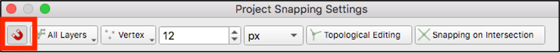

### 2. Activate the Georeferencer
{: .no_toc }

In the top menu, click `Raster > Georeferencer` to launch the georeferencing tool.

### 3. Load the map
{: .no_toc }

Load the historical map into the Georeferencer by clicking the `Open Raster…` button at the top of the tool and navigating to the map file you downloaded earlier.

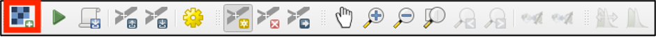

### 4. Add GCPs
{: .no_toc }

The `Add Points` tool should already be activated – if not, click it.

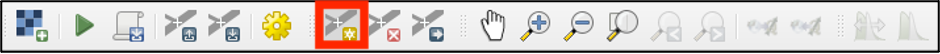

Zoom in to a part of the map where you can identify a common point with the target dataset, such as a corner of the Amherst town boundary. Click the point in the map. In the `Enter Map Coordinates` window that appears, select `From Map Canvas`.

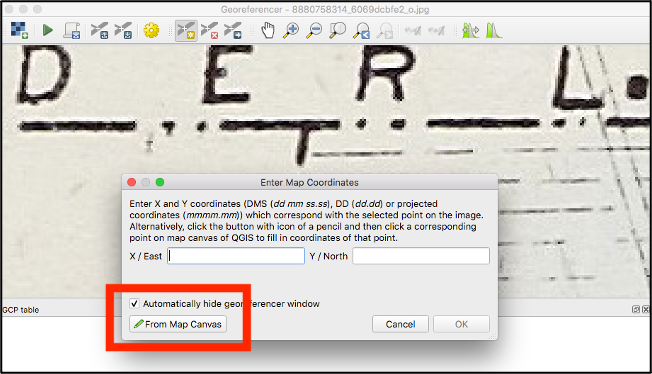

Click in the same location on the target dataset. Click `OK` in the window that pops up to add the link to the GCP table.

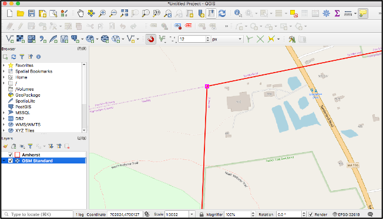

Continue adding GCPs across the map. Make sure they are well distributed, ideally in each of the four corners and throughout the center of the map. Use the Amherst town boundary corners, as well as features identifiable in the OSM imagery.

Be very careful that the features you select have not moved in the last 150 years! (Parts of the town boundary have!).
{: .warning}

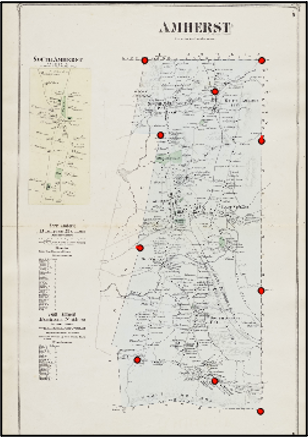

---
## Set the transformation and resampling methods
{:toc}

Click the `Transformation Settings…` button in the menu bar.

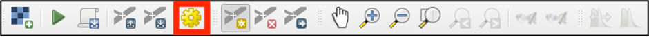

Set the following parameters:
* `Transformation type` - Polynomial 2
* `Resampling method` - Nearest Neighbor
* `Target SRS` - [EPSG:32618 - WGS84 / UTM Zone 18N](https://epsg.io/32618). 
* `Save GCP points` - (optional), check if you want to save the points for future georeferencing of the same image. You can also save them by clicking the `Save GCP Points as…` button in the menu bar. 
* `Use 0 for transparency when needed` - leave unchecked (this will turn some of the black pixels in the image to transparent). 

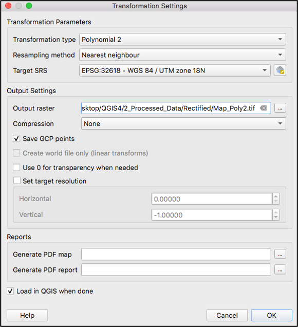

Click `OK`.

---
## Assess the GCP error
{:toc}

Once you've set the transformation method, take a look at the `Residual (pixels)` column in the GCP table. For any GCPs with high residual error, highlight the GCP and pan/zoom to investigate the point more closely. If it looks accurate, try adding some more GCPs to the general vicinity (the terrain might be affecting the residual values, or the points might not be well distributed). If it doesn’t look accurate, delete it and add a new one.

Remember: high residual error does not necessarily mean the point is located incorrectly, but it's worth investigating before finishing the georeferencing process.

---
## Save the georeferenced image
{:toc}

Click the `Start Georeferencing` button in the menu bar to run the tool.

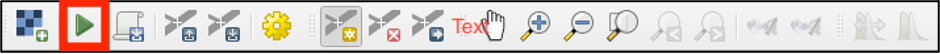

The georeferenced map should automatically load in the map session. Inspect the map – are there any areas that do not align well? Consider adding more GCPs or trying a different transformation method.

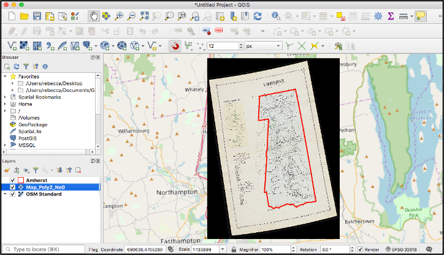

Congratulations! You successfully georeferenced a historical map and are ready to tackle a new georeferencing project!

---
## Further practice
{:toc}

If you're ready for a more difficult challenge, try georeferencing a historical aerial photograph. 

Aerial photos are more difficult than maps because for a number of reasons:
* the landscape may have changed since the photo was taken,
* aerial photos cover smaller areas and have more detail,
* it takes practice to be able to "read" an aerial photo and identify features like roads, houses, utility infrastructure, etc.

### The MacConnell Aerial Photo Collection
{: .no_toc }

The William P. MacConnell Aerial Photo Collection contains historical aerial photographs of the entire state of Massachusetts. The earliest date to 1951-1952. All the photos from this series have been scanned at high-resolution and are availalbe online through the [Special Collections & University Archives](https://credo.library.umass.edu/view/collection/mufs190) at UMass Amherst Libraries.

To locate an aerial photo, use the [MacConnell Aerial Photos Index (1951-1952)](https://arcg.is/qGe1) web map in ArcGIS Online.

1. Read the instructions on the web map's info page to learn how to use the map.
2. To launch the web map, click `Open in Map Viewer`.
3. Once you've located the photo you want to download, you can use SCUA's website to search for its code and download a PDF of the image (as in [this example](https://credo.library.umass.edu/view/full/mufs190-1952-dpb6h112-i001)). 
4. To download a `.jpg` version of the image, use this URL (substituting the YEAR and ID of the particular photo you want): https://credo.library.umass.edu/images/resize/full/mufs190-1952-dpb6h112-i001.jpg 
