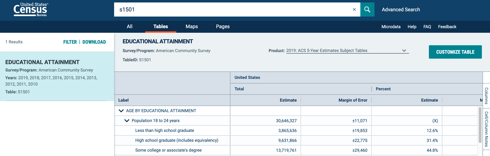
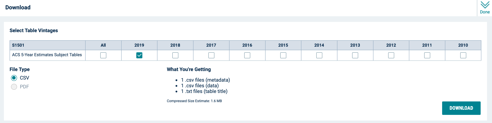
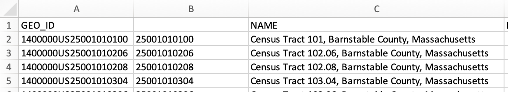
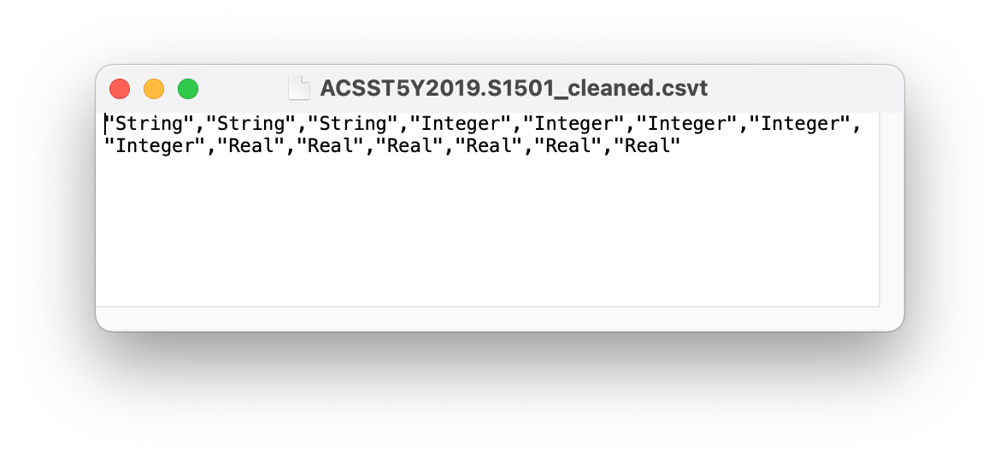
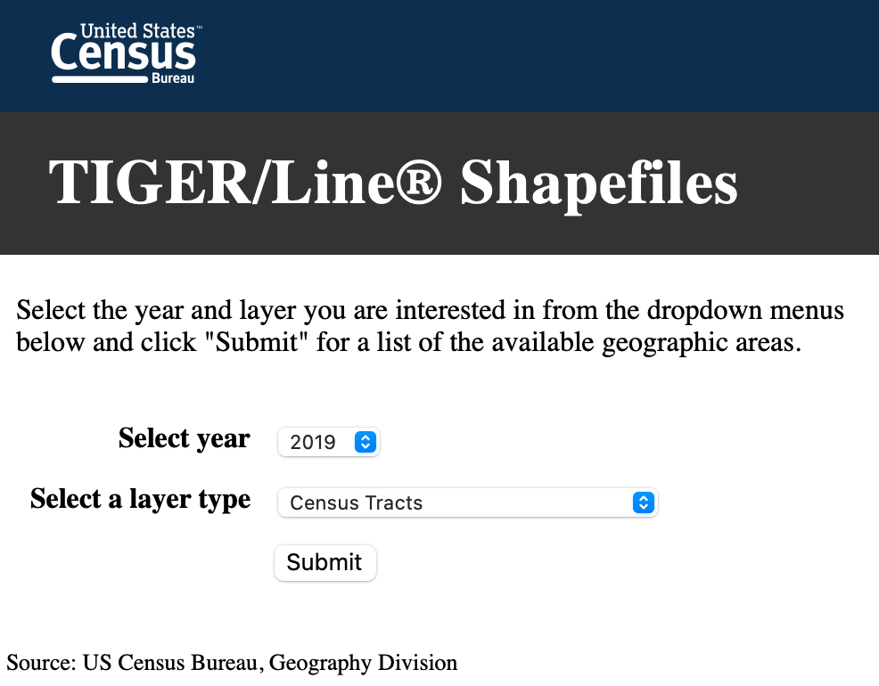
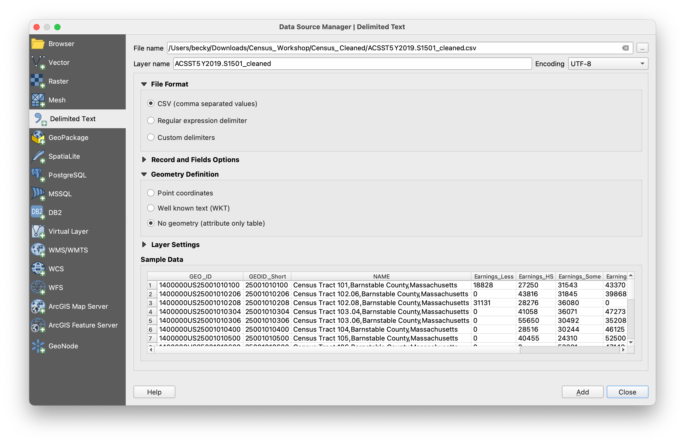

# Tutorial
{: .no_toc }

Practice mapping U.S. Census data in QGIS
{: .fs-6 .fw-300 }

  

    Table of contents
  

  {: .text-delta }
1. TOC
{:toc}

---
## Overview
{:toc}

We'll practice working with U.S. Census data by downloading a sample dataset from the American Community Survey program. Imagine you are a researcher who wants to find out more about education in the state of Massachusetts. Specifically, you want to explore know:
* How much money do people earn depending on their level of education?
* How many people earn Bachelor's and advanced degrees?
* How many people within specific race/ethnicity groups earn Bachelor's and advanced degrees?

Most importantly, you want to find out how these data play out spatially. Your hypothesis is that there is spatial variability to the datasets (for example, you hypothesize that people living in Boston earn more than people in Western Massachusetts, even if they have the same level of education).

To answer these questions, you'll use the Subject Table on "Educational Attainment" from the ACS 5-Year Estimate for 2015-2019 (Table S1501).

### If you're short on time...
{: .no_toc}

Most of this tutorial teaches you how to find data on the U.S. Census Bureau's website and how to clean it to get it ready for mapping in QGIS. You can skip these steps and go straight to [Join the files in QGIS](#join-the-files-in-qgis) by downloading the data pack here:

[Get the data pack](https://github.com/umass-gis/workshops/blob/main/content/mapping-census-data/data/mapping-census-data-pack-Fall2021.zip){: .btn .btn-purple }

This link will take you to a page on GitHub. Click the `download` button to save it to your computer.

---
## Find and download the ACS 5-year estimate subject table
{:toc}

* Search the [Explore Census Data](https://data.census.gov/cedsci/) portal for "S1501" (or click [this link](https://data.census.gov/cedsci/table?q=s1501&tid=ACSST5Y2019.S1501) to open the table directly).
* Click the table name, "Educational Attainment," to open the table.
* In the product drop-down menu, select "2019: ACS 5-Year Estimates Subject Tables."

 
* In the upper-left corner, click “Filter” to open the filter panel.
* Check Geography > Tract > Massachusetts > All Census Tracts within Massachusetts.

 
* Minimize the filter window by clicking the "Done" button in the upper-right corner.
* Click "Download Table" to open the download dialog, then click "Download" to save the table and its associated metadata to your hard drive.

---
## Clean the table so it can be joined in QGIS
{:toc}

* Unzip the file you just downloaded and take a look at its contents. There should be three files:

| ACSST5Y2019.S1501_data_with_overlays.csv | The main data table |
| ACSST5Y2019.S1501_metadata.csv | A list of all the fields (i.e. columns) in the data table; this file will help you figure out which fields you'll need for your research |
| ACSST5Y2019.S1501_table_title.txt | The metadata for the data table; it explains where the data came from and how to interpret symbols (like asterisks) used in the table |

 
* Open the list of fields in Excel (or another spreadsheet program). The list has two columns: the first column contains a code, and the second column contains a title or explanation for that code. Figure out which fields you'll need to answer your research question. It can be helpful to highlight these fields in the spreadsheet or write down the codes on a piece of paper.  

 
* Open the main data table in Excel (or another spreadsheet program).
* Save a copy of the file in .xlsx format.

 
* The next step is to create a "clean" version of the data table that contains only the GEO_ID column, the NAME column, and your selected research fields - all the other columns should be deleted.
  * **Option 1**: Find the columns that contain the data you want to explore, and delete all the other columns.
  * **Option 2**: Create an empty .xlsx file and copy-paste the columns into this document.
* Consolidate the header rows into a single row.
* Rename each column so the title is short and informative. Use underscores (_) instead of spaces.

 
Next, we want to make sure that QGIS will properly read each of the columns with numbers as numerical data. This won't work properly if there are dashes or empty cells.
* **Replace dashes with 0**:
  * Open Excel's "Replace" tool.
  * In the "Find what:" field, type the dash symbol (-).
  * In the "Replace with:" field, type 0.
  * Click "Replace All."

* **Replace empty cells with 0**:
  * Open Excel's "Go to Special..." tool and search for "Blanks."
  * Once all the blank cells are highlighted, type the value 0 and click Ctrl+Enter (Windows) or Command+Enter (Macs)

 
Last but not least, the data in the GEO_ID column isn’t in the correct format, so we'll need to fix that.
* Add a new column and use the formula “=RIGHT(A2,11)” to retrieve just the 11 right-most characters from the GEO_ID field.

* Drag the formula down to the end of the column.

* Create a new column and copy-paste just the values into it. The goal here is to remove the formula, and paste just the reformatted GEOID code. Give the column a name, like "GEOID_Short."
* Delete the column with the formula.
* Format the new column as text.

* Save the .xlsx file - this format is typically easier to edit, so it's a good idea to keep this version somewhere with your other data files.
* Save a copy of the file in .csv format - this is the version we will use in the next step, because it plays nicely with QGIS software.

 
**Fun extra step!** QGIS sometimes has a hard time deciphering the data type for the columns in a .csv file. In order to make the process more seamless, we will create a .csvt file that tells QGIS the exact data type of each column. The format for a .csvt file is a single line of text, with each column's data type in quotes and separated by commas. The data type choices are: "Integer", "Real", and "String".

* Open a text editor like Notepad or a word processor like Microsoft Word.
* In a singe line, list the data types for the fields in your cleaned data table.
* Save the file in .csvt format. The filename must *exactly match the name of your data table*. If you are unable to save it in .csvt format directly, you can save it as a .txt file and then manually change the extension to .csvt.

Mac users beware! Macs might add the extension .txt to the end of the filename, even if you manually replace it with .csvt. To fix this, right-click the file and select "Get Info." Expand the Name & Extension section, then delete the .txt ending (making sure "Hide extension" is unchecked).
{: .note}

In this example, the .csvt file is referencing the data table "ACSST5Y2019.S1501_cleaned.csv." It tells us that the first 3 columns are text ("String"), the next 5 are integers, and the last 6 are decimals ("Real").

---
## Download the census tract shapefile for MA
{:toc}

The table we exported in Step 2 summarized the ACS data at the tract level for the state of Massachusetts. We chose the ACS 5-Year Estimate for 2015-2019, which uses the most recent version of the Census Bureau's boundary data: 2019. Therefore, we need to download the 2019 shapefile of the tracts in Massachusetts.

### Option 1: Cartographic boundary shapefile (best for mapping the state)
{: .no_toc}

* Go to the [Cartographic Boundary Files page](https://www.census.gov/geographies/mapping-files/time-series/geo/cartographic-boundary.html).
* Click the tab for the year 2019.
* Scroll down to the section "Cartographic Boundary Files by Geography," then continue scrolling until you get to "Census Tracts"
* In the dropdown for "1 : 500,000 (state) shapefile," select the state of Massachusetts. The file should automatically download.

* Unzip the file. It’s now ready to be added to QGIS!

### Option 2: TIGER/Line shapefile (best for mapping individual towns)
{: .no_toc}

* Go to the [TIGER/Line Shapefiles page](https://www.census.gov/geographies/mapping-files/time-series/geo/tiger-line-file.html).
* Click the tab for the year 2019.
* Under "Download", click "Web interface" to launch the download portal.
* Select year: 2019.
* Select a layer type: Census Tracts.
* Click "Submit."

* Select a state: Massachusetts.
* Click "Download."
* Unzip the file. It’s now ready to be added to QGIS!

---
## Join the files in QGIS
{:toc}

* Start a new session in QGIS.
* Add the tract shapefile to the map. For a refresher on how to add a vector layer, check out [Open a Layer](https://umass-gis.github.io/workshops/content/basics-qgis/getting-started.html#open-a-layer) in the Learn the Basics of QGIS workshop.

* Change the project coordinate reference system (CRS) to EPSG:26986 (NAD83 Massachusetts Mainland). For a refresher on coordinate systems, see [Change the Project CRS](https://umass-gis.github.io/workshops/content/basics-qgis/coordinate-systems.html#change-the-project-crs) in the Learn the Basics of QGIS workshop.

* Use the "Add Delimited Text Layer" button to add the cleaned .csv file that you created in Step 2.
  * **File name**: use the three buttons to the right of the box to navigate to where you saved the .csv file.
  * **Geometry Definition**: Select "no geometry (attribute only table)."
  * **Sample Data**: scroll to the right to check that all the fields will import properly. If you see an error, go back to the .xlsx file, correct the issue, re-export the table as a new .csv, and try again.
  * Click "Add," then "Close."

* Open the data table's properties window, then navigate to the "Fields" menu. Double-check that all the fields were imported in the correct format. The most important field is GEOID_Short, which must be formatted as a string/text field in order for the join to work. If you see a problem, go back to the end of Step 2 and work on fixing the .csvt file so that the .csv imports properly.
* Close the window when you're done.

* Open the tract layer's properties window, then navigate to the "Joins" menu.
* Click the green plus icon (+) to add a new join.
  * **Join layer**: the .csv data table
  * **Join field**: GEOID_Short (or whatever you named the abbreviated GEOID field from Step 2)
  * **Target field**: GEOID
  * Click OK, then OK again.

* Open the tract's attribute table and explore. Scroll all the way to the right to confirm that the data table was successfully joined to the shapefile.
* Congratulations! You can now have fun exploring the data visually! Check out the slides on [Vector Symbology](https://umass-gis.github.io/workshops/content/basics-qgis/visualizing-data.html#vector-symbology) for a quick refresher on how to use different colors and patterns to visualize data.

*Map showing the percent of people who have earned a high-school degree or higher*

---
## Answer the research questions

Now that your data is ready to go in QGIS, you can try to answer your research questions about education levels in the state of Massachusetts:
* How much money do people earn depending on their level of education?
* How many people earn Bachelor's and advanced degrees?
* How many people within specific race/ethnicity groups earn Bachelor's and advanced degrees?
