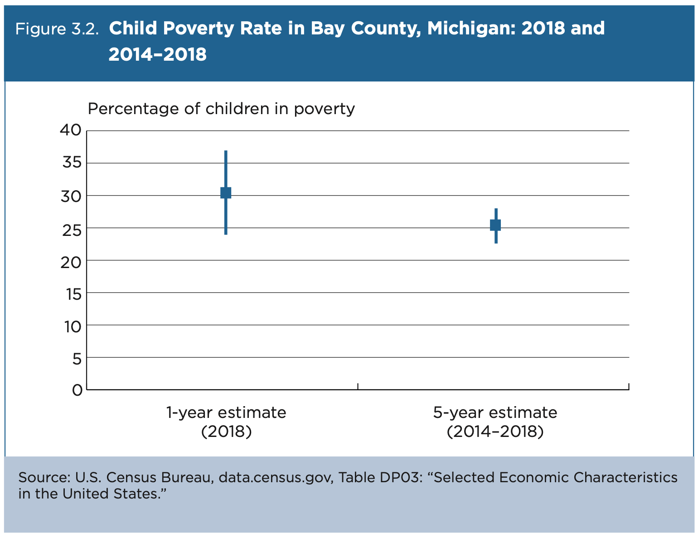

# Types of Census Data
{: .no_toc }

Brief intro to the U.S. Census Bureau's main datasets
{: .fs-6 .fw-300 }

  

    Table of contents
  

  {: .text-delta }
1. TOC
{:toc}

---
## Overview
{:toc}

The U.S. Census Bureau carries out over one hundred [surveys and programs](https://www.census.gov/programs-surveys/surveys-programs.html) each year. If you're looking for information about a particular topic, chances are very good that the Census Bureau has data about it. If you're interested in exploring demographic trends - including population, income, race, housing status, and more - the two main datasets to consult are the [Decennial Census](#decennial-census) and the [American Community Survey](#american-community-survey).

### How to access the data
{: .no_toc }

The main place to find and download Census data is the [Explore Census Data](https://data.census.gov/cedsci/) portal. The portal will search across all the Census Bureau's many datasets. If you already know what type of data you're looking for, you can use the filter to narrow down the search to just that dataset, geography, or subject.

---
## Decennial Census
{:toc}

Every 10 years, the U.S. Census Bureau carries out a nation-wide survey to find out how many people are living in the country. The first [Decennial Census](https://www.census.gov/programs-surveys/decennial-census.html) was carried out in 1790, and the most recent in 2020.

### What information it contains
{: .no_toc }

The exact data collected by each Decennial Census changed over time. Generally, you can expect the datasets to contain very basic demographic information that is summarized by some geographical unit, including:
* Age
* Race and Ethnicity
* Sex
* Tenure (Owner/Renter)

Individual records are kept confidential for 72 years, but records older than that are available through the [National Archives](https://www.archives.gov/research/census). Researchers can use these to learn about specific people who responded to the census survey.

### Why this data matters
{: .no_toc }

The Decennial Census is a critical source of data that is used for **apportioning** the House of Representatives among the states, so that states that increase in population gain more seats, and those that lose population lose seats. The data also directly informs the **redistricting** process: voting districts within each state may be redrawn in order to more fairly represent the distribution of residents.

In short, the Decennial Census is used to make decisions about voting districts that will be in place for the next 10 years. These decisions directly affect how funds are distributed, and they can even alter the outcomes of elections.

To learn more about the apportionment process, check out this video:

---
## American Community Survey
{:toc}

The [American Community Survey (ACS)](https://www.census.gov/programs-surveys/acs) is a much more detailed survey that is sent to a sample of 3.5 million addresses over the course of every year. The data are pooled together and used to produce an estimate for that year. This means the data is *representative of the wider population*, rather than a thorough documentation of every living person or a snapshot of a single point in time (like the Decennial Census). However, what makes it useful is the depth of its questions - the ACS collects information about all kinds of topics that are not included in the Decennial Census.

ACS data is the main source of information about communities in the U.S. The data is used to allocate funding at the local and national levels for programs, emergency management, economic development, and so on, and it gives leaders insight into changing demographic trends at the community scale.

The handbook *Understanding and Using American Community Survey Data: What All Data Users Need to Know* ([here](https://www.census.gov/programs-surveys/acs/guidance/handbooks/general.html)) is a great place to find more information about the ACS.

### What information it contains
{: .no_toc }

The ACS asks about a wide range of topics that don't appear in the Decennial Census, including:
* Social Characteristics
  * Ancestry, Citizenship Status, Citizen Voting-Age Population, Disability Status, Educational Attainment, Fertility, Grandparents as Caregivers, Language Spoken at Home, Marital History, Marital Status, Migration/Residence 1 Year Ago, Period of Military Service, Place of Birth, School Enrollment, Undergraduate Field of Degree, Veteran Status, Year of Entry
* Economic Characteristics
  * Class of Worker, Commuting (Journey to Work), Employment Status, Food Stamps/Supplemental Nutrition Assistance Program (SNAP), Health Insurance Coverage, Income and Earnings, Industry and Occupation, Place of Work, Poverty Status, Work Status Last Year
* Housing Characteristics
  * Computer and Internet Use, House Heating Fuel, Kitchen Facilities, Occupancy/Vacancy Status, Occupants Per Room, Plumbing Facilities, Rent, Rooms/Bedrooms, Selected Monthly Owner Costs, Telephone Service Available, Tenure (Owner/Renter), Units in Structure, Value of Home, Vehicles Available, Year Householder Moved Into Unit, Year Structure Built
* Demographic Characteristics
  * Age and Sex, Group Quarters Population, Hispanic or Latino Origin, Race, Relationship to Householder, Total Population

For a full list of subjects with links to quickly search in the Explore Census Data portal, visit [Subjects Included in the Survey](https://www.census.gov/programs-surveys/acs/guidance/subjects.html).

### Which estimate to use
{: .no_toc }

ACS data are available in 1-year estimates and 5-year estimates. For a while, the U.S. Census Bureau also published 3-year estimates, but they discontinued this in 2013.

|  | 1-year estimates | 1-year supplemental estimates | 3-year estimates [discontinued] | 5-year estimates |
| :--- | :--- | :--- | :--- | :--- |
| Pooled data | 12 months | 12 months | 36 months | 60 months |
| Availability | Areas with populations of 65,000+ | Areas with populations of 20,000+ | Areas with populations of 20,000+ | All areas |
| Reliability | Less reliable than 3- or 5-year | Less reliable than 3- or 5-year | More reliable than 1-year, less reliable than 5-year | Most reliable |
| Currency | Most current | Most current | More current than 5-year, less current than 1-year | Least current |
| Release dates | 2005-present | 2014-present | 2007-2013 | 2009-present |
| Smallest Geographic Entity | Counties | Counties | Counties | Census Tracts or Block Groups (depending on the table) |

*Information from [When to Use 1-year or 5-year Estimates](https://www.census.gov/programs-surveys/acs/guidance/estimates.html)*

### Which product to use
{: .no_toc }

If you're unsure where to start with ACS data, [Which Data Table or Tool Should I Use?](https://www.census.gov/acs/www/guidance/which-data-tool/) is a helpful guide for figuring out which ACS dataset might be appropriate for your research question. These are some of the ways you can access ACS data:
* **Detailed Tables** contain the most detailed cross-tabulations, many of which are published down to block groups. The data are population counts. There are over 20,000 variables in this dataset.
* **Subject Tables** provide an overview of the estimates available in a particular topic.  The data are presented as population counts and percentages.  There are over 18,000 variables in this dataset.
* **Data Profiles** contain broad social, economic, housing, and demographic information. The data are presented as population counts and percentages. There are over 1,000 variables in this dataset.
* **Comparison Profiles** are similar to Data Profiles but also include comparisons with past-year data.  The current year data are compared with prior 5-Year data and include statistical significance testing.  There are over 1,000 variables in this dataset.

*Information from [American Community Survey 5-Year Data (2009-2019)](https://www.census.gov/data/developers/data-sets/acs-5year.html)*

### A note on sampling error
{: .no_toc }

All ACS data has a degree of uncertainty associated with it because it is based on a sample, rather than a total survey of all people in the country. All ACS data contains a "margin of error" for each estimate, which should be combined with the actual ACS estimate in order to determine the range of values within which the "real-world" value is likely to fall.

Because they have a larger sample size, 5-year estimates are more accurate than 1-year estimates.

*Figure 3.2 shows the improved precision of an ACS 5-year estimate, compared with a 1-year estimate, for child poverty statistics in Bay County, Michigan—a county with about 100,000 residents in 2018. The lines above and below the point estimates represent the confidence intervals, or ranges of uncertainty, around each estimate. The confidence interval for the 1-year child poverty estimate ranges from 23.5 percent to 36.9 percent (13 percentage points) while the interval for the 5-year estimate is narrower, ranging from 22.7 percent to 27.7 percent (5 percentage points) ([U.S. Census Bureau 2020](https://www.census.gov/programs-surveys/acs/guidance/handbooks/general.html)).*

---
## GIS Files
{:toc}

The [Geography Program](https://www.census.gov/programs-surveys/geography.html) is key to how the U.S. Census Bureau collects and shares data. The Census' geographic units range from the lowest resolution (nation) to the highest resolution (blocks). Different datasets are available at each of these levels.

*[U.S. Census Bureau 2020: Standard Hierarchy of Census Geographic Entities](https://www.census.gov/programs-surveys/geography/guidance/hierarchy.html)*

The first step when looking for Census data is to figure out what scale is appropriate for your research study. Do you need the highest possible resolution of data (the census block)? Or is generalized data more appropriate? Once you figure out which geographical unit you are interested in, you can go ahead and start mapping!

### Each geographic unit has a GEOID
{: .no_toc }

The key thing to remember is that every spatial unit - be it a county, a town, a census block, or so on - has a unique identifier called a [GEOID](https://www.census.gov/programs-surveys/geography/guidance/geo-identifiers.html). GEOIDs appear consistently across all U.S. Census Bureau's products to make comparing and joining data possible.

For example:
* The GEOID for the state of Texas is 48.
* The GEOID for Harris County, TX, is the state code (48) + the county code (201), or 48201.
* The GEOID for census tract 2231 in Harris County, TX, is the state code (48) + the county code (201) + the tract code (223100), or 48201223100.

GEOIDs allow users to join a GIS file (of the geographic boundaries) with a data table (containing the Census data) in order to explore the data spatially.

### Which dataset to use
{: .no_toc }

If you plan to create your own maps in GIS software, you'll need to download the appropriate GIS boundary file. The Census Bureau's Geography Program offers two basic types of boundary files: **TIGER/Line files** and **Cartographic Boundaries**. Boundary files don't contain any census data, while others are curated versions that have been pre-joined to the Census tables to make mapping easier.

TIGER stands for Topologically Integrated Geographic Encoding and Referencing. Fun fact!
{: .note}

This table summarizes the boundary files that are available in shapefile (.shp) format. The Census Bureau also provides curated data that has been pre-joined to the Census table to make mapping easier (called "TIGER/Line with Selected Demographic and Economic Data"), but these are only available in geodatabase (.gdb) format, which is a proprietary file format that can only be used with ArcGIS software.

|  | TIGER/Line Shapefiles | Cartographic Boundary Shapefiles |
| :--- | :--- |
| Best for... | Most mapping projects; this is the most comprehensive dataset | Thematic mapping of large areas |
| Type of data | Boundaries, roads, address information, water features, and more | Small-scale (limited detail) boundaries clipped to shoreline |
| Level of detail | Full detail (not generalized) | Less detail (generalized) |
| Descriptive attributes | Extensive | Limited |
| Vintages available | 2006-2021 | 1990, 2000, 2010, 2013-2020 |

*Information from [TIGER Data Products Guide](https://www.census.gov/programs-surveys/geography/guidance/tiger-data-products-guide.html)*
