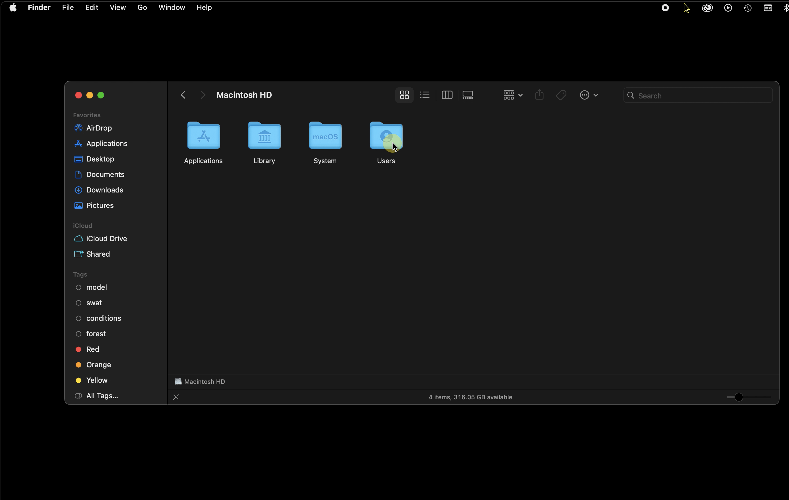

# Introduction to Directories
{: .no_toc }

  

    Table of contents
  

  {: .text-delta }
1. TOC
{:toc}

---

Note: This tutorial was created on Mac OS Ventura. Depending on your specific operating system, some options may appear differently on your machine, but the general processes should be similar if not the same.

Smoothly operating and navigating your computer's file storage system is a fundamental skill for anyone who works with or uses computers. On Mac OS, the hierarchical (or "nested") file system has three basic domains, Local, System, and User.

[Image: Apple Inc.](https://developer.apple.com/library/archive/documentation/FileManagement/Conceptual/FileSystemProgrammingGuide/FileSystemOverview/FileSystemOverview.html)

 The term "file path" refers to the specific location of a file or folder within the computer's directory. The forward slash "/" symbolizes the base or "root" directory on Mac OS. All absolute file paths begin with "/"; relative file paths may begin further "down" in the directory. For example, the absolute path of "Utilities" is "/Applications/Utilities". "Relative" paths do not list all the folders containing the file or folder of interest, and instead can begin at any of the folders above "/" in the hierarchy. For example, if we were viewing (or "at") the "Applications" folder, and we wanted to write the relative path of the "Utilities" folder from this location, we could leave out the "/" and write the path as "Applications/Utilities"; this would be referred to as a relative path. [[[re-word/clunky, also, technically you just wrote the path to utilities FROM / not from applications, from applications the path is just Utilities...so maybe not a great example. use longer path]]]

With the exception of the Applications folder (in the Local Domain), most users should avoid manipulating any files in the "System" domain, and should only work within the "User" domain.

Follow the tutorial below for a step by step tour of your computer's directories, and for demonstrations on how to:

* navigate finder
* create folders
* save and copy files
* move and manage multiple files
* delete files
* Use Spotlight to search your entire computer  

---
## Basics of "Finder"
{:toc}

1. Open the Finder application by clicking any blank area on the Desktop.
2. From the Menu bar, select **Go**

3. From the dropdown menu, select **Computer**

#### Basic View Options

4. A new finder window will appear, showing "Macintosh HD", and "Network" icons. Currently, the finder window is set to display items in "icon" view, indicated by the four small highlighted boxes at the top of the finder window.

5. To toggle to "list" view, **select the symbol with the three small horizontal lines**. Notice that now, columns titled "Date Modified", "Date", and "Kind" have appeared. This is an excellent view option if you have many items in a folder and want to organize or view them with a little more detail. These view options are also available from the Finder Menu bar, under "View"

6. To toggle to "column" view, **select the symbol with three vertical lines**. This is an excellent view to use when navigating through Mac OS's nested file structure. Once a directory is selected, users may navigate by using their cursor and clicking, or by using their directional arrow keys.

7. A "gallery" view is also available, which shows a short summary of the file, and displays a large icon. To activate "Gallery" view, **select the right-most symbol**, which is a small rectangle with three dots beneath it. Afterwards, switch back to Icon view.

8. At the bottom of the displayed Finder window, the absolute path of the current directory is shown.

9. To toggle this "Path Bar" on or off, **select "View" from the finder menu bar**.

10. From the dropdown menu, **select "Hide/Show Path Bar"**. Please toggle the path bar on for the duration of this tutorial. It can be useful to see full file paths while navigating through finder. This way, if you are ever in doubt of a file's location, you will have quick access to its parent directories. **Note: Clicking a folder in the file path bar navigates to that directory.**

### Mac Directories - System and Local Domains
{:toc}

##### Macintosh HD (Hard Drive) "/"

12. **Double-click "Macintosh HD"**.

13. This is the "root" (or base) directory, symbolized by "/" in all absolute file paths. All files contained on your computer are held in this location. They are in one of four locations, "Applications", "Library", "System", or "Users"

##### Library

14. **Double-click the Library folder**, but do not make any changes to this folder.

15. **IMPORTANT NOTE** Unless you are advnised by an Apple representative, or someone with an extremely high level of technical knowledge, **never add, delete, manipulate or change in any way, any files in this location**. The files contained in the Library directory are used for basic processing tasks, and changing anything in this folder (including adding folders), could disrupt your computer, or stop it from working entirely.

16. In the upper left corner of the finder window, **select the left arrow to navigate "backwards"**, to the directory we were last in, called "Macintosh HD". The right-facing arrow will navigate "forward" to the next "child" or subdirectory we had selected.

##### Applications

17. From "Macintosh HD" **Double-click the "Applications" folder**.

18. **Select "List" view** to show item details. This is the default save/installation location for any applications that are installed on your machine. If you download an app from the app store, and install is using default settings, you will be able to run the application by locating it in this directory and double-clicking it.

##### "Favorites" bar (quick access)

19. On the left-hand side of all finder windows, underneath the red, yellow, and green buttons, several "Favorite" directory locations appear in blue text. Users can also access the "Applications" folder by **clicking "Applications"** from Favorites.

20. **Select "Desktop"** to show the items present on your dekstop and **select list view**. In the picture shown, the user has 7 folders, and 2 files on their desktop.

##### Change Details in List View [[["Advanced List View Options"]]]

21. Once in List view, **select "View" from the finder menu bar**.

22. Select **"Show View Options"**

23. A dialog box should appear showing check-boxes to toggle specific attributes. Check Date Created, Size, and Date Modified.

24. In the desktop shown below, the items are organized by the date they were modified; the most recently-modified appearing at the top. This is indicated by the text "Date Modified" being highlighted. Double-clicking "Date Modified" will reverse the order. The same is true of all column headers.

25. To organize files based on their size, **click "Size"**. Notice that only files have associated sizes. The folders contain files (that all have sizes), but finder only reports size for files, not folders. Note: to see the total size of a folder, right-click the folder, and select "Get Info" from the dropdown menu.

  

26. The desktop items are now organized by their size. This can be especially helpful when trying to save space.

### Mac Directories: User Domain and Best Practices for File Management

##### User Domain Introduction
With the exception of Applications, the default save location for all files in a Mac enviornment is within the Users domain. (It is useful to store applications in the "Applications" folder within the system domain; this enables applications to be run from any new/additional user accounts you create). Other than applications, all files should be carefully organized within the User domain.   

27. To examine the set of User directories, open Macintosh HD and **double-click the folder of the user you are currently logged in to.** You will be able to tell which user you are in because the current User folder will have a small "Home" or "House" symbol on it. If you have any doubt about which User account you are currently in, click the apple-shaped icon in the upper left corner of the screen, and look at the bottom "log out of..." text. What follows "log out of..." will be the name of your current user.

28. Now that we're viewing the main User folder, several sub-folders should appear. With the exception of "Zotero" and "test_directory", all other folders should be present in your User folder. Take note of the "Downloads" folder. This is the default save location for any data, folders, or files downloaded from the internet. If you download a photo, music file, or video file, it is possible (depending on your system settings) that the file will be saved in "Movies", "Music", or "Pictures" -- this may be a good place to check if a download is not showing up in the "Downloads" folder. **Note: it is generally best-practice to avoid leaving items in your downloads folder; ideally they would be filed into some logical system of organization within your directories.*** See below for more information.

##### File Management Best Practices
29. In order to simplify file paths and make your directories easier to navigate, we suggest that you use "Documents" as the main folder in which all other files and folders are kept. Double-click "Documents" to view this directory.

Within this folder, if you were using your computer for Graduate School, Work, and Personal use, you might consider creating and adding the following folders to begin organizing your files (potential subfolders are shown as nested bullets):

* Pictures
  - pics_2023 (with subfolders like "Cape Cod Vacation", or "Dog Pictures")
  - pics_2022
* Videos_2023
  - vid_2023
  - vid_2022
* workDocuments_2023
  - Client_list
  - wd_q1
  - wd_q2
  - wd_q3
  - wd_q4
  - WorkDocs_archive (with subfolders for previous years)
* PersonalDocuments_2023
  - Taxes_2023
  - Reciepts_2023
  - Poems_2023
  - Misc
* GradSchool_docs
  - Fall_2023 (Could include subfolders such as "Econ101", "Assignments", etc.)
  - Winter_2023
  - Spring_2023
* GradSchool_data
 - Modeling_data
 - Data_Documentation

The most important part of setting up directories is ensuring that the system ***makes sense for you*** considering how you plan to use your computer and the files on it. For example, if you don't keep music on your computer, there is no need for a folder (or some complex of subfolders) for Music. If you are an accountant and have hundreds of clients, and tax information for each client, for each quarter, you may need to carefully craft a directory with many subfolders to store this information in a way that minimizes the effort needed to retrieve necessary information. If users neglect to set up sensible directories, they may spend ***a lot*** of time sifting through all their files in an attempt to find the one(s) they need. It is worth it to spend some time creating a logical directory for yourself, and then to continually tinker with and update it as needed to ensure smooth operation.

### Creating New Folders, Choosing Save Locations, Copying, and Moving Files [[[alternative header?]]]

##### Create New Folders

30. While in the documents folder (or with the Documents folder selected), click "File" from the menu bar.

31. From the dropdown menu, select "New Folder"

32. A new folder named "Untitled Folder" will be added to the Documents directory. **Single-click "Untitled Folder"** to highlight it.

##### Rename Folders

33. With the Untitled Folder highlighted, **press "Enter" on the keyboard to select the text.** The text should now appear highlighted. Rename the file to "a_new_folder", and press enter on the keyboard.

34. "a_new_folder" should now appear near the top of the documents folder, depending on how other items in the folder are named.

##### Create text file and save to new folder

35. Open "Applications" from Favorites by single-clicking "Applications"

36. Open "Text Edit"

37. With Text Edit open, select "File" from the menu bar.

38. From the dropdown menu, click "New"

39. Type something in the new Text Edit window that opens.

##### Save work to a specific folder/location

40. With your changed Text Edit window open, **select "File" from the menu bar**.

41. From the dropdown menu, **click "Save"**.

42. A new Save dialog box should open. The default save location is your most recent save location. For example, if the last place I saved something to was /Users/johnslaff/Music, "Music" would be selected instead of "Documents", as shown below. The view options (Icon, List, etc) are available to the left of the currently-selected directory. **Rename your file, and click the small white arrows on a blue button directly next to the save location** to show additional directories. The white arrow next to the current directory hide and expands the navigator window portion of the dialog box. The seach bar allows users to search the current directory.

43. Select your User account.  

Your navigation window should now show your User directory and all its subfolders (if in column view).

44. Select documents. Notice that each time you select a new folder, the current save location listed at the top of the dialog box changes.

45. Select a_new_folder.

46. Press enter or **click the blue "Save" button** at the bottom right.

Congratulations, you just made and saved a new file to a brand new folder!

### Copying, Moving, and Deleting Files  [[[reformat headers here?]]]

##### Selecting Multiple Files

Note: Multiple files may be copied, moved, or deleted at once.

To select all files in a directory, hold the "Command" key and press the "a" key on the keyboard.

To select multple files in list or column view, highlight the first file by single-clicking it, then hold the "Comand" key, and select additional files with a single click. Each new file will be added to the selection. Let up on the "Command" key when finished adding files, once you have released the Command key, you may hold it again and click a highlighted file to deselct it. The remaining selected files will remain highlighted/selected. Alternatively, after selecting your the file, holding the "Shift" key instead of the "Command" key will select all files between the first and second selections. This is a convenient way to bulk-select files. In Icon view, use the above methods, or click and drag a rectangle around the items you want to select.

43. Create a new folder in Documents, and then **select File from the menu bar**.

44. From the drop down menu, **select "New Finder Window"**.

45. A new Finder window should appear. Navigate to your new folder and resize the windows so you can see both at once.

##### Copy Files

46. **Right-click your file and select "Copy" from the dropdown menu.**

Alternatively, you may select the file, hold the "Command" key, and press the "C" key (you may then release the "Command" key). Additionally, you may select the file, and then ***from the menu bar*** click "File", and select "Duplicate" from the dropdown menu. (Note: "Duplicate" will add a new copy of the file to the directory in which the original file resides, "Copy" adds the file to your clipboard so it may be copied/added to any directories.)

47. Right-click anywhere in your original folder (the one from which the file came), and select "Paste" from the dropdown menu.

A new copy of your file should be added to the directory.

##### Move Files

48. **Click and drag the copied file into the new folder.** (To click and drag: Hover over the file of interest, depress the left-click, and then without releasing, move the cursor--the file will move with the cursor--and release the mouse button/trackpad button when you are hovering over the new save location). Note: files may be copied or moved into folders directly, it is not necessary to open a new window with the folder you'd like to save to, you may drop directly into the folder icon and the files will be added to that directory.

##### Delete Files

49. Right-click the file you wish to delete, and **click "Move to Trash" from the dropdown menu.**

50. Click the trash can icon to open up the Trash and view its contents. From here, files may be moved and added back to the your file system if desired. To empty the trash and permenantly delete the eclosed items, click the button labeled "Empty" in the upper right corner of the Trash window.

### Spotlight

You may search all your files, applications, and folders directly by typing search terms into Spotlight. You may search for file types by typing the file extension in (e.g. .png, .docx, .xlsx., etc.), and all files with that type will be shown. Similarly, searching for "Documents", will return not only the folder(s) called "Documents", but also any files containing the word "documents". This can be useful for finding files where you know some of the contents, but not the file name itself. For example, if you had a word document that included in its body "Roses are red, violets are blue", but the file was named "Untitled_document" and you were unaware of its location, you could search "Roses are red, violets are blue" and Spotlight will search through your computer, find any documents that include that exact text, and will show "Untitled_document". Spotlight also automatically searches the internet for your search term, and will show search results categorized by the type of file it is displaying. It is a powerful tool that's worth becoming aquainted with.

##### Using Spotlight

51. Spotlight may be opened in one of three ways:

**- Click the small magnifying glass icon near the upper right corner of the Menu Bar (pictured below)**
- Hold the "Command" key, and press the space bar once, then release the "Command" key.
- Open any Finder window, and type into the search bar in the upper right corner of the window, this allows searching, but the results are returned within a Finder window, not a spotlight window. If using this option, the default search is a spotlight search of the entire computer, but the option will appear to instead search only the current directory (folder), which can be very useful when you know a files location, but don't know its name. This option will not search the internet.

52. A new spotlight search bar should appear. **Search "documents"**

It may take a moment to index and return results, but spotlight should now show a "Documents" folder. ***A single click on any of these items will open the file/folder.***

53. **Scroll to the bottom of the spotlight window, and click "Search in Finder"**

A new Finder window will appear, showing the results of your spotlight search.

54. If you want to know the file path, click the file of interest, and if the Path bar is toggled on, you will see the file path appear at the bottom of the Finder window. You've now searched and located an item using spotlight, congratulations!

