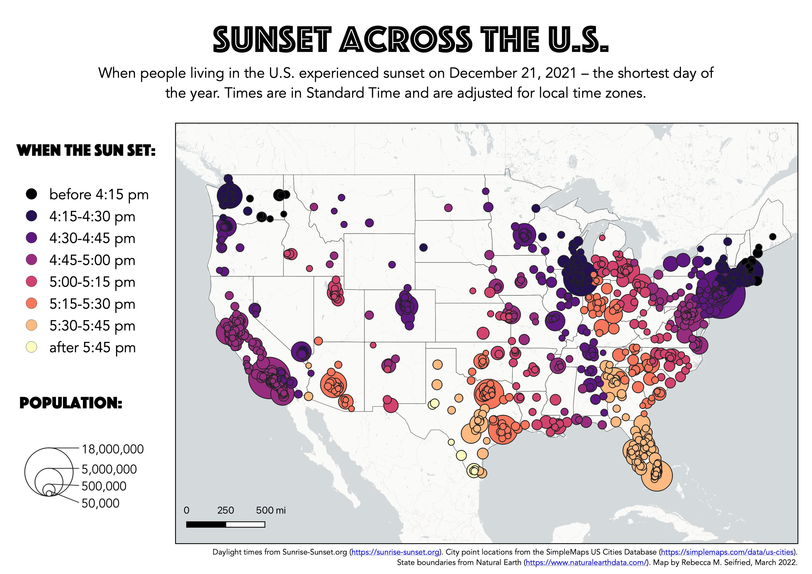
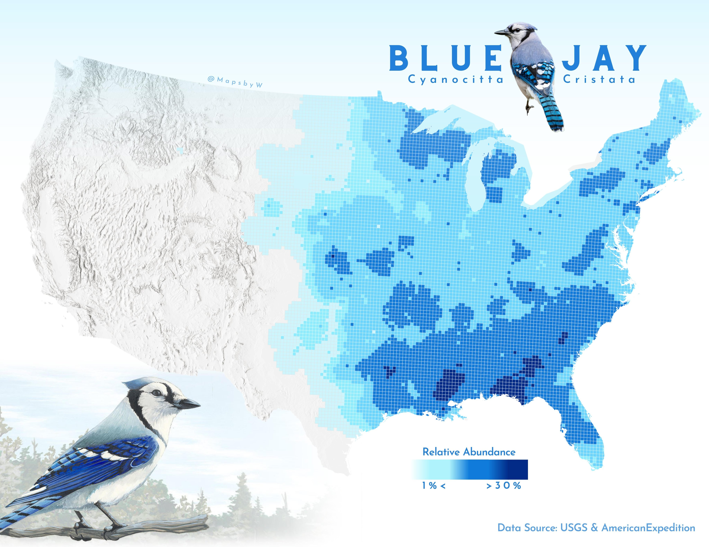
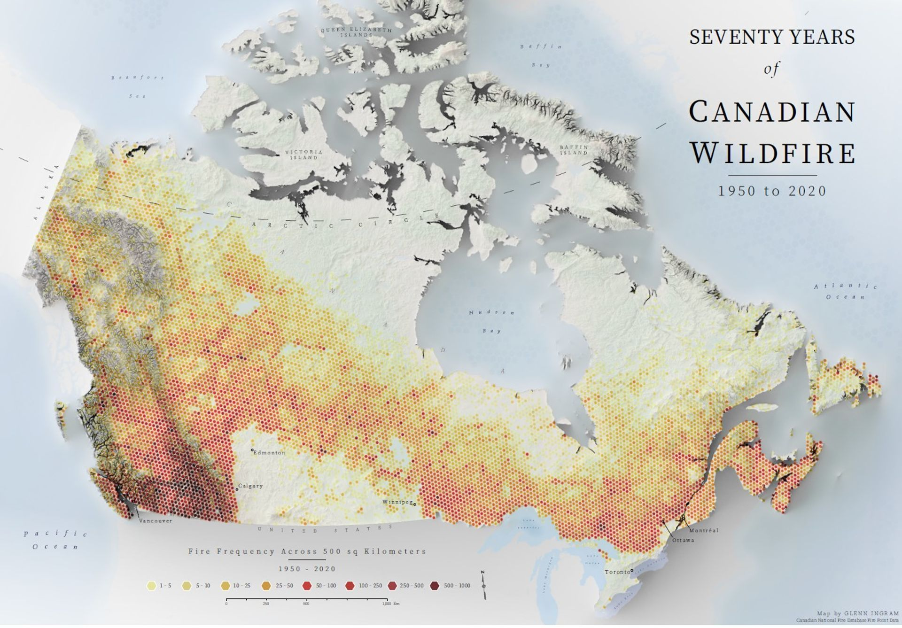
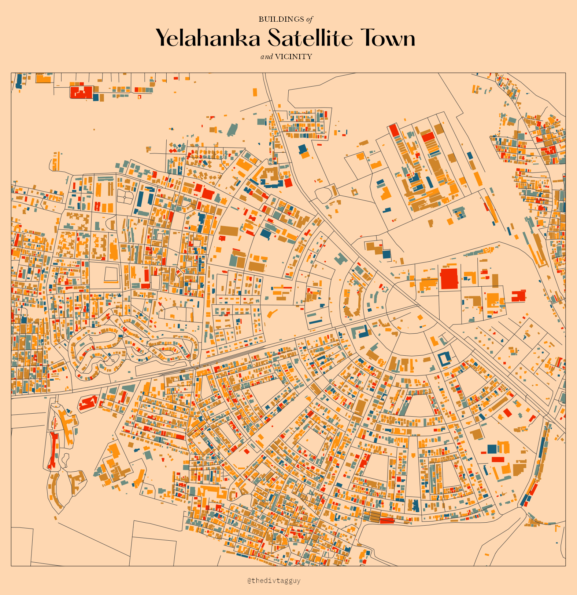
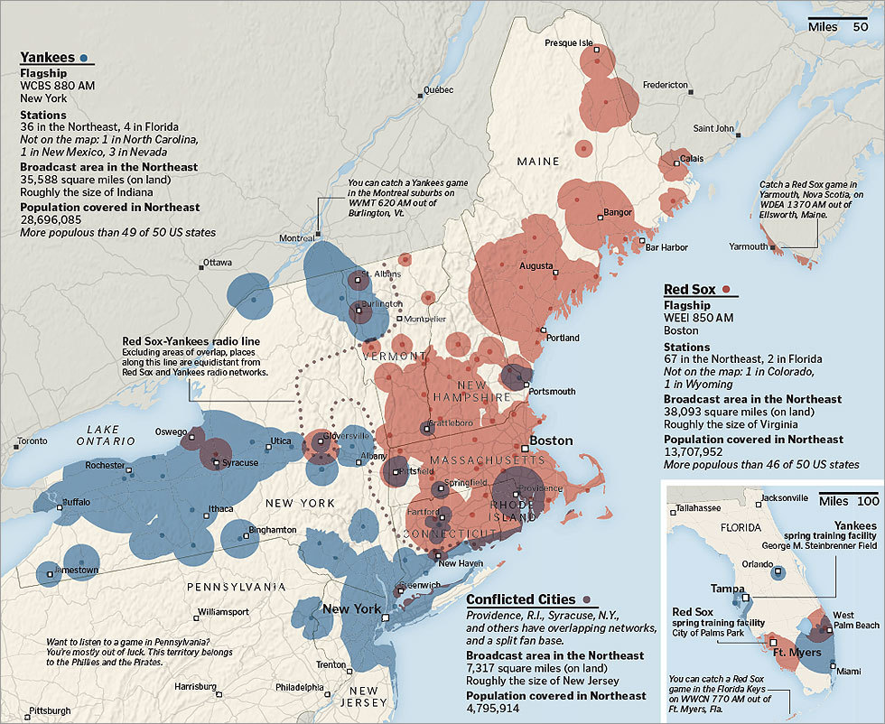

# Example Maps

Curated maps that highlight cartographic best practices
{: .fs-6 .fw-300 }

For each of these maps, ask whether it meets the assessment criteria in the [How to Design Your Own Map](./map-design.html#assess-and-revise) guide:
* Is it easy to identify important information?
* Is the layout balanced?
* Does the map take into account optical center and natural eye movement?
* Is it accessible?
* Does it abide by the Cartography Code of Ethics?

---
### Sunset Across the U.S.
Map by Rebecca M. Seifried, 2022. Designed for the "Build a Web Map" workshop on this site. [View the original map](https://umass-gis.github.io/workshops/content/web-map/static-vs-web.html).

---
### Blue Jay
Map by Wanmei L ([@MapsbyW](https://twitter.com/MapsbyW)), 2022. [View on Twitter](https://twitter.com/MapsbyW/status/1593631856087298048?s=20).

---
### Seventy Years of Canadian Wildfire: 1950 to 2020
Map by Glenn Ingram, 2022. Submitted to the Esri User Conference 2022 by the GIS Certification Institute. [View the original map](https://www.esri.com/en-us/about/events/uc/agenda/virtual-map-gallery#/submission-detail/62a0b7ddc26db51743eb1c6d).

---
### Buildings of Yelahanka Satellite Town and Vicinity
Map by [@thedivtagguy](https://twitter.com/thedivtagguy), 2021. Check out their tutorial, [Visualizing Pretty Building Footprints with QGIS](https://thedivtagguy.com/blog/2023/building-footprints/?tutorial).

---
### Two Nations, Over the Air
Map by Tim Wallace, 2011. [View the original map](http://archive.boston.com/bostonglobe/ideas/articles/2011/07/10/two_nations_over_the_air/).

---
### UFO Sightings Since 1925
Map by John Nelson, 2015. [View the original map](https://www.behance.net/gallery/27818075/UFO-Sightings-Since-1925).

