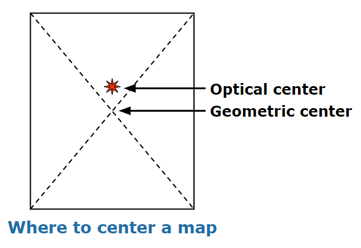
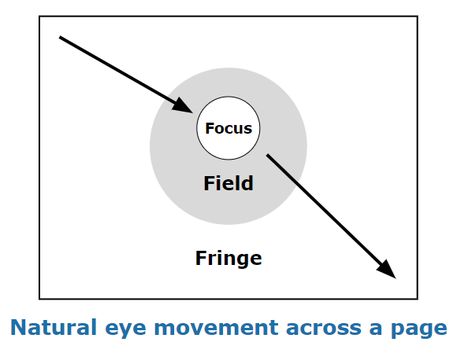

# Best Practices in Map Design
{: .no_toc }

Principles to follow when designing a static map
{: .fs-6 .fw-300 }

  

    Table of contents
  

  {: .text-delta }
1. TOC
{:toc}

---
## Overview

This page gives an overview of key concepts to keep in mind when designing a map.

If you want to learn more about map design, I recommend exploring these resources:
* The State of Minnesota’s page on [Map Design](https://mn.gov/mnit/about-mnit/accessibility/maps/design.jsp) includes a Map Design Quick Card (PDF) and a full Map Design Guide (PDF) to help ensure your map is well-designed and accessible.
* The State of Minnesota also has a page on [Static Digital Maps](https://mn.gov/mnit/about-mnit/accessibility/maps/static.jsp) with advice for designing maps destined to be exported as JPGs or PDFs.
* Dent, Borden D., Jeffrey S. Torguson, and Thomas W. Hodler. 2009. *Cartography: Thematic Map Design*. Sixth ed. Boston: McGraw Hill Higher Education.

---
## How to Design Your Own Map

### Decide what you want to map
{: .no_toc }

* What kind of information will the map show?
* Who is your intended audience?
* How will the map be shared - as an image, PDF, printout, etc.?
* What scale is appropriate for this topic?

### Compose the map
{: .no_toc }

* Decide on [color](#color) and symbology
* Decide on fonts and use labels to highlight important features
* Choose classification methods that are appropriate for the data
* Include important [map elements](#map-elements)

### Assess and revise
{: .no_toc }

* Is it easy to identify important information?
* Is the layout balanced?
* Does the map take into account [optical center and natural eye movement](#framing)?
* Is it accessible?
* Does it abide by the [Cartography Code of Ethics](#ethical-considerations)?

For more questions to ask yourself when assessing your map, check out Aileen Buckley and Kenneth Field's [Making a Meaningful Map](http://www.esri.com/news/arcuser/0911/files/mapchecklist.pdf).

---
## Color

Color is a great way to add vibrancy and make your map visually appealing. However, not all colors work well on a map. Consider that some of your viewers may have color blindness or would benefit from enhanced contrast. These resources are great for generating color schemes that are accessible:

* [ColorBrewer 2.0](https://colorbrewer2.org/)
* [Adobe Color](https://color.adobe.com/create/color-accessibility)
* [Color Safe](http://colorsafe.co/)
* [Accessible Color Palette Builder](https://toolness.github.io/accessible-color-matrix/)

---
## Map Elements

The groups below are my personal opinions about what is most important to include in a map. Ultimately, it is your job to figure out which of these elements you need to include to make sure your map is accessible, reproducible, and easy to read.

| Really Important Elements | Notes |
| :------------------------ | :---- |
| Title                     | In publications, a figure caption is preferred |
| Scale                     | Ideally a scale bar rather than a ratio like "1:5,000" |
| Direction                 | Especially important if north isn't up |
| Legend                    | Helps with interpretation  |
| Data sources              | Essential for reproducibility |

| Optional Elements         | Notes |
| :------------------------ | :---- |
| Projection                | Helps with reproducibility |
| Production info (name and date) | Provides credit |
| Locator or inset maps     | Helps with interpretation |

---
## Framing

Although it may seem counter-intuitive, the geometric center of a map is *not* the first place a viewer tends to look. Instead, the "optical center" is situated slightly above this point. This is where your most important content should be placed.

Another concept to keep in mind is that many viewers will naturally shift their gaze from the upper-left part of a map, through the optical center, and then down to the lower-right. (It's worth noting this is related to the direction that the viewer reads text, so if they speak a language that is read right-to-left, the direction would be reversed.) Content should ideally follow this direction of movement.

---
## Ethical Considerations

Maps are powerful tools for communicating information. Unfortunately, they also have the power to convey the *wrong* information. In his book *How to Lie with Maps* (1991, p. 2), Mark Monmonier writes: "In showing how to lie with maps, I want to make readers aware that maps, like speeches and paintings, are authored collections of information and also are subject to distortions arising from ignorance, greed, ideological blindness, or malice."

Cartographic codes of ethics exist to help ensure that professional mapmakers do not distort reality either intentionally or unintentionally. The British Cartographic Society, for example, published a [Code of Ethics](https://www.cartography.org.uk/code-of-ethics) centered around the values of honesty, integrity, competence, respect, and responsibility.

This is another code of ethics proposed by Dent et al. (2009:19-20):
1. Always have a straightforward agenda, and have a defining purpose or goal for each map.
1. Always strive to know your audience (the map reader).
1. Do not intentionally lie with data.
1. Always show all relevant data whenever possible.
1. Data should not be discarded simply because they are contrary to the position held by the cartographer.
1. At a given scale, strive for an accurate portrayal of the data.
1. The cartographer should avoid plagiarizing; report all data sources.
1. Symbolization should not be selected to bias the interpretation of the map.
1. The mapped result should be able to be repeated by other cartographers.
1. Attention should be given to differing cultural values and principles.
