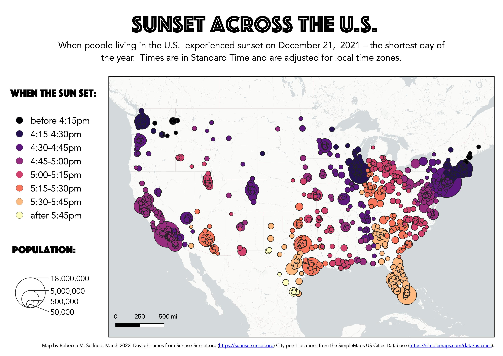

# Static Maps vs. Web Maps

What's the best way to tell your story?
{: .fs-6 .fw-300 }

Web maps are great ways to share data with others in a visually exciting and interactive way. The great power of web maps (vs. printed or static maps) is that they allow users to zoom, pan, click, search, and explore the data in new ways.

Let's say you're a big fan of the sun, and you are curious about how people's experience of daylight varies across the U.S. You could collect data about sunset times and create a static map to print out or post online:

Or you could turn this beautiful map into a web map: [Sunset Across the U.S.](https://rmseifried.github.io/sunlight-in-the-us/).

Pros of static maps:
* Visualize data in a specific way, based on your (the map creator's) preferences
* Easy to add text, legends, credits, etc.
* Image can be exported and shared as a standalone file

Pros of web maps:
* Interactive!
* Allow for multiple layers that can be turned on/off
* URL can be shared as a link and viewed on phones, tablets, or computers

## Yes, I want to make a web map!
{: .no_toc }

There are many ways to make a web map. This workshops shows you how to make one using the open-source software, QGIS, and the free plugin, qgis2web. Follow the tutorial in the next section to get started!
